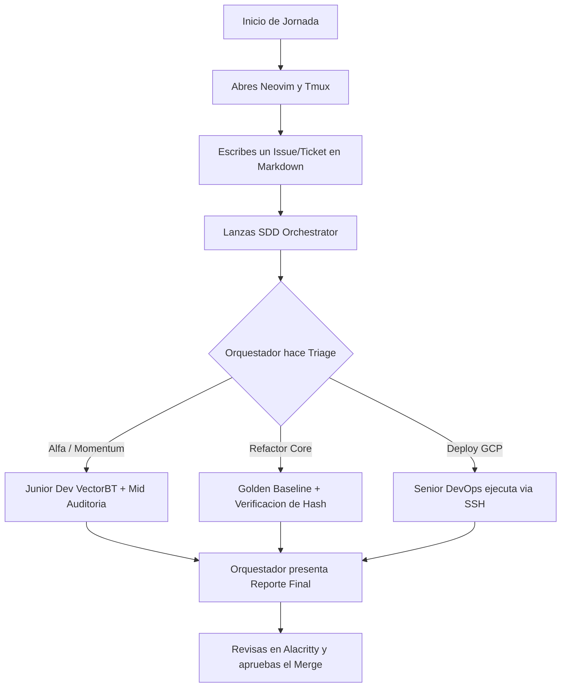

# 5. Matriz de Roles y Agentes

Este capítulo define las "personalidades" técnicas, restricciones (*System Prompts*) y delegación de responsabilidades para cada subagente dentro del marco de Agent Teams Lite (SDD).

## 5.1. ¿Qué se modifica exactamente en el Framework?

No se destruye nada de lo que ya funciona (la FSM de OpenSpec y los harnesses de validación se mantienen intactos). Lo que se agrega son reglas de enrutamiento y perfiles de subagentes:

1. **Configuración de Roles y Seniority (`.agents/subagents/` o prompts):** Se definen los perfiles específicos (Quant Data Eng, Quant Researcher, Quant Dev, Risk SRE) asociándoles su modelo LLM óptimo (`flash_lite`, `flash`, `pro`).
2. **Matriz de Triaje en el Orquestador (`AGENTS.md` / `sdd-orchestrator`):** Se añade la regla para que el orquestador clasifique cada tarea de `tasks.md` y la delegue al agente del nivel adecuado en lugar de ejecutar todo con un modelo pesado.
3. **Metadata en OpenSpec:** Se añade un campo simple en `proposal.md` indicando qué roles intervienen en el issue.

## 5.2. Ejemplo: Optimizar el cálculo de volatilidad (ADR/ATR)

### 5.2.1. ANTES (Flujo Monolítico)
* **Proceso:** Un solo agente con modelo pesado (`pro`) lee todo el contexto, reescribe el código, corre los tests, busca look-ahead bias y audita la memoria en una conversación larga.
* **Problema:** Consumo excesivo de tokens, riesgo de que el mismo desarrollador audite su propio código y mayor probabilidad de errores mecánicos por saturación de contexto.

### 5.2.2. DESPUÉS (Flujo Jerárquico)
1. **Planificación Universal (Orquestador - `pro`):** Diseña el plan SDD (`proposal` y `tasks.md`) y asigna la tarea: Junior Quant Dev (implementación) + Mid-Senior Risk SRE (auditoría).
2. **Ejecución (Junior Quant Dev - `flash`):** Recibe solo el archivo de indicadores y escribe la vectorización en Numba/Numpy.
3. **Auditoría Cuantitativa (Mid-Senior Risk SRE - `flash` / `pro` en paralelo):** Corre `sdd_verify_wrapper.py`, ejecuta la lente *reliability* y valida que el retorno y drawdown no desvíen 0.00%.
4. **Aprobación de Despliegue (Senior Architect - `pro`):** Recibe el reporte parseado, valida el SHA-256 de resultados y aprueba el commit/merge.

## 5.3. Configuración de la Matriz de Agentes LLM

| Rol Asignado | Modelo LLM | Herramientas & Librerías Clave | Responsabilidad Técnica |
| :--- | :--- | :--- | :--- |
| **Tech Lead / Orquestador** | `pro` | OpenSpec, Git, GCP CLI | Genera `proposal.md`, rutea tickets (Triage), valida Hashes (SHA-256) y aprueba despliegues. |
| **Senior Quant Risk / Mid** | `pro` / `flash` | Pytest, Pandas (Métricas) | Ejecuta `sdd_verify_wrapper.py`. Audita código del Junior buscando *look-ahead bias* y límites de Drawdown. |
| **Junior Quant Dev** | `flash` | vectorbt, Optuna, LightGBM | Fuerza bruta matemática. Escribe vectorizaciones, optimiza hiperparámetros y limpia tick data. |
| **Junior DevOps** | `flash_lite` | Bash, Linux utils (ext4) | Tareas repetitivas: formateo de logs, limpieza de contenedores, scripts básicos de I/O. |

## 5.4. Implementación del Triage de Tickets (OpenSpec)

El Orquestador clasifica los issues (tickets) y activa el flujo correcto según el playbook institucional. A continuación se detallan los 4 flujos operativos estandarizados:

### 5.4.1. Ticket de Alfa (Nueva Estrategia o Modelo Momentum/Swing)

*   **Trigger:** Ticket del estilo *"Probar LightGBM para Momentum"*.
*   **Modo Senior (Quant Researcher / Orquestador):** Define la hipótesis matemática, establece métricas objetivo y aprueba el paso a Paper Trading.
*   **Modo Junior (Quant Dev / Ejecutor):** Limpia datos históricos (EDA), programa el backtest inicial (VectorBT) y ejecuta optimización de parámetros (Optuna).
*   **Modo Mid (Risk / Auditor Técnico):** Revisa el script del Junior, busca *look-ahead bias*, verifica costos de transacción y aprueba el código.
*   **Modo Senior (Architect / DevOps):** Diseña cómo se integrará el nuevo modelo en la infraestructura existente.
*   **Modo Junior (Quant Dev):** Escribe el código de producción final con tests unitarios.

### 5.4.2. Ticket de Infraestructura / Core Refactor

*   **Trigger:** Ticket del estilo *"Refactorizar conector de mercado / Migrar base de datos a ext4"*.
*   **Modo Senior (Core Lead / Orquestador):** Define el estado de la verdad e indica qué partes no deben alterarse (*Golden Baseline*).
*   **Modo Junior (Core Dev / Ejecutor):** Corre el backtest actual, exporta los logs financieros y genera el Hash (SHA-256). Ejecuta la migración técnica (ej. formateo a ext4).
*   **Modo Mid (Auditor Técnico):** Verifica que el Hash inicial sea sólido y aprueba el inicio de la migración.
*   **Modo Junior (Core Dev):** Ejecuta el Test Ciego (corre el backtest en el nuevo entorno y genera el nuevo Hash).
*   **Modo Mid / Senior (Auditor Final):** Compara Hash viejo contra Hash nuevo. Si son idénticos, aprueba la tarea.
*   **Modo Senior (DevOps):** Programa y ejecuta el script de despliegue final.

### 5.4.3. Ticket de Incidencia Crítica (Bug / Hotfix)

*   **Trigger:** Ticket del estilo *"Latencia alta en GCP / Error de API"*.
*   **Modo Senior (Risk Manager / On-Call):** Detecta la anomalía financiera y ejecuta el *Kill Switch* o apagado de emergencia.
*   **Modo Mid (Core Dev):** Diagnostica la causa raíz analizando logs y estado del servidor.
*   **Modo Senior (Core Lead):** Diseña el parche o solución temporal rápida (Hotfix).
*   **Modo Junior / Mid (Quant Dev):** Programa el Hotfix específico.
*   **Modo Mid (Auditor):** Ejecuta un Code Review rápido (Smoke Test).
*   **Modo Senior (DevOps):** Despliega a producción saltando el pipeline lento para frenar la pérdida.
*   **Modo Junior (Quant Dev):** Redacta el Post-Mortem y añade tests unitarios días después.

### 5.4.4. Ticket de Data Pipeline (ETL y Mantenimiento)

*   **Trigger:** Ticket del estilo *"Gaps detectados en histórico de precios"*.
*   **Modo Mid (Data Engineer):** Identifica gaps o corrupción en las bases de datos históricas.
*   **Modo Junior (Quant Dev):** Actualiza conectores de API y corre los scripts para descargar y limpiar los datos faltantes.
*   **Modo Mid (Auditor):** Recarga el histórico y verifica la continuidad de las series de tiempo antes de unirlas a la base principal.

## 5.5. Flujo de Ejecución (Día a Día del Trader/Orquestador)

Para visualizar cómo trabajarás realmente con este plan ensamblado desde tu entorno:

