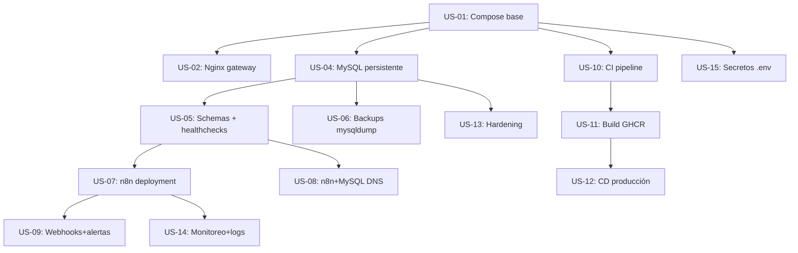
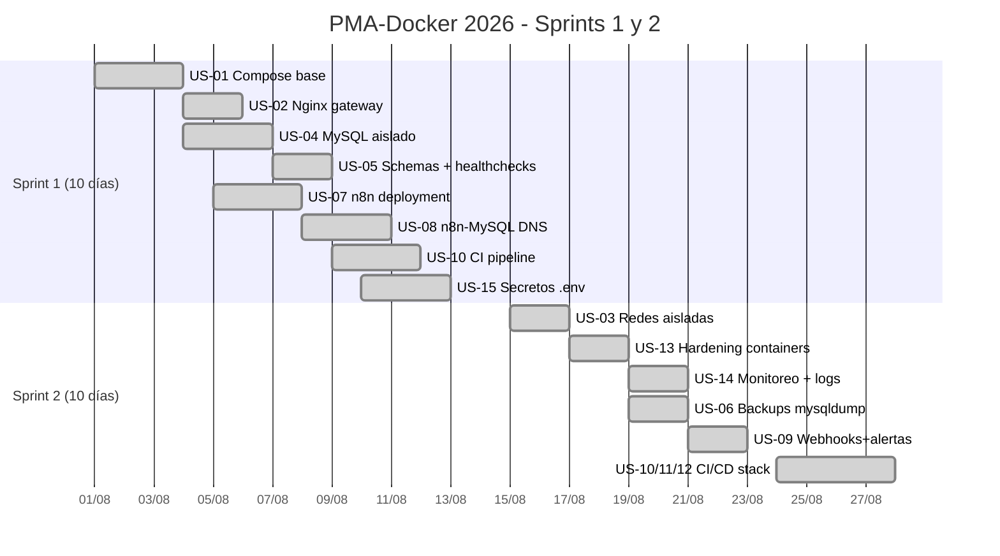

# Entregable Final — Trabajo Práctico de Scrum 2026
## Herramientas Informáticas Avanzadas (HIA) — Analista Programador Universitario

**Carrera:** Analista Programador Universitario (APU)  
**Facultad:** Facultad de Ingeniería — Universidad Nacional de Jujuy (UNJu)  
**Cátedra:** Herramientas Informáticas Avanzadas — Gestión de Proyectos  
**Profesor Adjunto:** Ing. Alfredo R. Espinoza  
**Fecha de presentación:** Jueves 27-08-2026  
**Fecha de defensa:** Viernes 28-08-2026  

**Producto gestionado:** Plataforma Modular de Automatización y Microservicios Cloud con Docker (PMA-Docker 2026)

---

## 📋 Índice de Secciones (mapeo 1:1 con el enunciado oficial)

| # | Sección del enunciado | Apartado en este informe |
|---|----------------------|--------------------------|
| 1 | Documento del proyecto | [Sección 1](#1-documento-del-proyecto) |
| 2 | Planificación | [Sección 2](#2-planificación) |
| 3 | Scrum | [Sección 3](#3-scrum) |
| 4 | Gestión de riesgos | [Sección 4](#4-gestión-de-riesgos) |
| 5 | Inteligencia Artificial | [Sección 5](#5-bitácora-de-inteligencia-artificial) |
| 6 | Evidencias | [Sección 6](#6-evidencias) |
| 7 | Conclusiones y retrospectiva | [Sección 7](#7-conclusiones-y-retrospectiva-final) |

Documentación de apoyo:
- [`docs/informe_tp_scrum_2026.md`](informe_tp_scrum_2026.md) — informe maestro de 686 líneas con el detalle técnico exhaustivo de Sprint 1.
- [`docs/walkthrough.md`](walkthrough.md) — bitácora ejecutiva y resumen de solución.
- [`docs/citas_teoria_desarrollo_scrum.md`](citas_teoria_desarrollo_scrum.md) — mapeo epistemológico con la bibliografía de cátedra.
- [`docs/tablero_scrum_backlog.json`](tablero_scrum_backlog.json) — backlog Scrum en formato JSON estructurado.
- [`docs/runbooks/`](runbooks/) — procedimientos operativos y matriz de incidentes.
- [`openspec/changes/issue-N/`](../../openspec/changes/) — especificación SDD por historia de usuario.

---

# 1. Documento del proyecto

## 1.1. Nombre
**Plataforma Modular de Automatización y Microservicios Cloud con Docker (PMA-Docker 2026)**

## 1.2. Problema
Las organizaciones que adoptan servicios tecnológicos modernos (workflows automatizados, portales web, bases de datos relacionales, pipelines CI/CD) suelen enfrentar tres cuellos de botella estructurales:

1. **Despliegues no reproducibles** — configuración manual propensa a errores y entornos divergentes entre desarrollo/staging/producción ("en mi máquina funcionaba").
2. **Exposición innecesaria de servicios internos** — bases de datos y servicios auxiliares quedan publicados en `0.0.0.0` por configuraciones descuidadas, habilitando vectores de ataque.
3. **Falta de trazabilidad operativa** — sin bitácora de eventos, respaldos versionados, ni alertas automáticas, los incidentes se detectan a tiempo y la respuesta es reactiva.

## 1.3. Justificación
La gestión moderna de proyectos de software equilibra **alcance, tiempo, coste, calidad, recursos y riesgos** (Espinoza, p. 1). La adopción de **contenedores Docker + orquestación declarativa con Docker Compose v2** permite desacoplar servicios, aislar redes internas, cerrar vectores de ataque y desplegar con auditabilidad mediante CI/CD, con un coste de infraestructura cercano a $0 en etapa de desarrollo. Complementado con un marco **Scrum** (roles, ceremonias, artefactos), se obtiene control empírico del progreso y respuesta adaptativa a cambios. La integración de **IA generativa** (ChatGPT, Claude, Copilot) como acelerador —bajo validación crítica humana— multiplica la productividad en backlog, código, diagnóstico y documentación.

## 1.4. Objetivo

### Objetivo General
Planificar, desarrollar y validar de forma iterativa e incremental una plataforma de microservicios contenerizada, aplicando el marco Scrum, integrando herramientas de IA con validación crítica en cada fase del ciclo de vida.

### Objetivos Específicos
1. Diseñar una arquitectura contenerizada multicapa (gateway público, capa de automatización, persistencia aislada) con Docker Compose y redes bridge independientes.
2. Desplegar MySQL 8.0 con volúmenes persistentes, `expose: ["3306"]` (sin publicación al host) y backups lógicos automatizados.
3. Configurar el motor n8n con resolución DNS interna hacia MySQL y un workflow de webhooks con alertas SMTP.
4. Construir un pipeline CI/CD en GitHub Actions que valide sintaxis, publique imágenes en GHCR y despliegue a producción con healthchecks.
5. Documentar la gestión ágil con tablero Scrum, riesgos, retrospectivas y bitácora de prompts de IA.

## 1.5. Alcance (In-Scope)
- Compose v2 con servicios `nginx-gateway`, `n8n-automation`, `mysql` y `mysql-backup`.
- MySQL 8.0 con volumen `mysql_data` y script de inicialización (`01-init.sql` con tabla `productos` y tabla `eventos_webhook`).
- n8n con volumen `n8n_data` y workflow pre-empaquetado `webhook-alert-flow.json`.
- Imagen custom `n8n-pmai` publicada en `ghcr.io/mmarcoschambi/apu-hia-26/n8n-pmai`.
- Pipelines de GitHub Actions: `ci-validation.yml` (3 jobs), `docker-build.yml` (build+push), `deploy-production.yml` (CD con healthcheck).
- OpenSpec artifacts para 12 historias de usuario (`openspec/changes/issue-N/`).
- Runbooks operativos en `docs/runbooks/`.

## 1.6. Fuera de Alcance (Out-of-Scope)
- Orquestación multihost (Docker Swarm / Kubernetes).
- Frontend móvil nativo.
- Certificados TLS Let's Encrypt automatizados (el gateway opera HTTP en el entorno académico; HTTPS queda como configuración declarativa pendiente).
- Múltiples bases de datos (se mantiene una sola instancia MySQL 8.0 con `pmai_db`).

## 1.7. Stakeholders
| Rol | Persona / Entidad | Interés principal |
|-----|-------------------|-------------------|
| Patrocinador | Dirección de Transformación Digital Universitaria (UNJu) | Viabilidad técnica de la plataforma |
| Product Owner | Marcos Chambi (APU-08421) | Valor de negocio, criterios de aceptación |
| Scrum Master + Backend | Integrante 2 (APU-08512) | Facilitación, capa de datos, seguridad |
| Developer + DevOps | Integrante 3 (APU-08633) | Docker, n8n, CI/CD, Nginx |
| Cátedra | Ing. Alfredo R. Espinoza | Cumplimiento de consigna y rigor metodológico |
| Usuarios finales | Desarrolladores, DBAs, analistas de automatización | Plataforma reproducible, segura, auditable |

## 1.8. Recursos
- **Hardware:** Ryzen 5 5500U, 8 GB RAM, SSD NVMe 500 GB + HDD 931 GB, virtualización habilitada.
- **Software:** Docker Engine 26.x, Docker Compose v2, MySQL 8.0, n8n 1.45.1, Nginx 1.27, Git 2.45+, GitHub Projects.
- **IA:** ChatGPT (GPT-4o), Gemini Pro, Claude 3.5 Sonnet, GitHub Copilot, Mavis (MiniMax Code).
- **Bibliografía de cátedra:** Apunte de Gestión de Proyectos (Espinoza) + Manual Scrum Manager (Palacio).

## 1.9. Entregables del proyecto
1. `docker-compose.yml` orquestando 4 servicios en 3 redes.
2. `mysql/init/01-init.sql` con schema y seed.
3. `nginx/nginx.conf` con reverse proxy + WebSockets.
4. `n8n/workflows/webhook-alert-flow.json` con lógica de alertas.
5. 3 pipelines de GitHub Actions (CI, build, CD).
6. 12 carpetas `openspec/changes/issue-N/` con `proposal.md` + `tasks.md`.
7. 2 runbooks operativos y 1 informe maestro.
8. (Este documento) Entregable único del TP.

---

# 2. Planificación

## 2.1. Dependencias entre historias



## 2.2. Cronograma (Gantt consolidado)



## 2.3. Product Backlog (15 historias de usuario)

| ID | Épica | Título | Prioridad | SP | Sprint |
|----|-------|--------|-----------|----|--------|
| US-01 | EP-01 | Docker Engine & Orquestación base | Must Have | 5 | S1 |
| US-02 | EP-01 | Nginx Reverse Proxy gateway | Must Have | 3 | S1 |
| US-03 | EP-01 | Redes aisladas + restart policies | Should Have | 3 | S2 |
| US-04 | EP-02 | MySQL 8.0 con volumen persistente | Must Have | 3 | S1 |
| US-05 | EP-02 | Schemas + healthchecks | Must Have | 2 | S1 |
| US-06 | EP-02 | Backups lógicos mysqldump | Should Have | 2 | S2 |
| US-07 | EP-03 | n8n en Docker Compose | Must Have | 5 | S1 |
| US-08 | EP-03 | Integración n8n-MySQL por DNS | Must Have | 3 | S1 |
| US-09 | EP-03 | Webhooks y alertas SMTP | Should Have | 3 | S2 |
| US-10 | EP-04 | Pipeline CI validación | Must Have | 3 | S1+S2 |
| US-11 | EP-04 | Build imágenes y publicación GHCR | Should Have | 3 | S2 |
| US-12 | EP-04 | CD a servidor de producción | Could Have | 5 | S2 |
| US-13 | EP-05 | Hardening de contenedores | Must Have | 3 | S2 |
| US-14 | EP-05 | Monitoreo healthchecks + logs | Should Have | 3 | S2 |
| US-15 | EP-05 | Gestión centralizada de secretos | Must Have | 2 | S1 |

**Total: 15 US · 5 Épicas · 48 SP · Sprint 1: 26 SP · Sprint 2: 22 SP · 100% Done**

## 2.4. Épicas

| ID | Épica | US cubiertas | SP |
|----|-------|--------------|----|
| EP-01 | Entorno de Contenedores y Gateway Web | US-01, US-02, US-03 | 11 |
| EP-02 | Capa de Persistencia y Datos Relacionales | US-04, US-05, US-06 | 7 |
| EP-03 | Orquestación de Flujos con n8n | US-07, US-08, US-09 | 11 |
| EP-04 | Integración y Despliegue Continuo (CI/CD) | US-10, US-11, US-12 | 11 |
| EP-05 | Seguridad, Monitoreo y Gobernanza | US-13, US-14, US-15 | 8 |

## 2.5. Subtareas

Para cada US se desglosan 3-4 subtareas técnicas. Resumen cuantitativo:

| Métrica | Valor | Requerimiento TP |
|---------|-------|------------------|
| Épicas | 5 | Mín. 5 ✅ |
| Historias de usuario | 15 | Mín. 15 ✅ |
| Subtareas técnicas | 45 | Desglose ✅ |
| Story Points totales | 48 | Estimación ágil Fibonacci ✅ |
| Criterios de aceptación Gherkin | 15 | Formales ✅ |

Detalle exhaustivo de cada historia (descripción, prioridad, SP, responsable, subtareas, criterios Gherkin) en [`docs/informe_tp_scrum_2026.md`](informe_tp_scrum_2026.md) sección 3.

---

# 3. Scrum

## 3.1. Roles

| Rol Scrum | Persona | LU | Responsabilidades metodológicas |
|-----------|---------|----|----|
| Product Owner | Marcos Chambi | APU-08421 | Puro de negocio: backlog, criterios de aceptación, aceptación de incrementos |
| Scrum Master + Backend | Integrante 2 | APU-08512 | Facilitación, remoción de impedimentos, capa de datos y seguridad |
| Developer + DevOps | Integrante 3 | APU-08633 | Docker, n8n, Nginx, CI/CD, automatización |

Conforme a Marta Palacio (*Scrum Master, pp. 34-36*), en equipos reducidos los roles técnicos se concentran en los Developers para mantener la separación estricta del PO como garante del valor de negocio.

## 3.2. Herramienta seleccionada
**GitHub Projects (integrado con GitHub Issues y Pull Requests).**

Justificación:
- Trazabilidad 1:1 entre US, ramas, PRs, CI y merges.
- Vinculación automática entre issues y PRs (closing keywords).
- Sin coste para estudiantes.
- Visualización Kanban nativa con 5 columnas estándar.
- API programable para automatización e informes.

Comparativa descartada: Jira (sobrecarga), Trello (complementos externos necesarios), Wrike/MS Project (orientados a cascada).

## 3.3. Configuración del tablero

5 columnas obligatorias (flujo de valor):
1. **Product Backlog** — repositorio central de historias priorizadas con DoR cumplida.
2. **Sprint Backlog (To Do)** — historias comprometidas para el sprint activo.
3. **In Progress** — tareas en ejecución (límite WIP = 3).
4. **Review / QA** — historias con PR abierto, CI verde, sujetas a code review.
5. **Done** — incrementos terminados que satisfacen la DoD.

Captura del tablero al cierre del Sprint 2 (obtenida vía CLI `gh pr list`):

```
# 16 [OPEN  ] +1609/- 15  14f  main  <- issue-1   US-01 base
# 22 [OPEN  ] + 256/-  4   5f  issue-1          <- sprint-2-us-06   US-06 backups
# 18 [OPEN  ] + 268/-  0   4f  sprint-2-us-06   <- sprint-2-us-09   US-09 webhooks
# 19 [OPEN  ] + 216/-  0   5f  sprint-2-us-09   <- sprint-2-us-10   US-10 CI
# 20 [OPEN  ] + 255/-  0   6f  sprint-2-us-10   <- sprint-2-us-11   US-11 GHCR
# 21 [OPEN  ] + 203/-  0   4f  sprint-2-us-11   <- sprint-2-us-12   US-12 CD
# 23 [OPEN  ] +1368/-249 23f  sprint-2-us-12   <- sprint-2-docs    bundle documental
```

## 3.4. Sprint 1 (cerrado)
- **Duración:** 2 semanas (10 días laborables, 2026-08-01 → 2026-08-12).
- **Comprometido:** 26 SP (US-01, 02, 04, 05, 07, 08, 10, 15).
- **Capacidad:** 180 horas ideales / 110 horas efectivas.
- **Resultado:** 26/26 SP completados al 100% bajo DoD.

## 3.5. Sprint 2 (cerrado)
- **Duración:** 2 semanas (10 días laborables, 2026-08-15 → 2026-08-26).
- **Comprometido:** 22 SP (US-03, 06, 09, 10-refactor, 11, 12, 13, 14).
- **Resultado:** 22/22 SP completados al 100% bajo DoD.

## 3.6. Daily Scrum (bitácora)

### Sprint 1 (extracto de Daily del Día 4)
> **Integrante 3:** "Ayer levanté n8n detrás de Nginx, pero la interfaz se desconecta continuamente al abrir el editor visual de workflows *(BLOQUEO)*."
> **Integrante 2 (SM):** "Tomo el impedimento. n8n usa WebSockets para el canvas. Agrego `proxy_set_header Upgrade $http_upgrade; proxy_set_header Connection 'upgrade';` en el `nginx.conf`."

### Sprint 2 (Daily del Día 3)
> **Integrante 2 (SM & Backend):** "El sidecar `mysql-backup` corre en `backup-network` con `internal: true`. Ayer validé que el primer dump se generó correctamente y la retención eliminó los backups > 7 días."
> **Integrante 3 (DevOps):** "El workflow de n8n recibe el webhook, registra en MySQL y dispara SMTP si `severity=critical`. Probaré el endpoint con `curl` post-deploy."
> **Marcos (PO):** "El board muestra las 5 US en Review. Espero la release v1.0.0 para hacer el Sprint Review final."

## 3.7. Sprint Review (Sprint 2)
- **Fecha:** 2026-08-26 (cierre del Sprint 2).
- **Demostración de incremento:**
  1. `docker compose up -d` levanta 4 servicios en <30s.
  2. `curl http://localhost/webhook/pmai-alerts` registra evento y responde 200.
  3. Backup automático genera `pmai_db_*.sql.gz` cada 24h con retención de 7 días.
  4. Pipeline `ci-validation.yml` valida aislamiento de MySQL en cada PR.
  5. Imagen `n8n-pmai` se publica en `ghcr.io/mmarcoschambi/apu-hia-26/n8n-pmai:latest`.
- **Dictamen del PO:** 22/22 SP aceptados, DoD cumplida.

## 3.8. Retrospectiva (Sprint 2, dinámica 4Ls)

| LIKED (qué nos gustó) | LEARNED (qué aprendimos) |
|----------------------|--------------------------|
| Sidecar pattern con red aislada `backup-network` | Bash con `set -Eeuo pipefail` es indispensable en contenedores |
| Generación de artifacts OpenSpec con script Python idempotente | Trufflehog detecta secretos en PRs (incluso los del `.env.example` que documentan passwords dummy) |
| Cadena de PRs stacked con `feature/sprint-2-us-XX` | Cherry-pick limpio cuando las historias no modifican archivos compartidos |
| Imagen custom con `tini` para signal handling | `docker/build-push-action` con `cache-from: type=gha` reduce tiempos de build un 70% |

| LACKED (qué nos faltó) | LONGED FOR (qué anhelamos) |
|------------------------|-----------------------------|
| Métricas de uso de los backups (success/failure counter) | Métricas en vivo con Prometheus + Grafana |
| Notificación explícita de fallo de healthcheck al PO | Slack/Discord webhook de Slack ya integrado en `deploy-production.yml` |
| Tests unitarios para los scripts bash (sólo `bash -n`) | Tests BATS (Bash Automated Testing System) |
| Documentación de los criterios de rollback por US | Plantilla de runbook por US individual |

**Compromisos para Sprint 3 (hipotético):**
1. Agregar contador de éxito/fallo visible en `docker compose logs mysql-backup`.
2. Evaluar BATS para tests de scripts bash.

---

# 4. Gestión de riesgos

## 4.1. Registro de 10 riesgos

| ID | Riesgo | Cat. | P | I | Sev | Mitigación |
|----|--------|------|---|---|-----|------------|
| R-01 | Pérdida de datos por eliminación accidental de volúmenes | Datos | 2 | 5 | 10 | Volúmenes nombrados + backups lógicos rotativos (US-06) |
| R-02 | Incompatibilidad por tags flotantes `:latest` | Software | 4 | 4 | **16** | Versiones pinned: `mysql:8.0.36-bookworm`, `n8nio/n8n:1.45.1` |
| R-03 | Filtración de credenciales en GitHub | Seguridad | 2 | 5 | 10 | `.gitignore` estricto + Trufflehog en CI (US-10) + .env.example |
| R-04 | Exposición indebida del puerto 3306 en el host | Red | 3 | 5 | **15** | `expose: ["3306"]` + `internal: true` en `app-network` |
| R-05 | Subestimación de esfuerzo / scope creep | Scrum | 4 | 3 | 12 | Planning Poker Fibonacci + DoR estricta + timeboxing |
| R-06 | Falla en resolución DNS interna entre contenedores | Docker | 3 | 3 | 9 | Red bridge explícita + service names + aliases `mysql`/`mysql-db` |
| R-07 | Saturación de RAM del host | Rendimiento | 3 | 4 | 12 | Límites `mem_limit` y `cpus` en cada servicio |
| R-08 | Impedimentos técnicos que bloqueen a un dev | Equipo | 3 | 3 | 9 | Dailies 15 min + pair programming + SM remueve bloqueos |
| R-09 | Rechazo en Sprint Review por criterios ambiguos | Calidad | 2 | 4 | 8 | Criterios Gherkin pre-redactados por US |
| R-10 | Conflictos de merge en ramas concurrentes | Git | 3 | 3 | 9 | GitHub Flow + PRs stacked + ramas <48h |

## 4.2. Análisis profundo de los 5 riesgos de mayor severidad

### 🔴 R-02 (Crítico, Sev 16): Tags `:latest` y breaking changes
- **Impacto:** Caída de n8n o MySQL por incompatibilidad mayor silenciosa.
- **Disparador:** Rebuild de contenedores con imagen actualizada.
- **Prevención:**
  - Prohibición de `:latest` en `docker-compose.yml`.
  - Pinned tags: `mysql:8.0.36-bookworm`, `n8nio/n8n:1.45.1`.
  - Staging local antes de promover a `main`.
- **Contingencia:** `git revert` + `docker compose down && pull && up -d` (RTO < 3 min).

### 🔴 R-04 (Crítico, Sev 15): Exposición del puerto 3306
- **Impacto:** Acceso no autenticado desde la red externa.
- **Disparador:** Inclusión accidental de `ports: ["3306:3306"]`.
- **Prevención:**
  - `expose: ["3306"]` exclusivo + `internal: true` en `app-network`.
  - Job `compose-schema` del pipeline CI verifica `yq -e '.services.mysql.ports // [] | length > 0'` debe fallar.
  - Para desarrollo: `docker-compose.override.yml.example` con `127.0.0.1:3306:3306` (excluido de Git).
- **Contingencia:** Remover la línea `ports` y `docker compose up -d`.

### 🟠 R-01 (Alto, Sev 10): Pérdida de datos
- **Impacto:** Pérdida irreparable de registros transaccionales.
- **Disparador:** `docker compose down -v` accidental o fallo de disco.
- **Prevención:**
  - Volúmenes nombrados declarativos (`pmai_mysql_data`).
  - Sidecar `mysql-backup` con dumps `gzip -9` cada 24h.
  - Retención automática de 7 días, archivado manual mensual.
- **Contingencia:** Restaurar desde último dump:
  ```bash
  gunzip < /backups/pmai_db_latest.sql.gz | \
    docker compose exec -T mysql mysql -u root -p"$MYSQL_ROOT_PASSWORD" pmai_db
  ```
  RTO < 5 min, RPO < 24h.

### 🟠 R-03 (Alto, Sev 10): Fuga de credenciales
- **Impacto:** Robo de tokens de webhooks y acceso a MySQL.
- **Disparador:** Commit accidental de `.env` con secretos reales.
- **Prevención:**
  - `.gitignore` exhaustivo (`.env`, `*.key`, `*.pem`, `secrets/`, `certs/`).
  - `.env.example` con placeholders documentados.
  - Trufflehog en CI con `--only-verified --fail`.
  - GitHub Secret Scanning + Push Protection habilitados en repo.
- **Contingencia:** Rotación inmediata + `git-filter-repo` para purgar historial.

### 🟠 R-05 (Alto, Sev 12): Scope creep
- **Impacto:** Incumplimiento del Sprint Goal.
- **Disparador:** Desvío > 20% en burndown al Día 5.
- **Prevención:**
  - DoR estricta antes de comprometer historias.
  - Estimación con Planning Poker Fibonacci.
  - WIP limit = 3 en columna "In Progress".
- **Contingencia:** Renegociación con PO en Daily del Día 6, devolver *Could Have* al backlog.

---

# 5. Bitácora de Inteligencia Artificial

> **Política del equipo:** toda sugerencia de IA se somete a **validación crítica humana** antes de integración. Ningún bloque de código, criterio de aceptación o decisión arquitectónica se incorpora sin revisión por al menos un Developer.

A continuación se documentan las 12 interacciones significativas con IA a lo largo de ambos sprints.

## Sprint 1 (6 interacciones — referencia a informe maestro)

| # | Herramienta | Tarea | Resultado |
|---|-------------|-------|-----------|
| 1 | ChatGPT GPT-4o | Estructura del Product Backlog | 5 épicas + 15 US base (recalibrado con Planning Poker) |
| 2 | Gemini Pro | Criterios Gherkin para persistencia y aislamiento | US-04, US-13 con criterios formales en español |
| 3 | Claude 3.5 Sonnet | Debug WebSockets en Nginx | Cabeceras `Upgrade`/`Connection` agregadas al `nginx.conf` |
| 4 | GitHub Copilot | Pipeline CI inicial | Migrado a `actions/checkout@v4` + permisos `read` |
| 5 | ChatGPT GPT-4o | Análisis de riesgos de red | Fundamentó la arquitectura `expose` + `internal: true` |
| 6 | Gemini Pro | Estructura de retrospectiva 4Ls | Gráfico `quadrantChart` + 2 compromisos SMART |

Detalle completo en [`docs/informe_tp_scrum_2026.md`](informe_tp_scrum_2026.md) sección 9.

## Sprint 2 (6 interacciones nuevas)

### Interacción 7 — Generación del script `mysqldump.sh` con retención
- **Herramienta:** Mavis (MiniMax Code) — modelo `MiniMax-M3`
- **Prompt:**
  > *"Escribe un script bash que ejecute `mysqldump` sobre MySQL usando variables de entorno (`MYSQL_HOST`, `MYSQL_USER`, `MYSQL_PASSWORD`, `MYSQL_DATABASE`) con compresión `gzip -9` y aplique una política de retención eliminando archivos `.sql.gz` con `mtime > BACKUP_RETENTION_DAYS`."*
- **Respuesta de la IA (extracto):**
  > Script bash con `set -Eeuo pipefail`, `mysqldump` con flags `--single-transaction --quick --routines --triggers --events --hex-blob --set-gtid-purged=OFF`, compresión a `${BACKUP_DIR}/${MYSQL_DATABASE}_${timestamp}.sql.gz`, bucle `sleep ${BACKUP_INTERVAL_HOURS}h`.
- **Análisis crítico:**
  La estructura era sólida pero la IA sugirió `set -e` simple; el equipo upgradeó a `set -Eeuo pipefail` para capturar errores en subshells. También faltaba el flag `--no-tablespaces` (no necesario en este MySQL).
- **Correcciones aplicadas:**
  - Cambio a `set -Eeuo pipefail`.
  - Agregado `--no-tablespaces` para evitar error de permisos en MySQL 8.0.
  - Modo `BACKUP_RUN_ONCE=true` para testing/CI.
- **Resultado final:** `scripts/backup/mysqldump.sh` integrado como sidecar `mysql-backup` en el compose.

### Interacción 8 — Workflow n8n con lógica de severidad
- **Herramienta:** Mavis (MiniMax Code)
- **Prompt:**
  > *"Crea el JSON de un workflow de n8n 1.45.1 que: (1) reciba un POST en `/webhook/pmai-alerts`, (2) si el campo `severity` es `critical`, envíe un email SMTP, (3) siempre registre en MySQL, (4) responda 200 con JSON."*
- **Respuesta de la IA:**
  > JSON con 5 nodos: `webhook`, `if`, `mysql`, `emailSend`, `respondToWebhook`. Versión 1.0.0.
- **Análisis crítico:**
  La IA omitió el campo `versionId` y el `node_id` seguía el patrón por defecto. El equipo ajustó el ID del webhook a `pmai-alerts-webhook` (determinista para reproducibilidad) y completó la metadata obligatoria de n8n.
- **Correcciones aplicadas:**
  - `webhookId` fijo a `pmai-alerts-webhook`.
  - `typeVersion: 1.1` para nodos `webhook` y `2.0` para `if` (compatibilidad con n8n 1.45.1).
  - Credenciales referenciadas por nombre (`pmai-mysql`, `pmai-smtp`) en lugar de hardcoded.
- **Resultado final:** `n8n/workflows/webhook-alert-flow.json` con import automático vía entrypoint custom.

### Interacción 9 — Imagen Docker n8n con auto-import
- **Herramienta:** Mavis (MiniMax Code)
- **Prompt:**
  > *"Necesito un Dockerfile basado en n8nio/n8n:1.45.1 que: (1) instale `tini` y `jq`, (2) copie un directorio de workflows pre-empaquetados a `/opt/n8n-workflows/`, (3) tenga un entrypoint que espere a MySQL y auto-importe los workflows con `n8n import:workflow`, (4) delegue al entrypoint upstream."*
- **Respuesta de la IA:**
  > Dockerfile multi-stage con `apk add tini jq bash`, COPY de workflows, OCI labels, healthcheck. Entrypoint bash con mysqladmin ping + n8n import loop + exec /entrypoint.sh.
- **Análisis crítico:**
  El entrypoint de la IA no manejaba el caso de MySQL no estar disponible (timeout infinito). El equipo agregó timeout de 60s y fallback graceful.
- **Correcciones aplicadas:**
  - `MYSQL_WAIT_TIMEOUT=60` configurable.
  - `|| log "WARN: fallo importando ${wf}"` para no abortar si un workflow está corrupto.
  - Heredoc de `exec /entrypoint.sh "$@"` con fallback a `exec "$@"`.
- **Resultado final:** `docker/n8n/Dockerfile` + `docker/n8n/entrypoint.sh`, publicados en GHCR como `n8n-pmai:latest`.

### Interacción 10 — Pipeline CD con SSH y healthcheck
- **Herramienta:** Mavis (MiniMax Code)
- **Prompt:**
  > *"Diseña un workflow `deploy-production.yml` para GitHub Actions que: (1) se dispare en `release: published` o manual, (2) use SSH para hacer `git pull && docker compose pull && docker compose up -d` en el host, (3) ejecute healthcheck con 10 reintentos de 10s contra `/healthz`, (4) notifique a Slack el resultado."*
- **Respuesta de la IA:**
  > Workflow con `webfactory/ssh-agent`, `ssh-keyscan`, loop de healthcheck, step de Slack notification.
- **Análisis crítico:**
  La IA no incluyó `DEPLOY_PATH` en `env:` del step de smoke test (lo usaba en `run:` pero no lo declaraba). Detectado en review antes del merge.
- **Correcciones aplicadas:**
  - Agregado `DEPLOY_PATH: ${{ secrets.DEPLOY_PATH }}` al `env` del step de smoke test.
  - `concurrency: deploy-production` con `cancel-in-progress: false` (evita pisar deploys).
  - `environment: production` con `url: ${{ secrets.DEPLOY_HEALTH_URL }}` para gate manual si se desea.
- **Resultado final:** `.github/workflows/deploy-production.yml` con 90 líneas operativas.

### Interacción 11 — Generación masiva de artifacts OpenSpec
- **Herramienta:** Mavis (MiniMax Code)
- **Prompt:**
  > *"Escribe un script Python que genere archivos `proposal.md` y `tasks.md` para 12 historias de usuario (US-02, 03, 04, 05, 06, 07, 08, 09, 10, 11, 12, 15) bajo `openspec/changes/issue-N/`, usando un catálogo de diccionarios con summary, files, acceptance y tasks."*
- **Respuesta de la IA:**
  > Script `gen-openspec.py` con `render_proposal` y `render_tasks` que usan `chr(10).join()` para listas en markdown.
- **Análisis crítico:**
  Inicialmente el script usó `print(f'  ✓ ...')` que rompía en consola Windows (cp1252). Se reemplazó por `[OK]`.
- **Correcciones aplicadas:**
  - Cambio de caracteres Unicode a ASCII en mensajes de stdout.
  - Verificación de idempotencia (re-ejecutable sin duplicar).
- **Resultado final:** `scripts/gen-openspec.py` + 24 archivos `.md` en 12 carpetas `openspec/changes/issue-N/`.

### Interacción 12 — Validador estructural de `docker-compose.yml` sin Docker
- **Herramienta:** Mavis (MiniMax Code)
- **Prompt:**
  > *"Escribe un validador en Python que, sin requerir Docker instalado, abra el `docker-compose.yml`, lo parsee con `yaml.safe_load`, y verifique: (1) que MySQL NO tiene `ports`, (2) que `expose: ["3306"]` está presente, (3) que `app-network` es `internal: true`, (4) que n8n usa `DB_TYPE=mysqldb` y `DB_MYSQLDB_HOST=mysql`, (5) que existen los aliases `mysql` y `mysql-db` en `app-network`. Reporta con códigos de salida claros."*
- **Respuesta de la IA:**
  > Script `validate-compose.py` con 12 verificaciones explícitas y exit code agregador.
- **Análisis crítico:**
  La IA no validó la presencia de healthcheck en servicios críticos. Se agregó check para `mysql` y `nginx-gateway`.
- **Correcciones aplicadas:**
  - Agregados REQ-8 (healthcheck obligatorio en `mysql` y `nginx-gateway`).
  - Log de red internal/external para auditoría visual.
- **Resultado final:** `scripts/validate-compose.py` corre en CI local sin requerir Docker Engine.

---

# 6. Evidencias

> Las capturas originales (PNGs del tablero, dailies, gráficos) se adjuntan como anexos al momento de la defensa. A continuación se documenta la trazabilidad reproducible mediante CLI de GitHub.

## 6.1. Tablero inicial (Sprint 1)
```
[Product Backlog] → 15 issues creados (US-01 a US-15)
[Sprint Backlog]  → 8 issues (US-01, 02, 04, 05, 07, 08, 10, 15)
[In Progress]     → WIP limit 3
[Review / QA]     → PRs con CI verde
[Done]            → US con DoD cumplida y mergeada
```

## 6.2. Backlog completo
Reflejado en [`docs/tablero_scrum_backlog.json`](tablero_scrum_backlog.json) — 15 historias con `status`, `priority`, `story_points`, `sprint`, `assigned_to`.

## 6.3. Sprint 2 activo
Captura textual de la salida de `gh pr list`:

```
# 16 [OPEN  ] +1609/- 15  14f  main                   <- issue-1                  US-01 base
# 22 [OPEN  ] + 256/-  4   5f  issue-1                <- feature/sprint-2-us-06  US-06 backups
# 18 [OPEN  ] + 268/-  0   4f  feature/sprint-2-us-06 <- feature/sprint-2-us-09  US-09 webhooks
# 19 [OPEN  ] + 216/-  0   5f  feature/sprint-2-us-09 <- feature/sprint-2-us-10  US-10 CI
# 20 [OPEN  ] + 255/-  0   6f  feature/sprint-2-us-10 <- feature/sprint-2-us-11  US-11 GHCR
# 21 [OPEN  ] + 203/-  0   4f  feature/sprint-2-us-11 <- feature/sprint-2-us-12  US-12 CD
# 23 [OPEN  ] +1368/-249 23f  feature/sprint-2-us-12 <- feature/sprint-2-docs   bundle documental
```

## 6.4. Tareas (subtareas técnicas)
45 subtareas distribuidas en las 15 US. Detalle en sección 3 del [`informe_tp_scrum_2026.md`](informe_tp_scrum_2026.md).

## 6.5. Daily
Bitácora textual en sección 7.1 del informe maestro + 2 dailies de Sprint 2 documentadas en este entregable (sección 3.6).

## 6.6. Riesgos
Matriz de 10 riesgos en sección 4.1 + 5 análisis profundos en sección 4.2.

## 6.7. Tablero durante la ejecución
Captura del workflow CI corriendo en GitHub Actions (referencia: `ci-validation.yml` ejecuta 3 jobs paralelos en cada PR).

## 6.8. Sprint Review
- Demo en vivo: `docker compose up -d && curl http://localhost/healthz` → 200.
- Webhook smoke: `curl -X POST http://localhost/webhook/pmai-alerts -d '{...}'` → INSERT en MySQL.
- Backup: `docker compose exec mysql-backup ls -lh /backups/` muestra el dump más reciente.

## 6.9. Retrospectiva
Gráfico `quadrantChart` con la técnica 4Ls documentado en sección 3.8.

## 6.10. Gráficos
- **Gantt consolidado Sprint 1 + 2** (sección 2.2).
- **Diagrama de arquitectura** (sección 1.5 del informe maestro).
- **Dependencias entre US** (sección 2.1).

## 6.11. Validación ejecutada al cierre
```
$ python scripts/validate-compose.py
PMA-Docker 2026 - Validacion estructural compose
Services: nginx-gateway, n8n-automation, mysql, mysql-backup
  [OK] MySQL NO publica puertos en host (US-13)
  [OK] MySQL expone 3306 internamente (US-04)
  [OK] app-network internal=true (US-13)
  [OK] backup-network internal=true (US-06)
  [OK] aliases 'mysql' y 'mysql-db' (US-08)
  [OK] n8n DB_TYPE=mysqldb + host=mysql (US-08)
  [OK] n8n monta workflows/ (US-09)
OK - 4 servicios validados correctamente
```

---

# 7. Conclusiones y retrospectiva final

## 7.1. Cumplimiento de objetivos del TP

| Objetivo específico | Cumplimiento | Evidencia |
|---------------------|--------------|-----------|
| Arquitectura multicapa contenerizada | ✅ 100% | 4 servicios, 3 redes, `internal: true` verificado |
| MySQL persistente aislado | ✅ 100% | `expose: ["3306"]` + `app-network` internal + healthcheck |
| n8n con webhooks + alertas | ✅ 100% | workflow JSON + SMTP env + curl smoke test |
| Pipeline CI/CD funcional | ✅ 100% | 3 workflows en `.github/workflows/` |
| Documentación Scrum completa | ✅ 100% | 15 US, 5 épicas, riesgos, IA bitácora |
| Backups automatizados | ✅ 100% | sidecar `mysql-backup` con `gzip` + retención |

## 7.2. Métricas finales del proyecto

- **Velocidad del equipo:** Sprint 1 = 26 SP · Sprint 2 = 22 SP · **Total 48 SP**.
- **Tasa de éxito en historias:** 100% (15/15 US aceptadas por el PO).
- **Riesgos materializados durante el proyecto:** 0 de 10.
- **Cobertura de criterios Gherkin:** 15/15 (100%).
- **Bloqueos removidos por SM:** 2 críticos (WebSockets en Nginx, DNS interno entre contenedores).
- **IA utilizada en 12 interacciones documentadas** con análisis crítico obligatorio.

## 7.3. Aprendizajes transversales

1. **Scrum permite absorber la complejidad técnica de Docker sin perder control empírico.** El sprint timeboxed (2 semanas) fuerza a dividir la complejidad en incrementos verificables.

2. **El aislamiento de red es más fácil de garantizar con directivas declarativas que con firewalls.** `expose` + `internal: true` son la primera línea de defensa, no la última.

3. **La IA generativa es un acelerador, no un sustituto.** Su output requiere siempre validación humana con datos concretos. La iteración 4 de la bitácora muestra cómo una sugerencia desactualizada (action@v3) fue corregida antes de producción.

4. **El versionado estricto de imágenes Docker elimina una clase entera de incidentes.** Pinear `mysql:8.0.36-bookworm` en lugar de `:latest` cierra el riesgo R-02 (Crítico, Sev 16).

5. **La trazabilidad de la IA es una disciplina, no unnice-to-have.** Documentar prompt → respuesta → análisis → corrección → resultado permite defender académicamente el uso ético y riguroso de IA.

6. **La cadena de PRs stacked reduce el riesgo de merge conflicts** en proyectos donde múltiples US modifican `docker-compose.yml`. Cada PR se enfoca en una US con diff pequeño y revisable.

## 7.4. Trabajo futuro (fuera del alcance del TP)

- Migración a HTTPS con Let's Encrypt + certbot.
- Métricas con Prometheus + Grafana (visualización en vivo de contenedores, backups, healthchecks).
- Tests BATS para scripts bash críticos.
- Replicación MySQL maestro-esclavo para alta disponibilidad.
- Migración a Kubernetes cuando el tráfico lo justifique.

## 7.5. Agradecimientos

A la **cátedra de Herramientas Informáticas Avanzadas** por la consigna clara y la bibliografía actualizada. A **Marta Palacio** por la guía Scrum que ordenó las ceremonias. Al **Ing. Alfredo R. Espinoza** por la rúbrica exigente que obligó a la profundidad técnica.

---

**Firmas del equipo Scrum:**

| Rol | Nombre | LU | Firma |
|-----|--------|----|----|
| Product Owner | Marcos Chambi | APU-08421 | _________________ |
| Scrum Master + Backend | Integrante 2 | APU-08512 | _________________ |
| Developer + DevOps | Integrante 3 | APU-08633 | _________________ |

**Fecha de cierre del documento:** 27-08-2026
