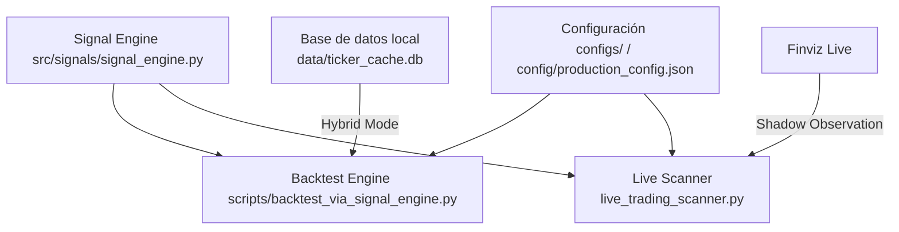

# 🎯 EMPIEZA AQUÍ - Mapa del Sistema Quant v2

Este documento sirve como el **punto de entrada unificado y mapa de arquitectura** del sistema **Momentum v2**. Está diseñado para que tanto desarrolladores humanos como agentes de inteligencia artificial comprendan de inmediato la estructura, los comandos reales de ejecución y las reglas de negocio vigentes.

---

## 🚀 Entry Points Reales (Quick Path)

Ejecutá el sistema utilizando únicamente los comandos oficiales según tu objetivo:

### 1. Simulación y Backtesting (Local / WSL2)
```bash
# Ejecutar el simulador canónico (Verdad Canónica de simulación)
python3 scripts/backtest_via_signal_engine.py --start 2023-01-01 --end 2024-12-31

# Ejecutar suite de pruebas completa
PYTHONPATH=. pytest tests/
```

### 2. Live Trading & Interface (VPS / Local)
```bash
# Iniciar la interfaz gráfica de Streamlit
streamlit run app.py

# Ejecutar el scanner de mercado en vivo
python3 live_trading_scanner.py

# Verificar la salud general del mercado (SPX, VIX, sectores)
python3 market_health_check.py
```

### 3. Sincronización y Deployment (VPS Link)
```bash
# Desplegar lógica, taxonomías y cronjobs al VPS
./deploy_vps.sh

# Descargar logs y reportes generados en el VPS para investigación local
./sync_from_vps.sh
```

---

## 🏛️ Estructura del Sistema y Fuentes de Verdad

Para evitar alucinaciones de código y mantener el contexto liviano, consultá los archivos específicos según el área de interés:



| Componente | Archivo / Directorio | Regla de Oro / Fuente de Verdad |
| :--- | :--- | :--- |
| **Lógica de Señales** | [signal_engine.py](file:///home/marcos/trade/momentum-v2/src/signals/signal_engine.py) | **Canónica.** Cualquier cambio en indicadores o filtros de entrada debe realizarse únicamente aquí. |
| **Estrategia Core** | [production_config.json](file:///home/marcos/trade/momentum-v2/config/production_config.json) | Parámetros del sistema: stops (2xATR), sizing y exclusiones de sector. |
| **Simulación** | [backtest_via_signal_engine.py](file:///home/marcos/trade/momentum-v2/scripts/backtest_via_signal_engine.py) | **Simulación oficial.** Soporta fusiones A/B, Point-In-Time (PIT) y portafolio de 6 posiciones. |
| **Tests de QA** | [tests/](file:///home/marcos/trade/momentum-v2/tests/) | **Strict TDD.** Se ejecutan antes de consolidar cualquier cambio de código en producción. |

---

## ⚙️ Detección de Entorno (Auto-Awareness)

El sistema se adapta automáticamente al entorno donde se ejecuta mediante la presencia o ausencia de la base de datos local:

*   **Laboratory (Local / WSL2):**
    *   **Indicador:** Presencia de `data/ticker_cache.db` (excluido de git).
    *   **Comportamiento:** Corre en **Modo Híbrido**. Utiliza el universo Point-In-Time (PIT) basado en volumen de dólares (ADV Top 200) para las decisiones principales, y Finviz para observación en auditoría.
*   **Torre de Control (VPS):**
    *   **Indicador:** Ausencia de base de datos local (filtrada por `deploy_vps.sh`).
    *   **Comportamiento:** Promueve la watchlist de **Finviz Live** como la fuente de verdad primaria para el escaneo 24/7 y alertas en tiempo real.

---

## 📈 Baselines de Performance y Candidates Activos

El sistema se optimiza y mide contra estas métricas verificadas:

1.  **Gold Standard Baseline:**
    *   **Estrategia:** Russell 1000 + E25 Dynamic Extension Sizing + ex-XLV.
    *   **Performance Histórica:** +96.12% Return, -35.09% MDD.
    *   **Performance Reciente (2023-2024 PIT):** +2.5% Return, -16.1% MDD, 0.45 Sharpe.
2.  **Shadow Candidates (En observación):**
    *   **ex-XLV Exclusion:** Validado en el período 2019-2025 (Net PnL $77,105.43, MDD -16.26%). Activo en auditorías de live trading.
    *   **Divergencia Temática (Variante E):** Setup Swing (horizonte >= 10 días). Válido cuando el **Tema** del activo tiene momentum alcista pero su **Sector** es neutral/bajista. Pendiente de acumular ~30-40 señales en producción para evaluación.

---

## 🛠️ Flujo de Trabajo Scrumban + SDD (Spec-Driven Development)

Para asegurar la estabilidad del sistema, todo desarrollo sigue este proceso rígido:

### 1. Inicialización de Tarea
*   Buscar issues abiertos: `gh issue list --state open`
*   Ver criterios del ticket: `gh issue view <ID>`
*   Crear rama de trabajo: `git checkout -b feat/<ID>-<nombre-corto>` o usar `/sdd-new`.

### 2. Ciclo de Desarrollo
*   **Strict TDD Mode:** Escribir pruebas unitarias primero en `tests/` (Fase Red), y luego modificar `src/` hasta que pasen (Fase Green).
*   **Contexto Ligero:** El orquestador delega tareas complejas a subagentes (`sdd-explore`, `sdd-apply`, `sdd-verify`) para evitar saturar la ventana de contexto.

### 3. Cierre de Ticket
*   Escribir aprendizajes clave en la memoria de Engram (`mem_save`).
*   Formato de commit convencional: `[Módulo] Descripción breve. Fixes #<ID>`.
*   Comentar y cerrar el issue:
    ```bash
    gh issue comment <ID> --body "✅ Build completado. Veredicto: ..."
    gh issue close <ID>
    ```

---

## 📋 Checklist de Calidad para el Desarrollador (Humano o IA)

- [ ] ¿Modifiqué la lógica de señales? Si es así, ¿lo hice únicamente dentro de `src/signals/signal_engine.py`?
- [ ] ¿Escribí las pruebas unitarias antes de implementar el código de producción (TDD)?
- [ ] ¿Corrí `pytest` y pasó al 100% sin warnings de regresión?
- [ ] ¿Guardé en la memoria persistente de Engram cualquier decisión de arquitectura o bugfix relevante?
- [ ] ¿El commit de cierre utiliza el formato convencional y vincula el issue ID?

---

**🎯 PRÓXIMO PASO SUGERIDO:**
Corré el backtest de referencia para validar que tu entorno local está 100% operativo:
```bash
python3 scripts/backtest_via_signal_engine.py --start 2023-01-01 --end 2024-12-31
```
