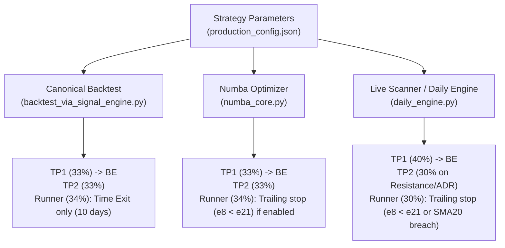

# Exit and Scaling Configuration Audit

This document presents the technical audit of the exit and scaling configurations within the `momentum-v2` trading system, resolving **Issue #28**.

---

## 1. Parameters Summary Table

Below is the configuration of exit and scaling parameters defined across different files in the codebase:

| Parameter | Frozen Value (production_config.json) | Code Definition Path | Function / Details |
| :--- | :---: | :--- | :--- |
| `tp1_r` | **1.25** | `config/production_config.json:L20` | Multiple of risk (R) for Take Profit 1. |
| `tp2_r` | **3.0** | `config/production_config.json:L21` | Multiple of risk (R) for Take Profit 2. |
| `tp1_pct` | **0.33** | `config/production_config.json:L22` | Share of position sold at TP1 (33%). |
| `tp2_pct` | **0.33** | `config/production_config.json:L23` | Share of position sold at TP2 (33%). |
| `runner_pct` | **0.34** | `config/production_config.json:L24` | Share of position kept for the trailing runner (34%). |
| `max_stop_pct` | **0.08** | `config/production_config.json:L25` | Maximum allowed hard stop loss (8%). |
| `use_phases` | **true** | `config/production_config.json:L27` | Flag to enable partial scaling / multi-stage exits. |
| `holding_days_limit` | **10** | `config/production_config.json:L233` | Hard time-based holding limit in market days. |

---

## 2. Frozen Candidate Configuration

The exact frozen configuration for the **Russell 1000 + E25 + ex-XLV + ticker-cap 20%** candidate is loaded from [config/production_config.json](file:///home/marcos/trade/momentum-v2/config/production_config.json) and evaluated canonically:
*   **TP1 Target**: `entry + 1.25 * stop_distance` (sells 33% of position, raises stop to Breakeven).
*   **TP2 Target**: `entry + 3.0 * stop_distance` (sells 33% of position).
*   **Stop Loss**: Initial hard stop at `entry - stop_distance` capped at **8.0%** (or dynamically adjusted by E25 sizing rules based on SMA20 extension).
*   **Sector Exclusion**: **XLV** (Healthcare ETF) is fully excluded (`exclude_sectors: ["XLV"]`).
*   **Risk per Trade**: Dynamic based on market regime ($2,878 at baseline/ATTACK mode, or scaled defensively).

---

## 3. Discrepancies and Gaps (Critical Audit Findings)

The audit revealed a **major architectural drift** between the backtesting environment, the optimization engine, and the live trading scanner:

### Gap A: Trailing Stops on Runner
*   **Backtest (`backtest_via_signal_engine.py`)**: Has **no trailing stop logic** implemented for the runner. After TP1/TP2 are hit, the remaining 34% of the position is carried until day 10, where it is closed at close via the `EOD` time exit.
*   **Live Engine (`daily_engine.py`)**: Implements an active trailing stop for Phase 3 (Runner). It closes the position at close if `ema_8 < ema_21` or if `close < sma_20`.
*   **Numba Core (`numba_core.py`)**: Implements trailing stop `e8 < e21` only if `use_trailing_stop` is enabled.

### Gap B: Sizing and Preset Mismatches
*   **Live/Daily Engine (`daily_engine.py`)**: Hardcodes partial exit shares as **40% for TP1** and **30% for TP2** (leaving 30% for the runner), whereas the config file and the backtest engine use **33% / 33% / 34%**.
*   **Live TP2 Trigger**: The live engine uses a complex multi-condition trigger for TP2 (2R resistance, 1.5x ADR expansion, or 2.5R high hit), whereas the backtest engine uses a simple check against `precio_tp2` (3.0R).

---

## 4. Recommendations for Track 4 (E26)
1.  **Do not mix exits**: Since the live system (`daily_engine.py`) has different hardcoded parameters, it is critical to unify the code or explicitly simulate the `daily_engine` logic in backtests before deploying E26 exits.
2.  **Benchmark Cleanly**: Use the canonical `backtest_via_signal_engine.py` as the baseline. Any E26 exit variant (like trailing stop or Atlas-style trimming) must be implemented inside the same engine structure to maintain a fair comparison.
