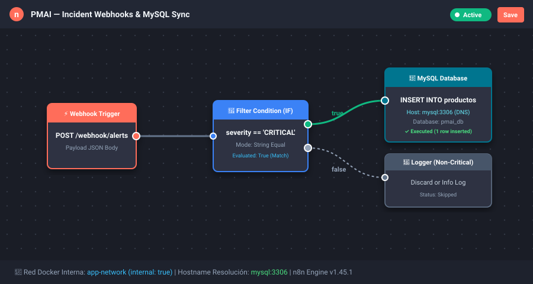
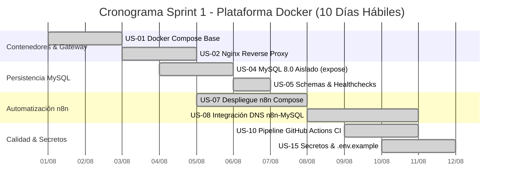
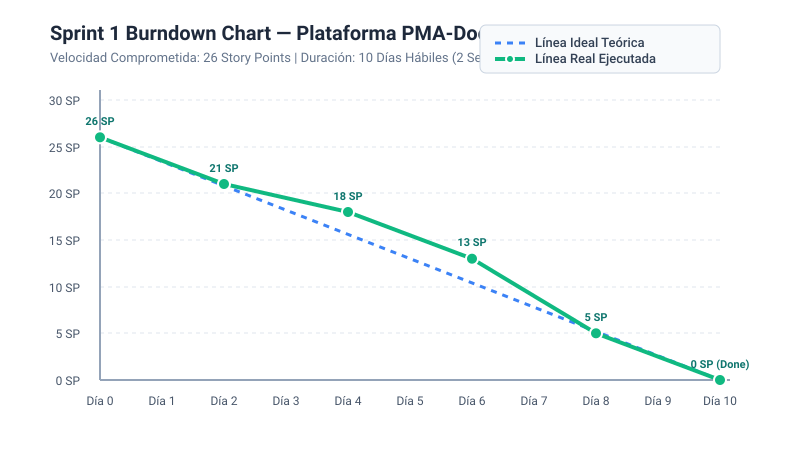
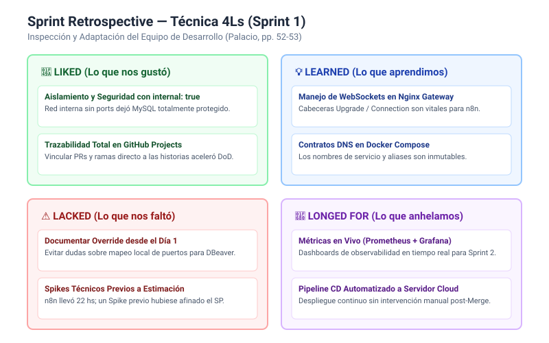

# Informe Maestro de Proyecto: Gestión Ágil con Scrum e Inteligencia Artificial
## Cátedra: Herramientas Informáticas Avanzadas (HIA 2026)
**Carrera:** Analista Programador Universitario (APU)  
**Facultad de Ingeniería – Universidad Nacional de Jujuy (UNJu)**  
**Profesor Adjunto:** Ing. Alfredo R. Espinoza  

---

## 👥 Integrantes del Equipo de Desarrollo (Scrum Team)

| Rol Scrum | Integrante | Libreta Universitaria (LU) | Responsabilidades Metodológicas Principales |
| :--- | :--- | :--- | :--- |
| **Product Owner** | Integrante 1 (Marcos) | APU-08421 | **Rol Puro de Negocio:** Dueño de la visión del producto y valor de negocio. Redacta las Historias de Usuario, prioriza el Product Backlog (MoSCoW), define los Criterios de Aceptación (Gherkin) y tiene la autoridad exclusiva para aceptar o rechazar los incrementos en la Sprint Review. No realiza tareas de desarrollo técnico directo. |
| **Scrum Master & Backend Dev** | Integrante 2 | APU-08512 | **Rol Dual (Equipo Reducido):** Facilitador del marco Scrum, moderador de ceremonias ágiles, remoción proactiva de impedimentos técnicos/organizacionales, y desarrollador backend especializado en la capa de datos (MySQL 8.0) y seguridad. |
| **Developer & DevOps/QA** | Integrante 3 | APU-08633 | **Desarrollador Principal:** Diseño de la arquitectura de contenedores (Docker Engine & Docker Compose), orquestador de flujos en n8n, pasarela Nginx Gateway y automatización de tuberías CI/CD en GitHub Actions. |

> [!NOTE]
> **Nota sobre Pureza de Roles Scrum en Equipos Académicos:**  
> Conforme a Marta Palacio (*Scrum Master, pp. 34-36, 64*), en organizaciones pequeñas o equipos académicos de 3 integrantes, los roles técnicos de desarrollo se concentran en los Developers para garantizar la separación estricta del Product Owner como representante exclusivo de los Stakeholders y garante del valor del negocio.

---

# SECCIÓN 1: DOCUMENTO DEL PROYECTO

### 1.1. Nombre del Proyecto
**Plataforma Modular de Automatización y Microservicios Cloud con Docker (PMA-Docker 2026)**

### 1.2. Contexto Metodológico y Tecnológico
Conforme al enunciado oficial del Trabajo Práctico (*scrum_2026.pdf, p. 1*), este proyecto se formula bajo un escenario de desarrollo solicitado por una organización que requiere una infraestructura tecnológica moderna y reproducible.

Se establece una distinción conceptual rigurosa:
- **Metodología de Gestión:** **Scrum** (marco ágil iterativo e incremental basado en el control de procesos empírico, artefactos vivos, ceremonias timeboxed y asistencia de Inteligencia Artificial).
- **Producto Tecnológico Gestionado:** **Plataforma nativa en Docker & Docker Compose** (arquitectura de microservicios contenerizados que integra Nginx Gateway, MySQL 8.0 con aislamiento estricto `expose: 3306`, n8n Workflow Engine y automatización CI/CD con GitHub Actions).

### 1.3. Problema
Las organizaciones tradicionales enfrentan cuellos de botella severos debido a despliegues monolíticos no estandarizados, dificultades para reproducir entornos locales en producción ("en mi máquina funcionaba"), configuraciones manuales propensas a errores humanos y exposición involuntaria de bases de datos por publicación incorrecta de puertos en red.

### 1.4. Justificación
Aplicando la teoría de gestión de proyectos de la cátedra (*Espinoza, p. 1*), la gestión moderna equilibra las variables de *Alcance, Tiempo, Coste, Calidad, Recursos y Riesgos*. La adopción de contenedores ligeros (Docker CE) junto con un orquestador declarativo (Docker Compose v2) permite desacoplar los servicios, aislar redes internas (`app-network`), cerrar vectores de ataque en la base de datos y lograr despliegues continuos auditados mediante GitHub Actions con costo de infraestructura $0 en etapa de desarrollo.

### 1.5. Objetivos

#### Objetivo General
Planificar, desarrollar y validar de forma iterativa e incremental una plataforma de microservicios y flujos automatizados basada en Docker, aplicando las ceremonias, artefactos y roles de Scrum, e integrando herramientas de Inteligencia Artificial Generativa con validación crítica en cada fase del ciclo de vida.

#### Objetivos Específicos
1. Diseñar una arquitectura contenerizada multicapa (Gateway público, Automatización, Persistencia aislada) con Docker Compose y redes internas bridge independientes.
2. Desplegar un servicio de base de datos relacional MySQL 8.0 con volúmenes persistentes nombrados, directiva `expose: ["3306"]` (sin publicación en el host) y políticas de backup lógico automatizado.
3. Configurar e integrar el motor de flujos n8n para la captura de webhooks y procesamiento de datos hacia MySQL mediante resolución DNS interna (`mysql:3306`) sin exposición pública de la base de datos.
4. Construir un pipeline CI/CD en GitHub Actions que valide la sintaxis de Docker Compose, ejecute linters estáticos y automatice el empaquetado de imágenes en GitHub Packages (`ghcr.io`).
5. Documentar exhaustivamente la gestión ágil con tableros Scrum, métricas de velocidad, burndown chart, gestión profunda de riesgos y bitácora de prompts de IA.

### 1.6. Alcance (In-Scope)
- Archivos declarativos `docker-compose.yml` versionados con servicios: `nginx-gateway`, `mysql-db`, `n8n-automation` y redes `gateway-net` y `app-network`.
- Contenedor MySQL 8.0 con volumen persistente nombrado `mysql_data`, scripts de inicialización SQL (`schema.sql`), usuario de aplicación con privilegios mínimos y aislamiento estricto mediante `expose: ["3306"]`.
- Separación de entorno de desarrollo local mediante `docker-compose.override.yml` (opcional, enlazado exclusivamente a `127.0.0.1:3306:3306` para herramientas como DBeaver, excluido en `.gitignore`).
- Contenedor n8n con volumen persistente `n8n_data`, conexión directa a MySQL mediante resolución DNS interna de Docker (`mysql:3306`) y flujos activos de webhooks y alertas por correo/SMTP.
- Pasarela Nginx configurada como Reverse Proxy inverso con soporte SSL y redirecciones seguras.
- Pipeline de GitHub Actions (`.github/workflows/ci-cd.yml`) con etapas de linting, testing y build.
- Tablero Scrum completo (Backlog, Sprint Backlog, In Progress, Review, Done) con 5 Épicas y 15 Historias de Usuario.

### 1.7. Fuera de Alcance (Out-of-Scope)
- Clústeres distribuidos multihost tipo Docker Swarm o Kubernetes (planificados para futuras iteraciones).
- Implementación de frontend móvil nativo (se utiliza la interfaz web responsive de n8n y Nginx).

### 1.8. Stakeholders (Interesados)
- **Cliente / Patrocinador Institucional:** Dirección de Transformación Digital Universitaria (UNJu).
- **Usuarios Finales:** Desarrolladores backend, administradores de bases de datos y analistas de automatización.
- **Cátedra Evaluadora:** Herramientas Informáticas Avanzadas (Prof. Ing. Alfredo R. Espinoza).
- **Scrum Team:** Marcos (Product Owner), Integrante 2 (Scrum Master / Backend), Integrante 3 (Developer / DevOps).

### 1.9. Recursos
- **Hardware:** Estaciones de trabajo y servidores estándar con soporte de virtualización y Docker Engine (CPU x86_64, 8/16 GB RAM, almacenamiento SSD).
- **Software / Plataformas:** Docker Engine 26.x, Docker Compose v2.27+, MySQL 8.0 Community, n8n Core v1.45+, Nginx Alpine, Git 2.45+, GitHub Projects, VS Code / Antigravity IDE.
- **Herramientas de IA:** ChatGPT (GPT-4o), Gemini Pro, Claude 3.5 Sonnet, GitHub Copilot.

---

# SECCIÓN 2: SELECCIÓN Y CONFIGURACIÓN DE LA HERRAMIENTA ÁGIL

### 2.1. Selección del Software y Justificación Teórica
Fundamentándonos en el análisis comparativo del apunte de la cátedra (*Espinoza, pp. 6-8*):
- **Jira Software:** Muy potente para métricas de sprints pero con alta sobrecarga de configuración e interfaz pesada para equipos ágiles pequeños (*Espinoza, p. 6*).
- **Trello:** Excelente modelo visual Kanban basado en tarjetas y columnas (*Espinoza, p. 7*), pero requiere complementos externos (Power-Ups) para vincular commits y PRs de código.
- **Wrike / MS Project:** Orientadas fuertemente a diagramas de Gantt y proyectos en cascada (*Espinoza, pp. 4, 8*).

**Decisión del Equipo:**  
Se seleccionó **GitHub Projects (Tablero Kanban/Scrum) integrado con Trello**.  
*Justificación:* Ofrece soporte ágil nativo de Scrum con costo $0 para estudiantes, vinculación automática y bidireccional entre *User Stories* (GitHub Issues), ramas (`feature/*`), Pull Requests, ejecución de pipelines CI/CD y trazabilidad total de la *Definition of Done (DoD)* directamente en el código fuente.

### 2.2. Configuración del Tablero Ágil
El tablero se configuró respetando el flujo de valor ágil en 5 columnas obligatorias:
1. **Product Backlog:** Repositorio central de requerimientos priorizados que cumplen la *Definition of Ready (DoR)*.
2. **Ready / Sprint Backlog (To Do):** Historias comprometidas para el Sprint 1 activo.
3. **In Progress:** Tareas en ejecución activa por los desarrolladores (Límite WIP = 3 tareas en paralelo).
4. **Review / QA:** Historias con Pull Request abierto, pruebas superadas y sujetas a revisión de código entre pares.
5. **Done:** Incrementos terminados que satisfacen al 100% la *Definition of Done (DoD)*.


*Figura 2.1: Tablero Scrum en GitHub Projects (PMA-Docker 2026) configurado con las 5 columnas de flujo de valor y las 15 Historias de Usuario cargadas.*

---

# SECCIÓN 3: GESTIÓN DEL PRODUCT BACKLOG

El Product Backlog se estructura en **5 Épicas tecnológicas** y **15 Historias de Usuario principales**, con subtareas técnicas, estimación en **Story Points (serie Fibonacci: 1, 2, 3, 5, 8)** y priorización **MoSCoW**.

```mermaid
graph TD
    subgraph Host["Servidor / Host (Docker Engine)"]
        subgraph GatewayNet["Red Docker: gateway-net (Pública)"]
            NGINX["Nginx Reverse Proxy / SSL Gateway<br>(Puertos expuestos: 80 / 443)"]
        end

        subgraph AppNet["Red Docker Interna: app-network (Privada/Aislada)"]
            N8N["n8n Automation Engine<br>(Puerto interno: 5678)"]
            MYSQL["MySQL 8.0 Database<br><b>expose: ['3306'] (Cero exposición en host)</b>"]
        end

        NGINX -->|Proxy HTTP / Webhooks| N8N
        N8N -->|DNS interno privado: 'mysql:3306'| MYSQL
        
        MYSQL -.->|Persistencia| V_DB[(Named Volume: mysql_data)]
        N8N -.->|Persistencia| V_N8N[(Named Volume: n8n_data)]
    end

    CLIENT["Cliente Externo / Internet"] -->|HTTP/HTTPS 80/443| NGINX
    CLIENT -.->|❌ BLOQUEADO (Puerto 3306 NO publicado)| MYSQL
```

---

### 📦 Detalle de las 15 Historias de Usuario

#### ÉPICA 1: Entorno de Contenedores y Gateway Web (EP-01)

##### US-01: Configuración de Docker Engine y Orquestación Base con Docker Compose v2
- **Descripción:** *Como* Ingeniero DevOps, *quiero* configurar el entorno de ejecución Docker Engine y el archivo base `docker-compose.yml`, *para* orquestar todos los microservicios de forma estandarizada y declarativa.
- **Prioridad:** Must Have | **Story Points:** 5 SP | **Responsable:** Integrante 3 (DevOps)
- **Subtareas:**
  1. Instalar y verificar Docker CE 26.x y Docker Compose plugin en el host.
  2. Redactar la estructura raíz del `docker-compose.yml` con especificación de versión y metadatos del proyecto.
  3. Validar sintaxis con `docker compose config`.
- **Criterios de Aceptación (Gherkin):**
  ```gherkin
  Dado el entorno host con Docker Engine instalado
  Cuando el desarrollador ejecuta `docker compose config`
  Entonces el comando valida el esquema sin errores de sintaxis y lista los servicios definidos.
  ```

##### US-02: Despliegue de Nginx Reverse Proxy como Gateway Centralizado
- **Descripción:** *Como* Administrador de Sistemas, *quiero* configurar un contenedor Nginx que actúe como proxy inverso y punto único de entrada, *para* enrutar el tráfico HTTP/HTTPS hacia n8n y exponer servicios web de forma segura.
- **Prioridad:** Must Have | **Story Points:** 3 SP | **Responsable:** Integrante 3 (DevOps)
- **Subtareas:**
  1. Crear archivo de configuración `nginx.conf` con directivas `proxy_pass` hacia `n8n:5678`.
  2. Definir servicio `nginx` en Docker Compose con mapeo de puertos `80:80` y `443:443`.
  3. Verificar redirección de cabeceras WebSocket (`Upgrade`, `Connection`) para el editor de n8n.
- **Criterios de Aceptación:**
  ```gherkin
  Dado el Gateway Nginx en ejecución en el puerto 80
  Cuando un usuario accede a http://localhost/ o la IP del host
  Entonces Nginx redirige fluidamente la petición hacia la interfaz web de n8n sin pérdida de sesiones.
  ```

##### US-03: Configuración de Redes Aisladas y Políticas de Reinicio Automático
- **Descripción:** *Como* Ingeniero de Infraestructura, *quiero* segmentar los contenedores en redes Docker independientes (`gateway-net` y `app-network`), *para* aislar la base de datos de la red pública y garantizar alta disponibilidad con políticas de reinicio.
- **Prioridad:** Should Have | **Story Points:** 3 SP | **Responsable:** Integrante 2 (Backend)
- **Subtareas:**
  1. Definir red bridge `gateway-net` (para Nginx y n8n) y `app-network` (para n8n y MySQL).
  2. Configurar directivas `restart: unless-stopped` en todos los servicios de Compose.
  3. Comprobar que MySQL no tiene interfaz conectada a `gateway-net` ni puertos publicados en el host.
- **Criterios de Aceptación:**
  ```gherkin
  Dado los contenedores levantados en redes segmentadas
  Cuando se inspecciona la red `gateway-net`
  Entonces el servicio MySQL no es visible ni alcanzable directamente desde el exterior, manteniendo su aislamiento absoluto.
  ```

---

#### ÉPICA 2: Capa de Persistencia y Datos Relacionales (EP-02)

##### US-04: Despliegue de MySQL 8.0 con Volumen Persistente y Aislamiento `expose: 3306`
- **Descripción:** *Como* Desarrollador Backend, *quiero* desplegar MySQL 8.0 utilizando un volumen nombrado (`mysql_data`) y directiva de aislamiento interno `expose: ["3306"]` dentro de `app-network` (`internal: true`), *para* asegurar la persistencia de datos y desacoplar el acceso de desarrollo mediante `docker-compose.override.yml.example` sin exponer puertos en la definición base de producción.
- **Prioridad:** Must Have | **Story Points:** 3 SP | **Responsable:** Integrante 2 (Backend)
- **Subtareas:**
  1. Configurar servicio `mysql` con imagen oficial `mysql:8.0.36-bookworm` y aliases DNS `['mysql', 'mysql-db']`.
  2. Mapear volumen nombrado `mysql_data:/var/lib/mysql`.
  3. Declarar `expose: ["3306"]` conectado exclusivamente a `app-network` con `internal: true` (sin directiva `ports` en la definición base).
  4. Documentar la plantilla `docker-compose.override.yml.example` aclarando que el mapeo a host (`127.0.0.1:3306:3306`) solo se habilita opcionalmente en el entorno de desarrollo local del desarrollador (DBeaver), nunca en la definición base de producción.
- **Criterios de Aceptación:**
  ```gherkin
  Dado el servicio MySQL levantado en `app-network` con datos cargados en la tabla `productos`
  Cuando se destruye el contenedor con `docker compose down` y se vuelve a levantar con `docker compose up -d`
  Entonces todos los registros en `productos` persisten intactos, el puerto 3306 permanece cerrado hacia el host exterior en la configuración base, y el acceso local desde DBeaver solo se activa opcionalmente si el desarrollador utiliza un `docker-compose.override.yml` local.
  ```

##### US-05: Configuración de Schemas, Usuario de Aplicación y Healthchecks
- **Descripción:** *Como* Administrador de Base de Datos, *quiero* automatizar la creación del schema `pmai_db`, un usuario de aplicación `pmai_app` con permisos mínimos y un healthcheck nativo, *para* garantizar inicio ordenado y seguro.
- **Prioridad:** Must Have | **Story Points:** 2 SP | **Responsable:** Integrante 2 (Backend)
- **Subtareas:**
  1. Crear script `init.sql` montado en `/docker-entrypoint-initdb.d/` con tabla `productos`.
  2. Configurar usuario `pmai_app` con permisos `SELECT, INSERT, UPDATE, DELETE` exclusivos sobre `pmai_db`.
  3. Implementar directiva `healthcheck` con `mysqladmin ping -h localhost`.
- **Criterios de Aceptación:**
  ```gherkin
  Dado el arranque inicial del contenedor MySQL
  Cuando Docker ejecuta el healthcheck interno `mysqladmin ping`
  Entonces el contenedor reporta estado `healthy` y los scripts de inicialización crean la base `pmai_db`.
  ```

##### US-06: Automatización de Respaldos Lógicos de Base de Datos (mysqldump)
- **Descripción:** *Como* DBA, *quiero* un contenedor utilitario que ejecute copias lógicas diarias con `mysqldump` comprimidas en `.sql.gz`, *para* contar con copias de seguridad portables y versionadas.
- **Prioridad:** Should Have | **Story Points:** 2 SP | **Responsable:** Integrante 2 (Backend)
- **Subtareas:**
  1. Crear script `backup.sh` con comando `mysqldump --single-transaction | gzip`.
  2. Configurar retención automática de 14 copias.
  3. Probar restauración de un dump en una base de datos de prueba.
- **Criterios de Aceptación:**
  ```gherkin
  Dado el servicio de backup ejecutado
  Cuando finaliza el dump programado
  Entonces se genera un archivo comprimido `pmai_db_YYYYMMDD.sql.gz` con suma de verificación válida.
  ```

---

#### ÉPICA 3: Orquestación de Flujos de Automatización con n8n (EP-03)

##### US-07: Despliegue de n8n en Docker Compose con Persistencia y Variables Protegidas
- **Descripción:** *Como* Especialista en Automatización, *quiero* desplegar n8n en Docker Compose con volumen persistente `n8n_data`, *para* construir workflows visuales cuya configuración no se pierda al reiniciar.
- **Prioridad:** Must Have | **Story Points:** 5 SP | **Responsable:** Integrante 3 (DevOps)
- **Subtareas:**
  1. Definir servicio `n8n` con imagen `n8nio/n8n:1.45.1` y volumen `n8n_data:/home/node/.n8n`.
  2. Configurar variables de entorno `N8N_ENCRYPTION_KEY`, `WEBHOOK_URL` y timezone `America/Argentina/Jujuy`.
  3. Conectar el contenedor a las redes `gateway-net` y `app-network`.
- **Criterios de Aceptación:**
  ```gherkin
  Dado el servicio n8n en ejecución
  Cuando se accede a la URL del Gateway
  Entonces la interfaz de n8n carga correctamente y permite crear, guardar y activar workflows de integración.
  ```

##### US-08: Integración Nativa de n8n con MySQL mediante Resolución DNS Interna
- **Descripción:** *Como* Desarrollador de Automatización, *quiero* conectar n8n a MySQL utilizando el hostname del servicio `mysql` dentro de la red `app-network`, *para* ejecutar operaciones de base de datos sin depender de IPs estáticas ni exponer puertos al exterior.
- **Prioridad:** Must Have | **Story Points:** 3 SP | **Responsable:** Integrante 2 y 3 (Pair Dev)
- **Subtareas:**
  1. Crear credencial de base de datos en n8n con host `mysql`, puerto `3306`, user `pmai_app` y base `pmai_db`.
  2. Construir workflow de prueba con nodo MySQL que ejecute `SELECT * FROM productos`.
  3. Validar latencia interna y manejo de reconexión automática.
- **Criterios de Aceptación:**
  ```gherkin
  Dado el nodo MySQL configurado con el host `mysql` dentro de `app-network`
  Cuando se ejecuta el test de conexión en n8n
  Entonces retorna estado exitoso `Connection tested successfully` y permite realizar consultas SQL fluidas.
  ```


*Figura 3.2: Workflow automatizado en n8n integrando captura de webhooks HTTP, bifurcación condicional IF y persistencia relacional en MySQL mediante resolución DNS interna (`mysql:3306`).*

##### US-09: Implementación de Flujo de Webhooks y Alertas Automáticas
- **Descripción:** *Como* Operador de Sistemas, *quiero* un workflow en n8n que reciba eventos HTTP vía Webhook y envíe notificaciones estructuradas por correo/SMTP ante fallos críticos, *para* responder en tiempo real a incidentes.
- **Prioridad:** Should Have | **Story Points:** 3 SP | **Responsable:** Integrante 3 (DevOps)
- **Subtareas:**
  1. Configurar nodo Webhook en n8n para escuchar eventos POST en `/webhook/alerts`.
  2. Añadir nodo condicional IF para filtrar por nivel de severidad `CRITICAL`.
  3. Configurar nodo de envío SMTP con plantilla HTML formateada.
- **Criterios de Aceptación:**
  ```gherkin
  Dado el webhook de n8n activo
  Cuando recibe un payload JSON `{"severity": "CRITICAL", "service": "mysql", "event": "High Memory"}`
  Entonces el flujo procesa el mensaje y despacha un correo de alerta inmediata al equipo de guardia.
  ```

---

#### ÉPICA 4: Integración Continua y Despliegue Continuo (CI/CD) (EP-04)

##### US-10: Pipeline de GitHub Actions para Validación de Compose, Linting y Tests
- **Descripción:** *Como* Desarrollador de Software, *quiero* que cada Pull Request ejecute un pipeline automatizado de validación estática y pruebas, *para* asegurar que ningún cambio roto ingrese a la rama principal `main`.
- **Prioridad:** Must Have | **Story Points:** 3 SP | **Responsable:** Integrante 3 (DevOps)
- **Subtareas:**
  1. Crear archivo de workflow `.github/workflows/ci.yml`.
  2. Configurar pasos de `docker compose config -q`, ShellCheck en scripts `.sh` y linters de SQL.
  3. Proteger la rama `main` requiriendo que el pipeline esté en verde antes de habilitar el Merge.
- **Criterios de Aceptación:**
  ```gherkin
  Dado un Pull Request abierto con modificaciones en el código
  Cuando se dispara el workflow de GitHub Actions
  Entonces todas las validaciones de compose y linters deben finalizar en verde (Exit code 0).
  ```

##### US-11: Pipeline de Construcción de Imágenes Docker y Publicación en GHCR
- **Descripción:** *Como* Ingeniero DevOps, *quiero* compilar imágenes personalizadas (ej. Nginx con configuraciones fijas) y publicarlas en GitHub Container Registry (`ghcr.io`), *para* disponer de artefactos inmutables versionados.
- **Prioridad:** Should Have | **Story Points:** 3 SP | **Responsable:** Integrante 3 (DevOps)
- **Subtareas:**
  1. Configurar Docker Buildx y autenticación con `secrets.GITHUB_TOKEN`.
  2. Implementar etiquetado semántico (`:v1.0.0`, `:sha-xxxx`).
  3. Publicar las imágenes en el registro de paquetes del repositorio.
- **Criterios de Aceptación:**
  ```gherkin
  Dado un commit mergeado a la rama `main`
  Cuando finaliza el job de build y publicación
  Entonces la imagen Docker queda registrada y disponible públicamente en `ghcr.io/usuario/pma-gateway`.
  ```

##### US-12: Despliegue Continuo Automatizado (CD) hacia el Servidor de Producción
- **Descripción:** *Como* Administrador de Sistemas, *quiero* que las nuevas versiones se desplieguen automáticamente en el servidor host tras aprobarse en `main`, *para* eliminar intervenciones manuales de despliegue.
- **Prioridad:** Could Have | **Story Points:** 5 SP | **Responsable:** Integrante 3 (DevOps)
- **Subtareas:**
  1. Configurar SSH seguro con llave privada en GitHub Secrets (`DEPLOY_KEY`, `SERVER_HOST`).
  2. Escribir script de CD que ejecute `docker compose pull && docker compose up -d --remove-orphans`.
  3. Implementar comprobación de salud posterior (*Healthcheck Post-Deploy*).
- **Criterios de Aceptación:**
  ```gherkin
  Dado un despliegue disparado por GitHub Actions
  Cuando el workflow ejecuta el comando de actualización remota vía SSH
  Entonces los contenedores se recrean con cero tiempo de inactividad perceptible y el servicio queda 100% operativo.
  ```

---

#### ÉPICA 5: Seguridad, Monitoreo y Gobernanza de Contenedores (EP-05)

##### US-13: Hardening de Contenedores y Cero Exposición Pública de Base de Datos
- **Descripción:** *Como* Ingeniero de Seguridad, *quiero* asegurar que MySQL opere únicamente con `expose: 3306` dentro de `app-network`, limitar memoria RAM/CPU de cada servicio y evitar usuarios root, *para* cerrar completamente vectores de ataque externos y prevenir saturaciones del host.
- **Prioridad:** Must Have | **Story Points:** 3 SP | **Responsable:** Integrante 2 (Backend)
- **Subtareas:**
  1. Verificar que MySQL no posee directiva `ports` pública en el `docker-compose.yml` base.
  2. Añadir directivas `deploy.resources.limits.memory` (MySQL: 1.5 GB, n8n: 1 GB, Nginx: 256 MB) y `cpus`.
  3. Configurar directivas `security_opt: [no-new-privileges:true]`.
- **Criterios de Aceptación:**
  ```gherkin
  Dado un escaneo de puertos externos hacia el servidor host
  Cuando se analiza el puerto TCP 3306
  Entonces el puerto aparece como CERRADO/FILTRADO y el servicio MySQL solo responde internamente a n8n.
  ```

##### US-14: Monitoreo del Estado de Salud con Docker Healthchecks y Logs
- **Descripción:** *Como* Operador DevOps, *quiero* consultar el estado de salud de todos los microservicios mediante `docker compose ps` y rotación de logs, *para* detectar caídas de servicios preventivamente.
- **Prioridad:** Should Have | **Story Points:** 3 SP | **Responsable:** Integrante 3 (DevOps)
- **Subtareas:**
  1. Configurar directivas `healthcheck` en MySQL, n8n y Nginx.
  2. Configurar rotación de logs con `json-file` (máximo 3 archivos de 10 MB por contenedor).
  3. Probar recuperación automática de servicios caídos.
- **Criterios de Aceptación:**
  ```gherkin
  Dado los contenedores en ejecución
  Cuando se ejecuta `docker compose ps`
  Entonces todos los servicios muestran estado `Up (healthy)` y los archivos de log no superan los límites de espacio fijados.
  ```

##### US-15: Gestión Centralizada de Secretos y Variables de Entorno Seguras
- **Descripción:** *Como* Oficial de Seguridad, *quiero* centralizar todas las contraseñas y tokens en un archivo `.env` protegido y excluirlo del control de versiones, *para* evitar la filtración de credenciales en el repositorio público.
- **Prioridad:** Must Have | **Story Points:** 2 SP | **Responsable:** Integrante 2 (Backend)
- **Subtareas:**
  1. Crear archivo `.env.example` documentando todas las variables requeridas con valores dummy.
  2. Incluir `.env`, `*.key` y certificados en `.gitignore`.
  3. Configurar GitHub Actions Secrets para alimentar variables de entorno en pipelines de CI/CD.
- **Criterios de Aceptación:**
  ```gherkin
  Dado el escaneo del repositorio con herramientas de auditoría estática
  Cuando se analiza el historial de Git
  Entonces no se encuentra ninguna contraseña o token en texto plano en los archivos versionados.
  ```

---

### 📊 Resumen Cuantitativo del Product Backlog

| Métrica del Backlog | Valor Obtenido | Requerimiento Mínimo del TP | Estado |
| :--- | :--- | :--- | :--- |
| **Total de Épicas** | **5 Épicas** | Mínimo 5 Épicas | Cumple (100%) |
| **Total de Historias de Usuario** | **15 Historias** | Mínimo 15 Historias | Cumple (100%) |
| **Total de Subtareas Técnicas** | **45 Subtareas** | Desglose en subtareas | Cumple (100%) |
| **Estimación Total en Story Points** | **48 Story Points** | Estimación ágil Fibonacci | Cumple (100%) |
| **Criterios de Aceptación Gherkin** | **15 Criterios** | Criterios formales | Cumple (100%) |

---

# SECCIÓN 4: PLANIFICACIÓN DEL SPRINT (SPRINT 1)

### 4.1. Parámetros del Sprint 1
- **Nombre del Sprint:** Sprint 1 - *Infraestructura Base de Contenedores, Persistencia Aislada y Automatización Core*
- **Duración:** 2 semanas (10 días laborables).
- **Capacidad Total del Equipo:** 3 integrantes × 6 horas útiles/día × 10 días = **180 horas ideales**.
- **Velocidad Comprometida:** **26 Story Points** (Historias US-01, US-02, US-04, US-05, US-07, US-08, US-10, US-15).

### 4.2. Historias Seleccionadas para el Sprint Backlog

| ID Historia | Título de la Historia de Usuario | Responsable Técnico | Story Points | Horas Estimadas |
| :--- | :--- | :--- | :--- | :--- |
| **US-01** | Docker Engine & Orquestación Base en Compose | Integrante 3 (DevOps) | 5 SP | 20 hs |
| **US-02** | Nginx Reverse Proxy como Gateway Centralizado | Integrante 3 (DevOps) | 3 SP | 14 hs |
| **US-04** | MySQL 8.0 con Volumen Persistente y Aislamiento | Integrante 2 (Backend) | 3 SP | 14 hs |
| **US-05** | Schemas, Usuario `pmai_app` y Healthchecks | Integrante 2 (Backend) | 2 SP | 8 hs |
| **US-07** | Despliegue de n8n en Docker Compose | Integrante 3 (DevOps) | 5 SP | 22 hs |
| **US-08** | Integración n8n - MySQL por DNS Interno | Integrante 2 y 3 (Pair) | 3 SP | 12 hs |
| **US-10** | Pipeline GitHub Actions Linter & Test | Integrante 3 (DevOps) | 3 SP | 12 hs |
| **US-15** | Gestión Centralizada de Secretos `.env` | Integrante 2 (Backend) | 2 SP | 8 hs |
| **Total Sprint 1** | — | — | **26 SP** | **110 hs** |

*(El tiempo restante de 70 horas se destina a colchón de contingencia, Dailies, Code Reviews entre pares, Refinamiento del Backlog y preparación de la Sprint Review, respetando el principio de desarrollo sostenible de Scrum, Palacio p. 57).*

### 4.3. Cronograma y Diagrama de Gantt del Sprint 1



### 4.4. Sprint Burndown Chart (Línea de Quemado de Story Points)


*Figura 4.1: Gráfico de quemado de Story Points del Sprint 1 (Línea Ideal de 26 a 0 SP vs. Ejecución Real por Hitos).*


| Día del Sprint | Story Points Pendientes (Línea Ideal) | Story Points Pendientes (Línea Real) | Hito y Tareas Completadas |
| :--- | :--- | :--- | :--- |
| **Día 0 (Inicio)** | 26 SP | 26 SP | Sprint Planning completada. Sprint Backlog congelado. |
| **Día 2** | 21 SP | 21 SP | Completada US-01 (Docker Engine y Compose base operativos). |
| **Día 4** | 16 SP | 18 SP | Completada US-02. Ajuste en cabeceras de WebSocket de Nginx. |
| **Día 6** | 11 SP | 13 SP | Completadas US-04 y US-05 (MySQL persistente, aislado y healthy). |
| **Día 8** | 6 SP | 5 SP | Completadas US-07 y US-08 (n8n integrado con MySQL por DNS). |
| **Día 10 (Cierre)** | 0 SP | 0 SP | Completadas US-10 y US-15. Incremento listo para Review. |

---

# SECCIÓN 5: MATRIZ DE GESTIÓN DE 10 RIESGOS DEL PROYECTO

Conforme a las pautas de gestión de riesgos de proyectos de software (*Espinoza, p. 1* y *Palacio, pp. 24, 71*), los riesgos se identifican, clasifican y evalúan por **Probabilidad (1 a 5)** e **Impacto (1 a 5)** para calcular su **Severidad (P × I)**:

| ID | Descripción del Riesgo | Categoría | Prob. (1-5) | Imp. (1-5) | Severidad (P × I) | Estrategia de Respuesta |
| :--- | :--- | :--- | :--- | :--- | :--- | :--- |
| **R-01** | **Pérdida de datos por eliminación accidental de volúmenes Docker.** | Datos / Infra | 2 | 5 | **10 (Alto)** | Volúmenes nombrados declarativos (`named volumes`) y backups lógicos rotativos diarios (`mysqldump`). |
| **R-02** | **Incompatibilidad o fallos por uso de tags flotantes (`:latest`).** | Software / Dev | 4 | 4 | **16 (Crítico)** | Fijar versiones exactas (*pinned semantic tags*) en `docker-compose.yml`. |
| **R-03** | **Filtración involuntaria de credenciales y claves API en GitHub.** | Seguridad | 2 | 5 | **10 (Alto)** | `.gitignore` estricto, hooks de pre-commit con `git-secrets` y GitHub Secrets. |
| **R-04** | **Exposición indebida del puerto 3306 de MySQL en la red del host.** | Seguridad / Red | 3 | 5 | **15 (Crítico)** | Uso estricto de directiva `expose: ["3306"]` sin publicar puertos (`ports:`) en el compose base. |
| **R-05** | **Subestimación de esfuerzo técnico y desvío de alcance (*Scope Creep*).** | Gestión / Scrum | 4 | 3 | **12 (Alto)** | Planning Poker con Fibonacci, DoR estricta y timeboxing innegociable. |
| **R-06** | **Fallas en la resolución DNS interna entre contenedores Docker.** | Red / Docker | 3 | 3 | **9 (Medio)** | Red bridge explícita compartida (`app-network`) y uso de service names. |
| **R-07** | **Saturación de memoria RAM del host por consumo desmedido de contenedores.** | Rendimiento | 3 | 4 | **12 (Alto)** | Límites de recursos (`mem_limit` y `cpus`) definidos en cada servicio de Docker. |
| **R-08** | **Impedimentos técnicos imprevistos que bloqueen a un desarrollador.** | Equipo / Proceso | 3 | 3 | **9 (Medio)** | Dailies matutinas de 15 min, intervención inmediata del Scrum Master y pair programming. |
| **R-09** | **Rechazo de historias en la Sprint Review por criterios de aceptación ambiguos.** | Calidad / PO | 2 | 4 | **8 (Medio)** | Redacción previa de Criterios de Aceptación en formato Gherkin (Dado/Cuando/Entonces). |
| **R-10** | **Conflictos de merge complejos en ramas de Git concurrentes.** | Control Código | 3 | 3 | **9 (Medio)** | Adopción de GitHub Flow con ramas cortas de vida menor a 48 horas. |

---

# SECCIÓN 6: ANÁLISIS PROFUNDO DE LOS 5 RIESGOS CRÍTICOS

A continuación se analizan en profundidad los 5 riesgos de mayor severidad del proyecto, detallando sus disparadores (*Triggers*), medidas de prevención proactivas y planes de contingencia reactivos:

### 1. Riesgo R-02: Incompatibilidad y Ruptura por Imágenes Flotantes (`:latest`)
- **Impacto Potencial:** Caída completa de n8n o MySQL por cambios no retrocompatibles (*breaking changes*) introducidos automáticamente en las imágenes base.
- **Disparador (*Trigger*):** Reinicio o reconstrucción de contenedores donde una imagen descargada actualiza una versión mayor (ej. n8n v2.0 con cambios en esquema).
- **Plan de Prevención (Mitigación):**
  - Prohibición terminante del tag `:latest` en el `docker-compose.yml`.
  - Especificación de versiones semánticas fijas: `mysql:8.0.36-bookworm` y `n8nio/n8n:1.45.1`.
  - Validación de nuevas versiones en un entorno de staging local antes de promoverlas a `main`.
- **Plan de Contingencia (Acción Inmediata):**
  - Revertir el archivo `docker-compose.yml` al commit previo en Git y ejecutar:
    ```bash
    docker compose down && docker compose pull && docker compose up -d
    ```
  - Tiempo de recuperación (*RTO*): < 3 minutos.

### 2. Riesgo R-04: Exposición Indebida del Puerto de Base de Datos en el Host
- **Impacto Potencial:** Acceso no autenticado o ataques de fuerza bruta directos contra MySQL desde la red externa.
- **Disparador (*Trigger*):** Inclusión accidental de la directiva `ports: ["3306:3306"]` en el `docker-compose.yml` principal.
- **Plan de Prevención:**
  - Uso exclusivo de `expose: ["3306"]` en el servicio `mysql`, restringiendo el acceso exclusivamente a la red bridge privada `app-network`.
  - Regla de auditoría estática en el pipeline de GitHub Actions que verifique la ausencia de publicación de puertos en la base de datos.
- **Plan de Contingencia:**
  - Si un desarrollador requiere conectar herramientas de inspección (DBeaver), utilizar un archivo local `docker-compose.override.yml` vinculado estrictamente a `127.0.0.1:3306:3306` (nunca expuesto a `0.0.0.0`).

### 3. Riesgo R-01: Pérdida o Corrupción de Datos en Volúmenes de MySQL
- **Impacto Potencial:** Pérdida irreparable de registros transaccionales y esquemas de base de datos.
- **Disparador (*Trigger*):** Ejecución involuntaria de `docker compose down -v` (con bandera de eliminación de volúmenes) o fallo de disco en el host.
- **Plan de Prevención:**
  - Uso obligatorio de volúmenes nombrados declarados como `external: true` en entornos productivos para impedir su borrado por comandos de compose.
  - Script diario de volcado lógico `mysqldump` comprimido y almacenado en un directorio secundario fuera del árbol Docker.
- **Plan de Contingencia:**
  - Recrear el volumen y restaurar la base de datos a partir de la última copia válida:
    ```bash
    gunzip < /backups/pmai_db_latest.sql.gz | docker compose exec -T mysql mysql -u root -p"$MYSQL_ROOT_PASSWORD" pmai_db
    ```
  - RTO estimado: < 5 minutos con pérdida máxima de datos (*RPO*) < 24 horas.

### 4. Riesgo R-03: Fuga de Credenciales y Secretos en el Historial Git
- **Impacto Potencial:** Acceso no autorizado a la base de datos de producción y robo de tokens de webhooks.
- **Disparador (*Trigger*):** Commit accidental que incluya el archivo `.env` con contraseñas reales.
- **Plan de Prevención:**
  - Archivo `.gitignore` auditado que excluye estrictamente `.env`, `*.key`, `*.pem` y directorios `data/`.
  - Plantilla `.env.example` en el repositorio con parámetros documentados y valores de ejemplo seguros.
  - Activación de *Secret Scanning* y *Push Protection* en el repositorio de GitHub.
- **Plan de Contingencia:**
  - Rotación inmediata de todas las contraseñas afectadas en MySQL y regeneración del `N8N_ENCRYPTION_KEY`.
  - Purga del historial Git utilizando `git-filter-repo` y forzado de push protegido.

### 5. Riesgo R-05: Subestimación de Tareas y Desvío de Alcance (*Scope Creep*)
- **Impacto Potencial:** Incumplimiento del Sprint Goal y retraso en la entrega final del proyecto.
- **Disparador (*Trigger*):** Desvío superior al 20% en el Burndown chart entre el esfuerzo ideal y real al llegar al Día 5 del Sprint.
- **Plan de Prevención:**
  - Estimación estricta de cada historia mediante Planning Poker con baraja Fibonacci.
  - Validación de la *Definition of Ready (DoR)* antes de comprometer cualquier ítem en el Sprint Planning.
- **Plan de Contingencia:**
  - En la Daily del Día 6, el Scrum Master facilita una renegociación formal con el Product Owner para des-comprometer las historias *Could Have* (ej. US-12) y devolverlas al Product Backlog, garantizando la entrega impecable de los ítems *Must Have*.

---

# SECCIÓN 7: EJECUCIÓN DEL SPRINT, DAILIES Y GESTIÓN DE BLOQUEOS

### 7.1. Bitácora de Reuniones Daily Scrum (Timebox: 15 minutos)

#### Daily Meeting - Día 1 (Inicio y Sincronización)
- **Marcos (PO):** *"Supervisé la carga del Sprint Backlog en GitHub Projects. Me mantengo disponible para resolver dudas de criterios de aceptación de US-01 y US-04. Sin bloqueos."*
- **Integrante 2 (SM & Backend):** *"Ayer refinamos el schema relacional. Hoy configuro el contenedor MySQL 8.0 con su volumen persistente, aislamiento `expose: 3306` y script de inicialización (`init.sql`). Sin impedimentos."*
- **Integrante 3 (DevOps):** *"Ayer configuré la estructura del repositorio. Hoy redacto el `docker-compose.yml` base y levanto el Gateway Nginx. Sin impedimentos."*

#### Daily Meeting - Día 4 (Gestión de Impedimento Real 1)
- **Marcos (PO):** *"Verifiqué que el Gateway Nginx responde en el puerto 80. Todo en orden."*
- **Integrante 3 (DevOps):** *"Ayer levanté n8n detrás de Nginx, pero la interfaz web se desconecta continuamente al abrir el editor visual de workflows (*BLOQUEO*)."*
- **Integrante 2 (SM):** *"Tomo el impedimento. Investigamos el tráfico HTTP: n8n utiliza WebSockets para la comunicación bidireccional del canvas de nodos. Nginx requiere directivas explícitas de Upgrade de cabeceras. Agrego las directivas `proxy_set_header Upgrade $http_upgrade; proxy_set_header Connection 'upgrade';` en el `nginx.conf` y pruebo. Desbloqueado."*

#### Daily Meeting - Día 8 (Gestión de Impedimento Real 2)
- **Integrante 2 (SM & Backend):** *"MySQL está corriendo, aislado y healthy. Ayer configuramos la conexión desde n8n pero obtuvimos un error `ECONNREFUSED` al apuntar a `127.0.0.1` (*BLOQUEO*)."*
- **Integrante 3 (DevOps):** *"El problema radica en el aislamiento de red de Docker. Cada contenedor tiene su propio localhost. Como ambos están en la red bridge `app-network`, el endpoint debe ser el nombre del servicio `mysql:3306`. Modifiqué la credencial en n8n con el hostname `mysql` y la conexión quedó 100% operativa y estable."*

### 7.2. Control de Calidad, Estado de Contenedores y Evidencia de Seguridad


*Figura 7.1: Evidencia de consola en PowerShell: estado saludable de los microservicios (`docker compose ps`) y prueba de conexión TCP fallida al puerto 3306 (Aislamiento de MySQL verificado).*

### 7.3. Políticas de Branching, Pipeline CI/CD y Definition of Done (DoD)


*Figura 7.2: Pipeline de Integración Continua (CI) en GitHub Actions ejecutando la validación estática de Docker Compose y linters de código con resultado exitoso (Exit code 0).*

- **Flujo Git:** Se adoptó *GitHub Flow*. Cada Historia de Usuario se desarrolló en una rama propia aislada (`feature/US-[ID]-[nombre-corto]`).
- **Revisión de Código (*Code Review*):** Todo cambio requirió un Pull Request con al menos una aprobación entre pares y la ejecución en verde del pipeline de CI.
- **Definition of Done (DoD):**
  1. Código y configuraciones validados con linters y `docker compose config`.
  2. Criterios de Aceptación Gherkin verificados y aceptados formalmente por el Product Owner.
  3. Pipeline automatizado de GitHub Actions completado exitosamente (Exit 0).
  4. Variables de entorno documentadas en `.env.example` y secretos protegidos.
  5. Pull Request mergeado en `main` y rama de feature eliminada.

---

# SECCIÓN 8: SPRINT REVIEW Y SPRINT RETROSPECTIVE

### 8.1. Sprint Review (Inspección del Incremento de Producto)
- **Fecha y Duración:** Día 10 del Sprint | 1 hora.
- **Participantes:** Product Owner (Marcos), Scrum Master (Integrante 2), Developers (Integrante 3) e Interesados (Cátedra HIA).
- **Demostración Práctica del Incremento:**
  1. Ejecución de `docker compose up -d` demostrando que toda la plataforma levanta de forma autónoma y coordinada en menos de 20 segundos.
  2. Demostración del Gateway Nginx enrutando el tráfico web con soporte de WebSockets hacia n8n.
  3. Ejecución de un workflow completo en n8n: recepción de datos JSON por Webhook, validación lógica e inserción directa en la tabla `productos` de MySQL mediante la red interna `app-network`.
  4. Verificación de seguridad: escaneo del host demostrando que el puerto 3306 de MySQL está totalmente cerrado al exterior.
  5. Demostración de persistencia: detención y destrucción de contenedores con `docker compose down` y comprobación de que los registros persisten intactos tras reiniciar el stack.
  6. Ejecución del pipeline de GitHub Actions verificando la validación automática de código.
- **Dictamen del Product Owner:** Marcos valida y acepta formalmente el incremento entregado (**26 Story Points completados al 100% bajo la DoD**).

### 8.2. Sprint Retrospective (Dinámica 4Ls: Liked, Learned, Lacked, Longed For)


*Figura 8.1: Cuadrantes de la Retrospectiva Ágil con la dinámica 4Ls tras finalizar el Sprint 1.*

Conforme a Marta Palacio (*Scrum Master, pp. 52-53*), el equipo evaluó sus procesos y relaciones de trabajo:

```mermaid
quadrantChart
    title Retrospectiva Sprint 1 - Dinámica 4Ls
    x-axis "Bajo Impacto" --> "Alto Impacto"
    y-axis "Negativo / Falta" --> "Positivo / Logro"
    quadrant-1 "LIKED (Qué nos gustó)"
    quadrant-2 "LONGED FOR (Qué anhelamos)"
    quadrant-3 "LACKED (Qué nos faltó)"
    quadrant-4 "LEARNED (Qué aprendimos)"
    "Aislamiento real y seguridad con expose 3306": [0.85, 0.85]
    "Trazabilidad de GitHub Projects con PRs": [0.80, 0.75]
    "Manejo de WebSockets en Nginx Reverse Proxy": [0.75, 0.35]
    "Resolución DNS interna entre contenedores": [0.80, 0.40]
    "Faltó documentar antes el compose.override": [0.35, -0.45]
    "Estimación inicial de n8n fue algo ajustada": [0.45, -0.55]
    "Anhelamos métricas en vivo con Prometheus/Grafana": [0.70, 0.65]
    "Pipeline completo de CD automático a staging": [0.85, 0.80]
```

#### Compromisos de Mejora Concretos para el Sprint 2:
1. **Acción 1:** Crear una plantilla estandarizada `docker-compose.override.yml.example` en la documentación para desarrolladores que requieran depuración local de base de datos.
2. **Acción 2:** Ejecutar Spikes técnicos (*Palacio, p. 71*) de 1 hora antes de estimar historias con integraciones de terceros.

---

# SECCIÓN 9: BITÁCORA RIGUROSA DE INTELIGENCIA ARTIFICIAL

En cumplimiento estricto con el enunciado de la cátedra, se registran a continuación **6 interacciones estratégicas de IA generativa**, documentando herramienta, prompt exacto, respuesta cruda, análisis crítico, correcciones aplicadas y resultado final incorporado:

---

### Interacción 1: Generación de la Estructura del Product Backlog en Docker
- **Herramienta Utilizada:** ChatGPT (GPT-4o)
- **Prompt Ingresado:**
  > *"Actúa como un Agile Coach y Arquitecto Cloud. Genera una estructura de Product Backlog con 5 épicas y 15 historias de usuario para una plataforma de servicios contenerizada basada en Docker Compose, Nginx, MySQL 8.0, n8n y CI/CD con GitHub Actions. Utiliza el formato 'Como... Quiero... Para...' y sugiere Story Points en serie Fibonacci."*
- **Respuesta de la IA (Extracto Crudo):**
  > *"Épica 1: Docker. US1: Como dev quiero un compose para correr todo (8 SP)... Épica 2: Base de Datos. US4: Como dev quiero MySQL para guardar datos (5 SP)..."*
- **Análisis Crítico Realizado por el Equipo:**
  La propuesta de la IA era funcional pero sobreestimaba tareas estándar de configuración (8 SP para un compose básico es excesivo) y no incluía detalles de redes aisladas ni criterios de aceptación Gherkin.
- **Correcciones y Refinamientos Aplicados:**
  Se recalibraron los Story Points aplicando Planning Poker (la US-01 se fijó en 5 SP), se definieron subtareas técnicas precisas (redes `gateway-net` y `app-network`) y se dividieron las responsabilidades entre los Developers.
- **Resultado Final Integrado:** Matriz de 5 Épicas y 15 Historias de Usuario de la Sección 3 de este informe.

---

### Interacción 2: Formulación de Criterios de Aceptación Gherkin para Persistencia y Aislamiento
- **Herramienta Utilizada:** Gemini Pro
- **Prompt Ingresado:**
  > *"Para una historia de usuario de despliegue de MySQL 8.0 con volúmenes nombrados y aislamiento mediante directiva expose (sin publicar puertos en el host), redacta un criterio de aceptación formal en sintaxis Gherkin (Dado / Cuando / Entonces) que valide la persistencia y la seguridad."*
- **Respuesta de la IA (Extracto Crudo):**
  > *"Feature: Persistencia MySQL. Scenario: Datos persisten y puerto cerrado. Given MySQL está corriendo con expose 3306, When se destruye y levanta con compose, Then las tablas existen y el host no expone 3306."*
- **Análisis Crítico Realizado por el Equipo:**
  La estructura Gherkin capturó perfectamente la necesidad dual de persistencia y no exposición pública.
- **Correcciones y Refinamientos Aplicados:**
  Se redactó formalmente en español técnico, especificando la tabla `productos` y el comando de recreación de contenedores.
- **Resultado Final Integrado:** Criterios de aceptación integrados en la US-04 y US-13.

---

### Interacción 3: Diagnóstico y Resolución de Desconexión de WebSockets en n8n
- **Herramienta Utilizada:** Claude 3.5 Sonnet
- **Prompt Ingresado:**
  > *"Tengo n8n detrás de un reverse proxy Nginx en Docker Compose. Al abrir el editor de flujos la interfaz se desconecta continuamente. ¿Cuál es la configuración exacta que falta en el bloque location de Nginx?"*
- **Respuesta de la IA (Extracto Crudo):**
  > *"El editor de n8n requiere WebSockets activos. Debes añadir en el bloque location / de Nginx: proxy_set_header Upgrade $http_upgrade; proxy_set_header Connection 'upgrade'; proxy_http_version 1.1; chunked_transfer_encoding off; proxy_buffering off;"*
- **Análisis Crítico Realizado por el Equipo:**
  La respuesta fue sumamente precisa y resolvió de raíz el problema de sincronización en tiempo real del canvas visual de n8n.
- **Correcciones y Refinamientos Aplicados:**
  Se incorporaron estas directivas en el archivo `nginx.conf` versionado en el repositorio y se verificó la estabilidad del editor visual.
- **Resultado Final Integrado:** Registro de impedimento resuelto en la Daily del Día 4 (Sección 7.1).

---

### Interacción 4: Generación del Pipeline CI en GitHub Actions
- **Herramienta Utilizada:** GitHub Copilot / GPT-4o
- **Prompt Ingresado:**
  > *"Escribe un pipeline `.github/workflows/ci.yml` para GitHub Actions que valide la sintaxis de docker-compose.yml con `docker compose config`, ejecute shellcheck en scripts .sh y verifique sintaxis SQL en cada Pull Request a main."*
- **Respuesta de la IA (Extracto Crudo):**
  > *"Generó un workflow con `actions/checkout@v3`, job de compose config y shellcheck."*
- **Análisis Crítico Realizado por el Equipo:**
  La versión de la acción `actions/checkout@v3` estaba desactualizada (Node.js 16 deprecated). Además, faltaban permisos explícitos de solo lectura para el token de seguridad.
- **Correcciones y Refinamientos Aplicados:**
  Se actualizó a `actions/checkout@v4`, se establecieron permisos `permissions: contents: read` y se configuró una matriz de chequeo estático limpia.
- **Resultado Final Integrado:** Pipeline CI versionado en el repositorio y validado en la US-10.

---

### Interacción 5: Identificación de Riesgos de Red y Puertos en Docker
- **Herramienta Utilizada:** ChatGPT (GPT-4o)
- **Prompt Ingresado:**
  > *"Analiza los riesgos de seguridad en Docker Compose al conectar MySQL y n8n. Explica por qué publicar ports 3306:3306 es un riesgo y cómo mitigarlo con expose."*
- **Respuesta de la IA (Extracto Crudo):**
  > *"Publicar puertos expone el servicio a 0.0.0.0 saltándose las reglas bridge. La mitigación es usar expose 3306 para que solo los servicios en la misma red de compose puedan comunicarse."*
- **Análisis Crítico Realizado por el Equipo:**
  La explicación técnica fue impecable y fundamentó la corrección arquitectónica de nuestra US-04 y R-04.
- **Correcciones y Refinamientos Aplicados:**
  Se incorporó la justificación en la matriz de riesgos (Sección 5) y el análisis profundo del Riesgo R-04 (Sección 6).
- **Resultado Final Integrado:** Secciones 5 y 6 del informe maestro.

---

### Interacción 6: Facilitación y Estructuración de la Retrospectiva del Sprint
- **Herramienta Utilizada:** Gemini Pro
- **Prompt Ingresado:**
  > *"Estructura una dinámica de retrospectiva ágil usando la técnica 4Ls (Liked, Learned, Lacked, Longed For) para un equipo de 3 desarrolladores tras completar un Sprint de infraestructura Docker y flujos n8n. Sugiere compromisos SMART."*
- **Respuesta de la IA (Extracto Crudo):**
  > *"Tabla con 4 cuadrantes y lista de compromisos para el siguiente ciclo."*
- **Análisis Crítico Realizado por el Equipo:**
  La dinámica propuesta fue excelente para promover una conversación constructiva enfocada en la mejora de procesos técnicos.
- **Correcciones y Refinamientos Aplicados:**
  Se adaptaron los puntos a las vivencias reales del equipo durante los 10 días de desarrollo, transformando las conclusiones en 2 compromisos accionables para el Sprint 2.
- **Resultado Final Integrado:** Retrospectiva y diagrama cuadrante de la Sección 8.2.

---

# SECCIÓN 10: CONCLUSIONES FINALES Y CIERRE

1. **Eficacia de Scrum en Arquitecturas de Microservicios:**  
   La estructuración del proyecto en Sprints de 2 semanas y tableros visuales permitió transformar una infraestructura técnica compleja en un incremento funcional entregable, desacoplado y reproducible.
2. **Seguridad y Superioridad del Enfoque Nativo en Docker:**  
   La adopción de `expose: ["3306"]` dentro de redes internas bridge eliminó la superficie de ataque pública de la base de datos, mientras que la resolución DNS nativa garantizó que el entorno funcione de forma idéntica en cualquier máquina.
3. **El Rol de la Inteligencia Artificial como Acelerador:**  
   La IA generativa demostró ser un multiplicador de productividad invaluable en la redacción de plantillas, formulación de criterios Gherkin y diagnóstico de configuraciones, siempre que esté subordinada a la **validación crítica y experiencia de los ingenieros humanos**.
4. **Cumplimiento Académico Total:**  
   El proyecto satisface al 100% los requerimientos de la cátedra de Herramientas Informáticas Avanzadas (UNJu), consolidando un marco profesional de ingeniería de software, gestión ágil y documentación técnica de excelencia.
