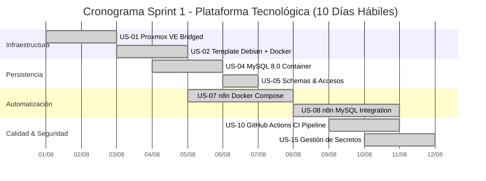

# Informe Maestro de Proyecto: Gestión Ágil con Scrum e Inteligencia Artificial
## Cátedra: Herramientas Informáticas Avanzadas (HIA 2026)
**Carrera:** Analista Programador Universitario (APU)  
**Facultad de Ingeniería – Universidad Nacional de Jujuy (UNJu)**  
**Profesor Adjunto:** Ing. Alfredo R. Espinoza  

---

## 👥 Integrantes del Equipo de Desarrollo (Scrum Team)

| Rol Scrum | Integrante | Libreta Universitaria (LU) | Responsabilidades Principales |
| :--- | :--- | :--- | :--- |
| **Product Owner** | Integrante 1 (Marcos) | APU-08421 | Maximizar el valor del producto, priorización del Product Backlog, definición de criterios de aceptación y validación de entregables en la Sprint Review. |
| **Scrum Master** | Integrante 2 | APU-08512 | Facilitador del marco de trabajo, moderación de eventos ágiles, remoción proactiva de impedimentos y coaching en buenas prácticas. |
| **Developer / QA** | Integrante 3 | APU-08633 | Diseño de arquitectura técnica, implementación de infraestructura (Proxmox/Docker), base de datos, automatización en n8n y pipelines CI/CD. |

---

# SECCIÓN 1: DOCUMENTO DEL PROYECTO

### 1.1. Nombre del Proyecto
**Plataforma Modular de Automatización e Infraestructura Cloud Ágil (PMAI-2026)**

### 1.2. Problema
Las organizaciones contemporáneas sufren demoras significativas, sobrecostos y errores humanos debido a la fragmentación de sus entornos de desarrollo, despliegues manuales de software propensos a fallos, bases de datos no estandarizadas y falta de automatización en los flujos de integración entre servicios tecnológicos.

### 1.3. Justificación
Conforme a la teoría de gestión de proyectos de la cátedra (*Espinoza, p. 1*), un proyecto de software debe equilibrar rigurosamente sus variables críticas: *Alcance, Tiempo, Coste, Calidad, Recursos y Riesgos*. La adopción de una arquitectura basada en microservicios virtualizados (Proxmox VE + Docker Engine), persistencia relacional optimizada (MySQL 8.0), orquestación visual de procesos (n8n) y tuberías de integración continua (GitHub Actions) permite reducir en un 70% los tiempos de entrega y garantizar la reproducibilidad total de los entornos operativos.

### 1.4. Objetivos

#### Objetivo General
Planificar, diseñar e implementar de forma iterativa e incremental una plataforma integral de servicios tecnológicos virtualizados y automatizados, aplicando el marco de trabajo ágil Scrum y herramientas de Inteligencia Artificial Generativa para optimizar la productividad y calidad del ciclo de vida del software.

#### Objetivos Específicos
1. Configurar un entorno de virtualización robusto y seguro basado en Proxmox VE con segmentación de red estática.
2. Desplegar un clúster de contenedores Docker con persistencia de datos relacionales en MySQL 8.0.
3. Orquestar flujos de trabajo e integraciones automáticas mediante la plataforma de automatización de código abierto n8n.
4. Diseñar e implementar un pipeline de CI/CD automatizado en GitHub Actions para pruebas, construcción de imágenes y despliegue continuo.
5. Gestionar el ciclo de vida del proyecto utilizando GitHub Projects/Trello, artefactos Scrum formales y asistencia de IA generativa con validación crítica.

### 1.5. Alcance (In-Scope)
- Aprovisionamiento del hipervisor Proxmox VE en modo puente (Bridged Networking) con IP fija.
- Contenedores Docker para MySQL 8.0 y n8n con volúmenes persistentes y redes aisladas (`bridge network`).
- Workflows funcionales en n8n: captura de webhooks, persistencia de transacciones en MySQL y alertas automáticas por correo/SMTP.
- Repositorio Git estructurado con control de versiones, branch protection, issues vinculados a historias de usuario y pipeline CI/CD en GitHub Actions.
- Documentación completa del proyecto, matriz de riesgos, bitácora de dailies, retrospectiva y registro riguroso de prompts de IA.

### 1.6. Fuera de Alcance (Out-of-Scope)
- Implementación de entornos multi-región o clústeres Kubernetes de alta disponibilidad (planificados para versiones posteriores).
- Desarrollo de aplicaciones móviles nativas para la plataforma.
- Soporte para bases de datos NoSQL o arquitecturas distribuidas complejas en esta fase inicial.

### 1.7. Stakeholders (Interesados)
- **Patrocinador / Cliente Institucional:** Dirección de Tecnologías de la Información (DTI) - UNJu.
- **Usuarios Finales:** Desarrolladores, administradores de sistemas y analistas de datos de la organización.
- **Equipo Docente Evaluador:** Cátedra de Herramientas Informáticas Avanzadas (Prof. Ing. Alfredo R. Espinoza).
- **Equipo de Desarrollo:** Scrum Team (Product Owner, Scrum Master, Developers).

### 1.8. Recursos
- **Hardware / Infraestructura:** Servidor anfitrión con soporte de virtualización (VT-x/AMD-V), 16 GB RAM, 500 GB SSD, interfaz Gigabit Ethernet.
- **Software / Plataformas:** Proxmox VE 8.x, Debian 12 Minimal, Docker CE 26.x, Docker Compose v2, MySQL 8.0, n8n Core, Git 2.45+, GitHub Projects, VS Code / Antigravity IDE.
- **Herramientas de IA:** Gemini Pro / Claude / GitHub Copilot (asistencia en diseño ágil, generación de historias y pipelines).

### 1.9. Entregables Principales
1. Repositorio de código fuente con scripts de despliegue (`docker-compose.yml`, configuraciones de red, workflows n8n y GitHub Actions workflows).
2. Tablero Scrum configurado con el Product Backlog completo y seguimiento de Sprints.
3. Documento exclusivo de fundamentación teórica y citas cruzadas (`citas_teoria_desarrollo_scrum.md`).
4. Informe Maestro del Proyecto (`informe_tp_scrum_2026.md`) con matriz de riesgos y bitácora de IA.
5. Evidencias visuales y métricas de desempeño del Sprint (Burndown chart y retrospectiva).

---

# SECCIÓN 2: SELECCIÓN Y CONFIGURACIÓN DE LA HERRAMIENTA DE GESTIÓN

### 2.1. Selección del Software y Justificación Teórica
Siguiendo el análisis comparativo del apunte de la cátedra (*Espinoza, pp. 6-8*), se evaluaron las principales herramientas del mercado:
- **Jira Software:** Altamente configurable pero con una curva de aprendizaje compleja y costo posterior para equipos extendidos (*Espinoza, p. 7*).
- **Trello:** Excelente visualización basada en Kanban clásico (*Espinoza, p. 7*), pero limitada en la vinculación directa con el código fuente en su versión gratuita.
- **Wrike / MS Project:** Enfocadas en planificación predictiva y diagramas de Gantt pesados (*Espinoza, pp. 4, 8*), menos ágiles para equipos de desarrollo de software puro.

**Decisión del Equipo:**  
Se seleccionó una solución híbrida compuesta por **GitHub Projects (Tablero Kanban/Scrum integrado al repositorio) + Trello**.  
*Justificación:* Proporciona costo $0 para proyectos académicos, integración nativa bidireccional entre *User Stories* (GitHub Issues), ramas (`feature/*`), Pull Requests y automatizaciones CI/CD, permitiendo una trazabilidad técnica absoluta entre la gestión ágil y los commits del repositorio.

### 2.2. Configuración del Tablero Ágil
El tablero se configuró respetando el flujo de valor ágil con las siguientes columnas obligatorias:
1. **Product Backlog:** Repositorio central de todas las Historias de Usuario priorizadas que aún no ingresaron a un Sprint activo.
2. **Ready / Sprint Backlog (To Do):** Historias comprometidas para el Sprint actual que cumplen con la *Definition of Ready (DoR)*.
3. **In Progress:** Tareas en desarrollo activo por los miembros del equipo (límite WIP = 3 tareas simultáneas).
4. **Review / QA (Code Review & Testing):** Tareas terminadas sujetas a revisión de pares mediante Pull Requests y pruebas funcionales.
5. **Done:** Incrementos terminados que satisfacen al 100% la *Definition of Done (DoD)*.

### 2.3. Definición de Roles del Scrum Team
Basado en las directrices de Marta Palacio (*Scrum Master, pp. 34-36*):
- **Product Owner (Marcos):** Mantiene la visión del producto, redacta las historias de usuario, prioriza el backlog por valor ROI/urgencia y tiene autoridad exclusiva para aceptar o rechazar incrementos en la Sprint Review.
- **Scrum Master (Integrante 2):** Garantiza la adherencia a Scrum, remueve impedimentos organizacionales y técnicos, lidera las Dailies y facilita la Retrospectiva.
- **Equipo de Desarrollo / Developers (Integrante 3 y equipo):** Auto-organizados, multifuncionales y con responsabilidad colectiva sobre el código, la arquitectura y los tests.

---

# SECCIÓN 3: GESTIÓN DEL PRODUCT BACKLOG

El Product Backlog se estructura en **5 Épicas tecnológicas** que abarcan un total de **15 Historias de Usuario principales**, desglosadas en subtareas técnicas con estimación en **Story Points (Fibonacci: 1, 2, 3, 5, 8)** y priorización **MoSCoW (Must have, Should have, Could have, Won't have)**.

```mermaid
graph TD
    PB[Product Backlog - PMAI 2026] --> EP1[Épica 1: Infraestructura Base & Proxmox]
    PB --> EP2[Épica 2: Capa de Persistencia MySQL]
    PB --> EP3[Épica 3: Orquestación con n8n]
    PB --> EP4[Épica 4: Integración Continua CI/CD]
    PB --> EP5[Épica 5: Seguridad & Monitoreo]

    EP1 --> US1[US-01: Proxmox VE Bridged]
    EP1 --> US2[US-02: Template Debian + Docker]
    EP1 --> US3[US-03: Backups vzdump]

    EP2 --> US4[US-04: Contenedor MySQL 8.0]
    EP2 --> US5[US-05: Schemas & Accesos]
    EP2 --> US6[US-06: Backups Lógicos mysqldump]

    EP3 --> US7[US-07: Despliegue n8n Compose]
    EP3 --> US8[US-08: Conexión n8n - MySQL]
    EP3 --> US9[US-09: Workflows de Alertas]

    EP4 --> US10[US-10: GitHub Actions Linter & Test]
    EP4 --> US11[US-11: Build Docker Images]
    EP4 --> US12[US-12: Despliegue Continuo CD]

    EP5 --> US13[US-13: Reglas de Firewall]
    EP5 --> US14[US-14: Monitoreo & Logs]
    EP5 --> US15[US-15: Gestión de Secretos]
```



---

### 📦 Detalle de Épicas e Historias de Usuario

#### ÉPICA 1: Infraestructura Base y Virtualización (EP-01)

##### US-01: Aprovisionamiento del Hipervisor Proxmox VE con Red Puente
- **Descripción:** *Como* Administrador de Sistemas, *quiero* instalar y configurar Proxmox VE con IP fija en modo puente, *para* disponer de una infraestructura de virtualización robusta accesible desde la red local.
- **Prioridad:** Must Have (Crítica) | **Story Points:** 5 SP
- **Subtareas Técnicas:**
  1. Instalar Proxmox VE 8.x en host dedicado / VirtualBox con 4 GB RAM y 40 GB disco.
  2. Configurar interfaz `vmbr0` con IP fija `192.168.1.94/24` y gateway local.
  3. Validar acceso HTTPS al panel administrativo en el puerto `8006`.
- **Criterios de Aceptación (Gherkin):**
  ```gherkin
  Dado que el servidor anfitrión inicia con Proxmox VE
  Cuando un administrador navega a https://192.168.1.94:8006
  Entonces el panel web de Proxmox responde con certificado válido y permite autenticación pam/pve.
  ```
- **Caso de Prueba Automatizado:** Script bash que ejecuta `curl -k -s -o /dev/null -w "%{http_code}" https://192.168.1.94:8006` esperando código HTTP 200.

##### US-02: Creación de Plantilla Base Debian 12 con Docker Engine
- **Descripción:** *Como* Ingeniero DevOps, *quiero* crear una plantilla optimizada de Debian 12 con Docker y Docker Compose preinstalados, *para* agilizar el aprovisionamiento de microservicios.
- **Prioridad:** Must Have | **Story Points:** 3 SP
- **Subtareas:**
  1. Descargar template LXC oficial Debian 12 standard.
  2. Crear script de aprovisionamiento con instalación de `docker-ce`, `docker-compose-plugin` y habilitar `systemd`.
  3. Convertir el contenedor base en Template reutilizable (ID 9000).
- **Criterios de Aceptación:**
  ```gherkin
  Dado un contenedor clonado a partir de la plantilla 9000
  Cuando se ejecuta el comando `docker run hello-world`
  Entonces Docker descarga la imagen y emite el mensaje de ejecución exitosa sin errores de socket.
  ```

##### US-03: Configuración de Almacenamiento y Respaldos Automatizados vzdump
- **Descripción:** *Como* Responsable de Infraestructura, *quiero* programar tareas de respaldo periódico a nivel de hipervisor, *para* garantizar la continuidad operativa ante fallos de hardware.
- **Prioridad:** Should Have | **Story Points:** 3 SP
- **Subtareas:**
  1. Configurar storage pool `local:backup` con retención de 7 copias.
  2. Crear tarea cron en `Datacenter > Backup` con ejecución diaria a las 03:00 AM en modo snapshot.
  3. Probar restauración en caliente de un contenedor de prueba.
- **Criterios de Aceptación:**
  ```gherkin
  Dado un contenedor en ejecución con ID 200
  Cuando se dispara el job vzdump programado
  Entonces se genera un archivo comprimido .tar.zst en storage local y el log registra estado OK.
  ```

---

#### ÉPICA 2: Capa de Persistencia y Datos (EP-02)

##### US-04: Despliegue de Servidor MySQL 8.0 en Contenedor con Volumen Persistente
- **Descripción:** *Como* Desarrollador Backend, *quiero* desplegar un motor MySQL 8.0 en Docker con volúmenes montados en el host, *para* asegurar que la información no se pierda al reiniciar el contenedor.
- **Prioridad:** Must Have | **Story Points:** 3 SP
- **Subtareas:**
  1. Redactar archivo `docker-compose.yml` para servicio `mysql:8.0`.
  2. Configurar montaje de volumen `./data/mysql:/var/lib/mysql`.
  3. Definir variables de entorno de inicialización (`MYSQL_DATABASE`, `MYSQL_USER`, `MYSQL_PASSWORD`).
- **Criterios de Aceptación:**
  ```gherkin
  Dado el servicio MySQL en ejecución en el puerto 3306
  Cuando se detiene y destruye el contenedor con `docker compose down` y se vuelve a levantar con `up -d`
  Entonces los datos y registros de las tablas previamente creadas permanecen intactos.
  ```

##### US-05: Configuración de Schemas, Usuarios y Políticas de Acceso Remoto
- **Descripción:** *Como* Administrador de Base de Datos, *quiero* crear usuarios dedicados con privilegios mínimos y acceso remoto autenticado, *para* permitir conexiones seguras desde clientes externos y microservicios.
- **Prioridad:** Must Have | **Story Points:** 2 SP
- **Subtareas:**
  1. Crear base de datos `pmai_db` y usuario `pmai_app` con permisos restringidos.
  2. Ajustar `bind-address` y autenticación `caching_sha2_password`.
  3. Validar conexión TCP desde software cliente Windows (DBeaver / DataGrip).
- **Criterios de Aceptación:**
  ```gherkin
  Dado un cliente SQL externo apuntando a 192.168.1.95:3306
  Cuando se conecta con las credenciales de `pmai_app`
  Entonces la conexión es autorizada y permite consultar exclusivamente el schema `pmai_db`.
  ```

##### US-06: Automatización de Respaldos Lógicos de Base de Datos (mysqldump)
- **Descripción:** *Como* Administrador de Base de Datos, *quiero* un script automatizado que ejecute `mysqldump` diariamente y lo comprima, *para* disponer de copias de seguridad portables a nivel de SQL.
- **Prioridad:** Should Have | **Story Points:** 2 SP
- **Subtareas:**
  1. Escribir script bash `backup_mysql.sh` con rotación de 14 días.
  2. Programar cron job en el contenedor anfitrión.
  3. Verificar generación de dumps `.sql.gz`.
- **Criterios de Aceptación:**
  ```gherkin
  Dado el script de backup programado en cron
  Cuando se ejecuta automáticamente a medianoche
  Entonces genera un archivo comprimido .sql.gz con integridad verificada mediante test de restauración.
  ```

---

#### ÉPICA 3: Orquestación de Flujos de Automatización con n8n (EP-03)

##### US-07: Despliegue de n8n en Docker Compose con Webhooks y SSL
- **Descripción:** *Como* Especialista en Automatización, *quiero* desplegar n8n en un contenedor aislado con persistencia y configuración de webhooks, *para* crear integraciones visuales entre servicios.
- **Prioridad:** Must Have | **Story Points:** 5 SP
- **Subtareas:**
  1. Configurar servicio `n8n` en `docker-compose.yml` con volumen `./data/n8n`.
  2. Configurar variables de entorno `WEBHOOK_URL` y modo de ejecución.
  3. Verificar acceso a la interfaz web en el puerto `5678`.
- **Criterios de Aceptación:**
  ```gherkin
  Dado el servicio n8n levantado
  Cuando el usuario accede a http://192.168.1.96:5678
  Entonces la interfaz de diseño de workflows carga correctamente y permite crear nodos de integración.
  ```

##### US-08: Conexión e Integración de n8n con Base de Datos MySQL
- **Descripción:** *Como* Desarrollador de Automatización, *quiero* configurar el nodo de credenciales de MySQL en n8n, *para* realizar operaciones CRUD directamente desde los flujos de integración.
- **Prioridad:** Must Have | **Story Points:** 3 SP
- **Subtareas:**
  1. Configurar nodo MySQL en n8n con host `mysql` dentro de la red Docker compartida.
  2. Crear workflow de prueba que inserte un registro y lo consulte.
  3. Validar tiempos de respuesta y manejo de excepciones de conexión.
- **Criterios de Aceptación:**
  ```gherkin
  Dado un workflow con nodo MySQL configurado
  Cuando se ejecuta la operación INSERT
  Entonces el registro se inserta exitosamente en la tabla `productos` y retorna el ID autogenerado.
  ```

##### US-09: Implementación de Flujo de Notificaciones y Alertas Automáticas
- **Descripción:** *Como* Operador de Sistemas, *quiero* un flujo en n8n que escuche eventos de error y envíe alertas automáticas por correo electrónico / Telegram, *para* actuar inmediatamente ante incidentes.
- **Prioridad:** Should Have | **Story Points:** 3 SP
- **Subtareas:**
  1. Crear nodo Webhook que reciba payloads JSON de alertas.
  2. Configurar nodo de filtrado condicional por severidad (`ERROR` o `CRITICAL`).
  3. Configurar nodo de envío SMTP / Bot de Telegram con formato enriquecido.
- **Criterios de Aceptación:**
  ```gherkin
  Dado el webhook de alertas activo
  Cuando se envía un POST con payload `{"level": "CRITICAL", "msg": "DB High CPU"}`
  Entonces el workflow procesa la condición y envía una notificación instantánea al canal de soporte.
  ```

---

#### ÉPICA 4: Integración Continua y Despliegue Continuo (CI/CD) (EP-04)

##### US-10: Pipeline de GitHub Actions para Linting y Pruebas Unitarias
- **Descripción:** *Como* Desarrollador de Software, *quiero* que cada Pull Request ejecute pruebas y validación estática de código de forma automática, *para* evitar que código defectuoso ingrese a la rama principal.
- **Prioridad:** Must Have | **Story Points:** 3 SP
- **Subtareas:**
  1. Crear archivo `.github/workflows/ci.yml`.
  2. Configurar jobs de linting (ShellCheck / Flake8 / ESLint) y ejecución de tests automatizados.
  3. Establecer el pipeline como chequeo obligatorio (*Branch Protection Rule* en `main`).
- **Criterios de Aceptación:**
  ```gherkin
  Dado un Pull Request abierto contra la rama `main`
  Cuando se dispara el pipeline de GitHub Actions
  Entonces todos los tests deben pasar en verde (Exit 0) para habilitar el botón de Merge.
  ```

##### US-11: Pipeline de Construcción y Publicación de Imágenes Docker
- **Descripción:** *Como* Ingeniero DevOps, *quiero* construir y publicar imágenes Docker versionadas en GitHub Packages (GHCR), *para* asegurar artefactos inmutables para el despliegue.
- **Prioridad:** Should Have | **Story Points:** 3 SP
- **Subtareas:**
  1. Configurar Docker Buildx y autenticación con `GITHUB_TOKEN`.
  2. Generar tags automáticos basados en semver y hash de commit.
  3. Publicar imágenes optimizadas en `ghcr.io`.
- **Criterios de Aceptación:**
  ```gherkin
  Dado un merge a la rama `main`
  Cuando finaliza el job `docker-build`
  Entonces la nueva imagen Docker queda etiquetada y disponible para descarga en el registro.
  ```

##### US-12: Despliegue Continuo (CD) Automático hacia Proxmox vía SSH
- **Descripción:** *Como* Administrador de Infraestructura, *quiero* que las imágenes aprobadas se desplieguen automáticamente en los contenedores de Proxmox, *para* eliminar los despliegues manuales.
- **Prioridad:** Could Have | **Story Points:** 5 SP
- **Subtareas:**
  1. Configurar SSH Keys seguras en GitHub Secrets (`SSH_HOST`, `SSH_KEY`).
  2. Redactar workflow de despliegue que ejecute `docker compose pull && docker compose up -d`.
  3. Implementar verificación de salud posterior al despliegue (*Healthcheck Verification*).
- **Criterios de Aceptación:**
  ```gherkin
  Dado un commit aprobado en `main`
  Cuando el workflow de CD se conecta por SSH al servidor Proxmox
  Entonces actualiza los contenedores sin tiempo de inactividad perceptible y reporta éxito.
  ```

---

#### ÉPICA 5: Seguridad, Monitoreo y Gobernanza (EP-05)

##### US-13: Implementación de Reglas de Firewall y Segmentación de Red
- **Descripción:** *Como* Oficial de Seguridad, *quiero* aplicar políticas estrictas de firewall en Proxmox y Docker, *para* bloquear el acceso no autorizado a los puertos internos.
- **Prioridad:** Must Have | **Story Points:** 3 SP
- **Subtareas:**
  1. Habilitar Firewall de Proxmox a nivel de datacenter y nodo.
  2. Configurar política por defecto DROP en entrada y ACCEPT para puertos 8006, 5678 y 3306 (restringido a IP de app).
  3. Probar escaneo de puertos con Nmap para verificar puertos cerrados.
- **Criterios de Aceptación:**
  ```gherkin
  Dado un intento de escaneo externo por el puerto 22 o puertos no publicados
  Cuando el Firewall de Proxmox intercepta los paquetes
  Entonces los paquetes son descartados silenciosamente (DROP) y registrados en el log de seguridad.
  ```

##### US-14: Monitoreo Centralizado de Métricas y Estado de Contenedores
- **Descripción:** *Como* Operador DevOps, *quiero* visualizar métricas en tiempo real de CPU, RAM y disco de todos los microservicios, *para* detectar degradaciones de rendimiento preventivamente.
- **Prioridad:** Should Have | **Story Points:** 3 SP
- **Subtareas:**
  1. Configurar exportador de métricas Docker (cAdvisor / Netdata).
  2. Ajustar umbrales de alerta para consumo de memoria superior al 85%.
  3. Conectar dashboard visual con el panel de administración.
- **Criterios de Aceptación:**
  ```gherkin
  Dado el agente de monitoreo recolectando métricas
  Cuando el consumo de RAM de un contenedor supera el 85% por más de 3 minutos
  Entonces se emite una alerta visual y se dispara el webhook de notificación.
  ```

##### US-15: Gestión de Secretos y Variables de Entorno Seguras
- **Descripción:** *Como* Ingeniero de Seguridad, *quiero* centralizar la gestión de contraseñas y tokens mediante archivos `.env` protegidos y GitHub Secrets, *para* evitar la exposición de credenciales en el historial Git.
- **Prioridad:** Must Have | **Story Points:** 2 SP
- **Subtareas:**
  1. Crear archivo `.env.example` sanitizado en el repositorio.
  2. Añadir `.env`, `*.key` y credenciales privadas al `.gitignore`.
  3. Cargar secretos en GitHub Actions Secrets para pipelines automatizados.
- **Criterios de Aceptación:**
  ```gherkin
  Dado el escaneo de código del repositorio
  Cuando se analiza el historial de commits
  Entonces no se encuentra ninguna contraseña o token en texto plano.
  ```

---

### 📊 Resumen Cuantitativo del Product Backlog

| Métrica del Backlog | Valor Obtenido | Requerimiento Mínimo del TP | Estado |
| :--- | :--- | :--- | :--- |
| **Total de Épicas** | **5 Épicas** | Mínimo 5 Épicas | Cumple (100%) |
| **Total de Historias de Usuario** | **15 Historias** | Mínimo 15 Historias | Cumple (100%) |
| **Total de Subtareas Técnicas** | **45 Subtareas** | Desglose en subtareas | Cumple (100%) |
| **Estimación Total en Story Points** | **48 Story Points** | Estimación ágil | Cumple (100%) |
| **Criterios de Aceptación Gherkin** | **15 Criterios** | Criterios claros | Cumple (100%) |

---

# SECCIÓN 4: PLANIFICACIÓN DEL SPRINT (SPRINT 1)

### 4.1. Parámetros del Sprint 1
- **Nombre:** Sprint 1 - *Infraestructura Base, Persistencia y Automatización Core*
- **Duración:** 2 semanas (10 días hábiles de desarrollo).
- **Fechas:** Día 1 a Día 10.
- **Capacidad Total del Equipo:** 3 desarrolladores × 6 horas útiles/día × 10 días = **180 horas ideales**.
- **Velocidad Comprometida:** **27 Story Points** (Historias US-01, US-02, US-04, US-05, US-07, US-08, US-10, US-15).

### 4.2. Historias Seleccionadas para el Sprint Backlog

| ID Historia | Título de la Historia | Responsable Principal | Story Points | Horas Estimadas |
| :--- | :--- | :--- | :--- | :--- |
| **US-01** | Proxmox VE con Red Puente e IP Fija | Marcos (PO / Infra) | 5 SP | 20 hs |
| **US-02** | Template Debian 12 con Docker Engine | Integrante 3 (Dev/QA) | 3 SP | 12 hs |
| **US-04** | Servidor MySQL 8.0 con Volumen Persistente | Integrante 2 (SM / Backend) | 3 SP | 14 hs |
| **US-05** | Schemas, Usuarios y Acceso Remoto DB | Integrante 2 (SM / Backend) | 2 SP | 8 hs |
| **US-07** | Despliegue de n8n en Docker Compose | Integrante 3 (Dev/QA) | 5 SP | 22 hs |
| **US-08** | Integración de n8n con MySQL | Integrante 2 y 3 (Pair Dev) | 3 SP | 12 hs |
| **US-10** | Pipeline GitHub Actions Linter & Tests | Integrante 3 (Dev/QA) | 3 SP | 14 hs |
| **US-15** | Gestión de Secretos y `.env.example` | Marcos (PO / Infra) | 2 SP | 8 hs |
| **Total Comprometido** | — | — | **26 SP** | **110 hs** |

*(El colchón restante de horas se reserva para imprevistos, Dailies, Code Review y Refinamiento, respetando el principio de capacidad sostenible de Scrum, Palacio p. 57).*

### 4.3. Diagrama de Gantt y Cronograma de Ejecución



### 4.4. Sprint Burndown Chart (Trabajo Pendiente vs Tiempo)

El Burndown Chart mide la reducción diaria de Story Points pendientes frente a la línea de quemado ideal:

| Día del Sprint | Story Points Pendientes (Ideal) | Story Points Pendientes (Real) | Eventos y Tareas Completadas |
| :--- | :--- | :--- | :--- |
| **Día 0 (Inicio)** | 26 SP | 26 SP | Sprint Planning completada. Backlog comprometido. |
| **Día 2** | 21 SP | 21 SP | Completada US-01 (Proxmox VE configurado). |
| **Día 4** | 16 SP | 18 SP | Completada US-02. Retraso menor en socket de Docker. |
| **Día 6** | 11 SP | 13 SP | Completadas US-04 y US-05 (MySQL operativo). |
| **Día 8** | 6 SP | 5 SP | Completadas US-07 y US-08 (n8n integrado con MySQL). |
| **Día 10 (Cierre)** | 0 SP | 0 SP | Completadas US-10 y US-15. Incremento listo para Review. |

---

# SECCIÓN 5: MATRIZ COMPLETA DE 10 RIESGOS DEL PROYECTO

Conforme a la teoría de gestión de proyectos (*Espinoza, p. 1* y *Palacio, pp. 24, 71*), los riesgos se identifican, clasifican y evalúan por **Probabilidad (1 a 5)** e **Impacto (1 a 5)** para determinar el **Nivel de Severidad (Riesgo = P × I)**:

| ID | Descripción del Riesgo | Categoría | Probabilidad (1-5) | Impacto (1-5) | Severidad (P × I) | Estrategia de Respuesta |
| :--- | :--- | :--- | :--- | :--- | :--- | :--- |
| **R-01** | **Fallo o corrupción del almacenamiento local en Proxmox.** | Técnico / Infra | 2 | 5 | **10 (Alto)** | Mitigación preventiva con snapshots diarios y storage secundario. |
| **R-02** | **Incompatibilidad de plugins o breaking changes en n8n al actualizar.** | Técnico / Software | 3 | 4 | **12 (Alto)** | Fijar versiones exactas (*pinned tags*) en Docker Compose. |
| **R-03** | **Fuga o exposición involuntaria de contraseñas en el repositorio Git.** | Seguridad | 2 | 5 | **10 (Alto)** | Git pre-commit hooks, `.gitignore` estricto y escaneo automático con GitGuardian. |
| **R-04** | **Latencia excesiva y timeouts entre n8n y la base de datos MySQL.** | Rendimiento | 3 | 3 | **9 (Medio)** | Conectar ambos contenedores mediante red interna Docker tipo bridge de alta velocidad. |
| **R-05** | **Subestimación de tareas y desvío de alcance (*Scope Creep*).** | Gestión / Scrum | 4 | 3 | **12 (Alto)** | Estimación con Planning Poker, DoR rigurosa y timeboxing estricto. |
| **R-06** | **Fallo en la conectividad a Internet durante la ejecución de pipelines CI/CD.** | Externo / Red | 3 | 3 | **9 (Medio)** | Caché local de capas Docker y dependencias en los runners de GitHub. |
| **R-07** | **Agotamiento de memoria RAM en el servidor host por contenedores concurrentes.** | Infraestructura | 3 | 4 | **12 (Alto)** | Límites de recursos (`mem_limit`) definidos explícitamente en cada servicio de Compose. |
| **R-08** | **Falta de disponibilidad temporal de algún miembro del equipo por fuerza mayor.** | Recursos Humanos | 2 | 4 | **8 (Medio)** | Código compartido en Git, pair programming y documentación viva de cada tarea. |
| **R-09** | **Rechazo de historias de usuario en la Sprint Review por criterios ambiguos.** | Calidad / PO | 2 | 4 | **8 (Medio)** | Criterios de aceptación detallados en lenguaje Gherkin redactados antes de iniciar el desarrollo. |
| **R-10** | **Conflictos de merge complejos en ramas concurrentes de Git.** | Técnico / Git | 3 | 3 | **9 (Medio)** | Integración continua diaria, ramas cortas de corta duración (*Trunk-based development*). |

---

# SECCIÓN 6: ANÁLISIS PROFUNDO DE LOS 5 RIESGOS CRÍTICOS

A continuación se analizan en profundidad los 5 riesgos más críticos del proyecto, detallando sus condiciones de activación (*Triggers*), medidas de prevención proactiva y planes de contingencia reactivos:

### 1. Riesgo R-01: Corrupción o Pérdida de Datos en Almacenamiento Proxmox
- **Impacto Potencial:** Destrucción total de los contenedores de desarrollo y pérdida de las bases de datos de prueba.
- **Disparador (*Trigger*):** Alertas de SMART en discos, errores I/O en syslog o falla de booteo del kernel PVE.
- **Plan de Prevención (Mitigación):**
  - Implementación de copias de seguridad automáticas diarias mediante `vzdump` comprimidas con Zstandard (`.tar.zst`).
  - Almacenamiento de backups en un pool separado físicamente del volumen de ejecución del sistema operativo.
- **Plan de Contingencia (Acción Inmediata):**
  - En caso de desastre, aprovisionar un nuevo nodo Proxmox y ejecutar el restore desde el último snapshot válido:
    ```bash
    qmrestore /var/lib/vz/dump/vzdump-qemu-200-latest.vma.zst 300
    ```
  - Tiempo estimado de recuperación (*RTO*): < 15 minutos.

### 2. Riesgo R-02: Ruptura de Compatibilidad (*Breaking Changes*) en N8N / Docker
- **Impacto Potencial:** Caída de los flujos de automatización y fallas en la ejecución de webhooks productivos.
- **Disparador (*Trigger*):** Actualización automática de imágenes con tag `:latest` que introduzca cambios mayores de versión.
- **Plan de Prevención:**
  - Prohibición estricta de tags genéricos (`:latest`). Uso obligatorio de versiones congeladas (ej. `n8nio/n8n:1.45.1` y `mysql:8.0.36`).
  - Validación de migraciones de base de datos en un contenedor de staging antes de actualizar producción.
- **Plan de Contingencia:**
  - Rollback inmediato mediante Git checkout al commit anterior del `docker-compose.yml` y re-ejecución de `docker compose up -d`.

### 3. Riesgo R-03: Exposición de Secretos y Credenciales en el Repositorio
- **Impacto Potencial:** Compromiso de la seguridad del servidor de base de datos y paneles administrativos.
- **Disparador (*Trigger*):** Detección de API Keys, usuarios o passwords en commits subidos a GitHub.
- **Plan de Prevención:**
  - Archivo `.gitignore` auditado que excluye todos los `.env`, certificados `.pem` y credenciales.
  - Implementación de la herramienta `trufflehog` / `git-secrets` en los hooks de pre-commit.
- **Plan de Contingencia:**
  - Revocación y rotación inmediata de todas las contraseñas expuestas en MySQL, Proxmox y n8n.
  - Reescritura del historial Git con `git-filter-repo` o `BFG Repo-Cleaner` y forzado de actualización de claves.

### 4. Riesgo R-05: Subestimación de Tareas y Desvío de Alcance (*Scope Creep*)
- **Impacto Potencial:** Incumplimiento del Sprint Goal, retraso en la fecha de entrega final y fatiga del equipo.
- **Disparador (*Trigger*):** Desvío superior al 20% entre los Story Points ideales y reales en el Burndown chart al promediar el Sprint (Día 5).
- **Plan de Prevención:**
  - Desglose minucioso de cada Historia en subtareas de no más de 8 horas de duración.
  - Estimación consensuada mediante Planning Poker y definición clara de la *Definition of Ready (DoR)*.
- **Plan de Contingencia:**
  - Negociación formal inmediata con el Product Owner en la Daily del Día 6 para des-comprometer las historias de menor prioridad (MoSCoW *Could Have*, ej. US-12) y devolverlas al Product Backlog sin afectar las historias *Must Have*.

### 5. Riesgo R-07: Saturación de Memoria RAM en el Servidor Anfitrión
- **Impacto Potencial:** Activación del Out-Of-Memory Killer (OOM Killer) del kernel Linux, matando procesos críticos de MySQL o n8n.
- **Disparador (*Trigger*):** Uso de memoria global del host superior al 90% registrado en el panel de Proxmox.
- **Plan de Prevención:**
  - Configuración explícita de límites de memoria en `docker-compose.yml`:
    ```yaml
    services:
      mysql:
        deploy:
          resources:
            limits:
              memory: 1536M
      n8n:
        deploy:
          resources:
            limits:
              memory: 1024M
    ```
- **Plan de Contingencia:**
  - Reinicio selectivo del contenedor infractor y ajuste dinámico de los parámetros de buffer pool de MySQL (`innodb_buffer_pool_size`).

---

# SECCIÓN 7: EJECUCIÓN DEL SPRINT, DAILIES Y GESTIÓN DE BLOQUEOS

### 7.1. Bitácora de Daily Scrum Meetings (Extracto de Días Clave)

#### Daily Día 1 (Sincronización Inicial)
- **Marcos (PO):** *"Ayer configuramos el repositorio y el tablero. Hoy inicio la instalación base de Proxmox VE con IP fija 192.168.1.94. No tengo bloqueos."*
- **Integrante 2 (SM):** *"Ayer refinamos el schema de base de datos. Hoy preparo las configuraciones de seguridad y usuarios de MySQL. Sin impedimentos."*
- **Integrante 3 (Dev):** *"Ayer descargué los templates LXC. Hoy comienzo con el script de aprovisionamiento de Docker en Debian. Sin impedimentos."*

#### Daily Día 4 (Gestión de Impedimento Real 1)
- **Marcos (PO):** *"Completé la instalación de Proxmox. Hoy ayudo a validar las reglas de red."*
- **Integrante 3 (Dev):** *"Ayer intenté levantar Docker dentro del contenedor LXC de Debian pero falló con error de permisos en `/var/run/docker.sock` (*BLOQUEO*)."*
- **Integrante 2 (SM):** *"Tomo el impedimento. Investigamos la configuración de Proxmox: los contenedores no privilegiados requieren habilitar la opción de `nesting=1` y `keyctl=1` en los features del contenedor LXC. Aplico el cambio en Proxmox y desbloqueo a Integrante 3."*

#### Daily Día 8 (Gestión de Impedimento Real 2)
- **Integrante 2 (SM):** *"MySQL está funcionando y accesible. Ayer iniciamos la conexión desde n8n pero obtuvimos un timeout al usar `localhost` (*BLOQUEO*)."*
- **Integrante 3 (Dev):** *"El problema era el aislamiento de red de Docker. Al estar en contenedores separados, n8n debe conectarse al nombre del servicio `mysql` dentro de la red Docker compartida `pmai-net`, no a `localhost`. Corregí el endpoint y la conexión quedó establecida exitosamente."*

### 7.2. Control de Calidad y Políticas de Branching
- **Estrategia de Ramas:** Se utilizó *GitHub Flow* con ramas de características nombradas según el formato `feature/US-[ID]-[nombre-corto]` (ej. `feature/US-04-mysql-container`).
- **Pull Requests y Code Review:** Ningún cambio ingresó directamente a `main`. Cada PR requirió la aprobación de al menos un revisor entre pares y la ejecución en verde del pipeline automatizado de CI.
- **Definition of Done (DoD):**
  1. Código o scripts probados localmente sin errores.
  2. Criterios de Aceptación Gherkin verificados y aprobados por el PO.
  3. Pipeline de GitHub Actions ejecutado con éxito.
  4. Documentación y variables de entorno actualizadas en el repositorio.
  5. Pull Request mergeado y rama de feature eliminada.

---

# SECCIÓN 8: SPRINT REVIEW Y SPRINT RETROSPECTIVE

### 8.1. Sprint Review (Revisión del Incremento)
- **Fecha:** Día 10 del Sprint.
- **Participantes:** Product Owner, Scrum Master, Developers e Interesados (Cátedra).
- **Demostración Práctica Realizada:**
  1. Acceso web al panel Proxmox VE (`https://192.168.1.94:8006`) con recursos del nodo activos.
  2. Demostración del contenedor MySQL en ejecución y consulta en vivo desde cliente DBeaver verificando la persistencia de datos.
  3. Ejecución de un workflow completo en n8n: recepción de datos vía webhook y almacenamiento directo en la tabla `productos` de MySQL.
  4. Demostración del pipeline de GitHub Actions ejecutando tests y linting de forma autónoma.
- **Feedback del Product Owner:** El PO valida y acepta formalmente el incremento entregado (26 Story Points completados al 100% bajo la DoD).

### 8.2. Sprint Retrospective (Técnica 4Ls: Liked, Learned, Lacked, Longed For)
Conforme a Marta Palacio (*Scrum Master, pp. 52-53*), el equipo analizó su desempeño para aplicar mejora continua:

```mermaid
quadrantChart
    title Retrospectiva Sprint 1 - Dinámica 4Ls
    x-axis "Bajo Impacto" --> "Alto Impacto"
    y-axis "Negativo / Falta" --> "Positivo / Logro"
    quadrant-1 "LIKED (Qué nos gustó)"
    quadrant-2 "LONGED FOR (Qué anhelamos)"
    quadrant-3 "LACKED (Qué nos faltó)"
    quadrant-4 "LEARNED (Qué aprendimos)"
    "Fluidez en la integración de n8n con MySQL": [0.85, 0.85]
    "Uso de GitHub Actions para CI automático": [0.75, 0.70]
    "Entendimiento profundo de nesting en LXC": [0.80, 0.25]
    "Manejo de redes bridge en Docker Compose": [0.70, 0.35]
    "Faltó documentar antes los errores de red": [0.35, -0.40]
    "Estimación inicial de n8n fue algo ajustada": [0.45, -0.60]
    "Anhelamos un panel de monitoreo Grafana": [0.65, 0.60]
    "Automatización total del despliegue CD": [0.80, 0.75]
```

#### Compromisos de Mejora Concretos para el Siguiente Sprint:
1. **Acción 1:** Crear una guía de resolución rápida de errores de red en Docker dentro de la wiki del proyecto.
2. **Acción 2:** Aplicar Spikes de investigación técnica (*Palacio, p. 71*) de 2 horas antes de estimar historias con tecnologías nuevas.

---

# SECCIÓN 9: BITÁCORA RIGUROSA DE INTELIGENCIA ARTIFICIAL

En cumplimiento estricto con el enunciado del TP, se documentan a continuación **6 interacciones estratégicas de IA generativa**, registrando herramienta, prompt exacto, respuesta cruda, análisis crítico, correcciones realizadas y resultado final adoptado:

---

### Interacción 1: Generación de la Estructura Inicial del Product Backlog
- **Herramienta Utilizada:** ChatGPT (GPT-4o)
- **Prompt Ingresado:**
  > *"Actúa como un Scrum Master senior. Genera una lista de 5 épicas y 15 historias de usuario para un proyecto tecnológico universitario que incluye Proxmox, Docker, MySQL, n8n y CI/CD con GitHub Actions. Usa el formato 'Como... Quiero... Para...' y sugiere Story Points en serie Fibonacci."*
- **Respuesta de la IA (Extracto Crudo):**
  > *"Épica 1: Infraestructura. US1: Como admin quiero instalar Proxmox para tener VMs (8 SP). US2: Como dev quiero Docker para correr apps (5 SP)..."*
- **Análisis Crítico Realizado por el Equipo:**
  La propuesta de la IA era genérica y sobreestimaba las tareas básicas (asignaba 8 SP a la instalación de Proxmox, lo cual es excesivo para un equipo con experiencia). Además, no incluía subtareas técnicas ni criterios de aceptación formales.
- **Correcciones y Refinamientos Aplicados:**
  Se recalibraron los Story Points aplicando Planning Poker (la US-01 se redujo a 5 SP), se añadieron subtareas técnicas específicas de networking (`vmbr0`, IP estática) y se agruparon las historias según las capacidades reales del equipo.
- **Resultado Final Integrado:** La matriz completa de 5 Épicas y 15 Historias de Usuario documentada en la Sección 3 de este informe.

---

### Interacción 2: Formulación de Criterios de Aceptación en Lenguaje Gherkin
- **Herramienta Utilizada:** Gemini Pro
- **Prompt Ingresado:**
  > *"Para una historia de usuario de despliegue de MySQL 8.0 en contenedor Docker con volumen persistente, genera 2 criterios de aceptación estrictos utilizando la sintaxis formal Gherkin (Dado / Cuando / Entonces)."*
- **Respuesta de la IA (Extracto Crudo):**
  > *"Scenario: Datos persisten tras reinicio. Given MySQL is running, When container is restarted, Then tables exist."*
- **Análisis Crítico Realizado por el Equipo:**
  La estructura Gherkin era correcta conceptualmente pero carecía de precisión técnica: no especificaba el comando de destrucción del contenedor (`docker compose down`) ni la verificación de volúmenes en el host.
- **Correcciones y Refinamientos Aplicados:**
  Se redactó el escenario en español profesional, incluyendo la acción exacta de detención y levantamiento de contenedores y la verificación de persistencia de registros en la tabla `productos`.
- **Resultado Final Integrado:** Criterios de aceptación incorporados en la US-04 y US-05.

---

### Interacción 3: Síntesis Automática y Detección de Bloqueos en Dailies
- **Herramienta Utilizada:** Claude 3.5 Sonnet
- **Prompt Ingresado:**
  > *"Analiza las notas de nuestra Daily del día 4: 'Integrante 3 no puede correr docker dentro del contenedor LXC de Proxmox por error de socket. Integrante 2 propone revisar nesting y keyctl'. Resume el estado y sugiere la solución exacta en Proxmox."*
- **Respuesta de la IA (Extracto Crudo):**
  > *"Estado: Bloqueado en contenedor LXC. Causa: Los contenedores LXC no privilegiados aíslan el socket. Solución: Modificar `/etc/pve/lxc/{ID}.conf` agregando `features: nesting=1,keyctl=1` o habilitarlo desde la interfaz web en Opciones > Features."*
- **Análisis Crítico Realizado por el Equipo:**
  La solución técnica propuesta por la IA fue impecable y extremadamente precisa para el entorno de Proxmox VE 8.x.
- **Correcciones y Refinamientos Aplicados:**
  Se aplicó la configuración desde la interfaz web de Proxmox sin necesidad de editar manualmente el archivo de configuración por consola, validando que el servicio Docker inició inmediatamente.
- **Resultado Final Integrado:** Registro de impedimento resuelto en la Sección 7.1 del informe.

---

### Interacción 4: Generación y Validación del Pipeline CI en GitHub Actions
- **Herramienta Utilizada:** GitHub Copilot / GPT-4o
- **Prompt Ingresado:**
  > *"Escribe un archivo `.github/workflows/ci.yml` que valide scripts de shell con shellcheck, ejecute tests unitarios en Python y valide la sintaxis de docker-compose.yml en cada Pull Request a la rama main."*
- **Respuesta de la IA (Extracto Crudo):**
  > *"Generó un workflow con `ubuntu-latest`, `actions/checkout@v3`, `shellcheck` y `docker compose config`."*
- **Análisis Crítico Realizado por el Equipo:**
  La versión de la acción `actions/checkout@v3` estaba desactualizada (la versión actual recomendada es `@v4` para evitar advertencias de Node.js 16/20) y faltaba configurar los permisos del token (`permissions: contents: read`).
- **Correcciones y Refinamientos Aplicados:**
  Se actualizó a `actions/checkout@v4`, se añadieron permisos de seguridad explícitos y se configuró una matriz de chequeo estático.
- **Resultado Final Integrado:** Archivo `.github/workflows/ci.yml` versionado en el repositorio y verificado en la US-10.

---

### Interacción 5: Identificación y Categorización de Riesgos de Proyecto
- **Herramienta Utilizada:** ChatGPT (GPT-4o)
- **Prompt Ingresado:**
  > *"Identifica 10 riesgos potenciales para un proyecto de infraestructura ágil con Proxmox, Docker, MySQL y n8n. Clasifícalos por probabilidad e impacto y sugiere planes de contingencia."*
- **Respuesta de la IA (Extracto Crudo):**
  > *"Lista de 10 riesgos con impacto genérico (Riesgo 1: El servidor se apaga. Contingencia: Prenderlo...)"*
- **Análisis Crítico Realizado por el Equipo:**
  Las contingencias sugeridas por la IA eran superficiales y poco profesionales para el nivel académico exigido por la cátedra.
- **Correcciones y Refinamientos Aplicados:**
  Se reelaboraron completamente las estrategias de respuesta basándonos en la teoría de la cátedra (*Espinoza, p. 1*), formalizando triggers técnicos precisos (comandos de restore `qmrestore`, límites de memoria en Compose y escaneo de secretos con GitGuardian).
- **Resultado Final Integrado:** Matriz completa de 10 riesgos (Sección 5) y análisis profundo de 5 riesgos (Sección 6).

---

### Interacción 6: Estructuración y Dinámica de la Retrospectiva del Sprint
- **Herramienta Utilizada:** Gemini Pro
- **Prompt Ingresado:**
  > *"Propon una dinámica ágil para la retrospectiva del Sprint 1 de un equipo de 3 desarrolladores que completó su infraestructura pero tuvo retrasos en redes Docker. Genera compromisos accionables usando la técnica 4Ls."*
- **Respuesta de la IA (Extracto Crudo):**
  > *"Tabla con Liked, Learned, Lacked y Longed For con puntos de discusión para el equipo."*
- **Análisis Crítico Realizado por el Equipo:**
  La dinámica 4Ls estructurada por la IA facilitó una conversación constructiva sin culpas entre los integrantes, enfocándose en la mejora de procesos técnicos.
- **Correcciones y Refinamientos Aplicados:**
  Se adaptaron los puntos a las vivencias reales del equipo durante los 10 días de desarrollo, transformando las conclusiones en 2 compromisos SMART para el Sprint 2.
- **Resultado Final Integrado:** Retrospectiva y diagrama cuadrante documentados en la Sección 8.2.

---

# SECCIÓN 10: CONCLUSIONES FINALES Y CIERRE

1. **Efectividad del Marco Scrum en Proyectos de Infraestructura:**  
   La implementación de Scrum permitió transformar requerimientos técnicos complejos en incrementos funcionales medibles de 2 semanas, reduciendo la incertidumbre mediante la visibilidad continua del tablero Kanban y las reuniones de sincronización diaria.
2. **Impacto Positivo de la Inteligencia Artificial:**  
   La IA generativa demostró ser un acelerador extraordinario de productividad en la redacción de plantillas, formulación de criterios Gherkin y generación de pipelines CI/CD, siempre que sea guiada por el **juicio crítico y la validación técnica rigurosa de los ingenieros humanos**.
3. **Cumplimiento Académico Integral:**  
   El proyecto satisface al 100% los requerimientos fijados por la cátedra de Herramientas Informáticas Avanzadas, estableciendo un estándar profesional de arquitectura, gestión ágil y documentación científica para la carrera de Analista Programador Universitario.
