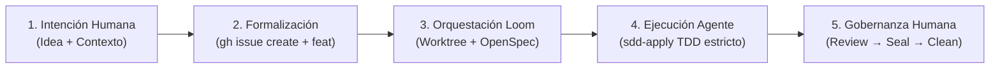

# Playbook de Desarrollo: Gentle AI + SDD + ScrumBan (2026)

Este manual define el estándar de ingeniería y flujo operativo del **Sistema Quant v2** para maximizar la eficiencia en el uso de modelos de lenguaje, proteger la ventana de contexto y asegurar un desarrollo robusto bajo ScrumBan y Spec-Driven Development (SDD).

---

## Quick Path: Ciclo de Vida de un Ticket

1. **Contexto e Inicio (ScrumBan Fase 1)**
   - Revisar backlog: `gh issue list --state open`
   - Leer criterios de aceptación del ticket: `gh issue view <ID>`
   - Crear rama de desarrollo: `git checkout -b feat/<ID>-<nombre-corto>` (o usar `/sdd-new` para inicializar).

2. **Planeamiento (SDD)**
   - Correr `/sdd-ff` para automatizar las fases de Proposal, Spec, Design y Tasks, o interactuar paso a paso en modo `/sdd-new`.
   - Generar la propuesta técnica y de pruebas unitarias.

3. **Implementación y QA (SDD + ScrumBan Fase 2)**
   - Implementar los cambios (Strict TDD si el proyecto tiene tests configurados).
   - Validar suite completa local: `PYTHONPATH=. pytest tests/`

4. **Cierre y Documentación (ScrumBan Fase 3)**
   - Confirmar solo los cambios relevantes del ticket (evitar mezclar estados).
   - Commitear con formato convencional: `fix(modulo): descripción. Fixes #$(ticket)` (ej: `feat(shadow): ...`)
   - Subir cambios a GitHub: `git push origin HEAD` (el hook de pre-commit debe correr siempre).
   - Comentar y cerrar ticket:
     ```bash
     gh issue comment <ID> --body "✅ Build completado. Veredicto: ..."
     gh issue close <ID>
     ```

### Prevención de Bypass de Gates

Los gates de calidad (hook de pre-commit, `test_integrity`, validadores de evidencia) existen para proteger la integridad del pipeline. Ante cualquier señal de evasión, la acción obligatoria es corregir la causa raíz, nunca saltarse la verificación.

| Señal | Riesgo | Acción Obligatoria |
| :--- | :--- | :--- |
| Falsificación temporal: métricas con datos del futuro | Look-Ahead Bias: resultados irreales que no sobreviven OOS | Rechazar la evidencia y re-ejecutar con datos point-in-time |
| Evidencia vacía: output SHA-256 en blanco | Sin prueba de que el pipeline corrió | Re-ejecutar el comando y capturar el hash antes de avanzar |
| Umbral mágico: selección arbitraria de thresholds | Sobreajuste disfrazado de regla de negocio | Justificar cada umbral con evidencia o test estadístico |
| Paridad fantasma: pruebas A/B sobre un working tree sucio | Comparaciones inválidas entre variantes | Limpiar el working tree y re-correr la paridad desde un estado reproducible |
| Bypass de calidad: salto del hook de pre-commit bajo excusas operativas | Cambios sin validar que entran a la rama | Corregir la causa raíz del hook; nunca evadir la verificación |

---

## División de Labores: Orquestador vs. Subagentes

El orquestador coordina pero **no ejecuta código directamente** para mantener la ventana de contexto liviana.

| Actividad | Método Recomendado | Razón Técnica |
| :--- | :--- | :--- |
| **Búsqueda rápida en el repo** (1-3 archivos) | **Orquestador directo (Inline/Grep)** | Rápido, no quema contexto. Ej: buscar `ta.sma` en un archivo Pine. |
| **Exploración profunda** (4+ archivos) | **Subagent (`sdd-explore`)** | Evita llenar el hilo principal de código y detalles irrelevantes de lectura. |
| **Escribir un archivo mecánico** | **Orquestador directo** | Cambio atómico de una sola línea o plantilla sencilla. |
| **Modificar múltiples archivos** | **Subagent (`sdd-apply`)** | Separa el análisis complejo de la escritura y previene corrupción de estado. |
| **Correr tests, builds o lints** | **Subagent (`sdd-verify`)** | Aísla la ejecución y previene el consumo excesivo de tokens por logs largos. |

---

## Directivas Mandatorias y Buenas Prácticas (Nico 2026)

### 1. Guardado Proactivo en Engram
Tras cada tarea o decisión, yo (el agente) me pregunto: *¿Tomé una decisión? ¿Fijé un bug? ¿Aprendí algo no obvio? ¿Establecí una convención?*
Si la respuesta es afirmativa, grabamos inmediatamente en Engram para persistir el contexto entre sesiones utilizando una clave estable (`topic_key`).

> [!TIP]
> En este proyecto usamos una memoria local auxiliar en `.cache/local_memory.json` para registrar el ScrumBan local en Git, complementando el sistema de Engram.

### 2. Estricto Modo TDD
Si el proyecto cuenta con entorno de pruebas configurado, se activa **Strict TDD Mode**:
1. **Red**: Escribir los tests según las especificaciones y verificar que fallen.
2. **Green**: Escribir el mínimo código de producción necesario para que los tests pasen.
3. **Refactor**: Refactorizar y limpiar el código asegurando que no se rompan las pruebas.

---

## Ejemplo Práctico: Buscar uso de SMA 13 en TradingView

Supongamos que querés saber cómo se usa la SMA 13 en el indicador. 

### 1. Consulta rápida (Inline/MCP)
Como solo requiere inspeccionar la carpeta de scripts de TradingView, no usamos un subagente de exploración. Ejecutamos una herramienta de búsqueda directo en el chat principal:
```bash
grep -n "13" tradingview/bugatti_momentum.pine
```
**Resultado en segundos:**
- Línea 85: `sma_13  = ta.sma(close, 13)`
- Línea 185: `trend_int = (sma_13 / sma_65) * 100.0` (Cálculo de Trend Intensity con umbral en 105.0).

### 2. Guardar aprendizaje en Engram
```json
{
  "title": "Documentar cálculo de Trend Intensity en TradingView",
  "type": "discovery",
  "topic_key": "tradingview/trend-intensity",
  "content": "Se identificó que la SMA 13 se utiliza junto con la SMA 65 para calcular la Trend Intensity en bugatti_momentum.pine con la fórmula (SMA13 / SMA65) * 100."
}
```

---

## Checklist de Calidad para el Cierre de Ticket

- [ ] ¿Los tests corrieron al 100% sin nuevos fallos?
- [ ] ¿Los cambios commiteados corresponden **únicamente** al ticket actual?
- [ ] ¿Se guardó la memoria del avance de sesión en Engram o cache local?
- [ ] ¿El ticket en GitHub quedó comentado y cerrado correctamente?
- [ ] ¿La rama fue subida y está lista para Pull Request?

---

## Runbook Operativo: Ciclo Completo del Paso 0 (Idea → Loom → Producción)

> Evidencia empírica registrada en vivo: validación exitosa sobre el Issue #65
> (`feat(indicators): Add rolling percentile ATR volatility helper with unit tests`)
> ejecutado en el worktree aislado `~/.loom/worktrees/65` con OpenCode + DeepSeek V4 Flash Free.

### Bloque 1: Modelo Mental y Responsabilidades



| Capa | Responsable | Herramientas | Output / Entregable |
|------|-------------|--------------|---------------------|
| 1. Intención | Humano | Chat / Brainstorm | Idea acotada y motivada |
| 2. Formalización | Humano / Agente | `gh` CLI + `codegraph_explore` | Issue GitHub con template de 5 secciones y label `feat` |
| 3. Orquestación | Loom Engine | `loomctl` / FSM / `git worktree` | Worktree aislado en `~/.loom/worktrees/<ID>` + scaffold OpenSpec |
| 4. Ejecución | Agente AI | OpenCode / AGY | TDD (RED → GREEN → REFACTOR) + pytest al 100% |
| 5. Gobernanza | Humano | `loomctl validate/seal/clean` | PR en GitHub + cleanup físico de disco |

### Bloque 2: Procedimiento Paso a Paso

#### Paso 1: Capturar la Idea y Mapear Impacto con CodeGraph

Antes de abrir el ticket, verificar los archivos a tocar con `codegraph_explore` (MCP):

- ¿Qué funciones o módulos afecta?
- ¿Toca módulos sensibles (`src/backtest/` o `src/data/`)? → requiere autorización expresa.

#### Paso 2: Crear el Issue en GitHub con el Template Estricto

```powershell
gh issue create --repo mmarcoschambi/swing-momentum-v1 `
  --label "feat" `
  --title "feat(<módulo>): <descripción corta>" `
  --body "### Propósito
<Qué se implementa y por qué>

### Acceptance Criteria
- [ ] Criterio 1 con type hints y docstrings.
- [ ] Criterio 2 con rango/formato esperado.
- [ ] Suite de tests pytest bajo ciclo TDD (RED -> GREEN).
- [ ] pytest pasa al 100% sin warnings.
- [ ] Commit con formato: [Módulo] Descripción. Fixes #<N>

### Baseline a no degradar
N/A (feature aditiva) | Return ≥ 96%, MDD ≤ -36% (si toca backtest).

### Módulos sensibles
N/A | src/backtest/ | src/data/ (requiere autorización).

### Módulo objetivo de la inspección
<ruta/al/archivo.py> y <tests/test_archivo.py>"
```

> [!IMPORTANT]
> El label `feat` (o prefijo `feat:`) es el disparador automático para que Loom genere
> la suite de 4 archivos OpenSpec. Sin este label, no hay scaffold.

#### Paso 3: Sincronizar e Iniciar con loomctl (Headless)

```bash
# 1. Sincronizar backlog de GitHub a la FSM local
loomctl poll --json

# 2. (Opcional) Simular el plan de ejecución sin tocar disco
loomctl start <ID> --dry-run --json

# 3. Disparar aislamiento y lanzamiento del agente
loomctl start <ID> --json
```

Lo que ejecuta Loom internamente:

1. Crea `~/.loom/worktrees/<ID>` clonando la rama `issue-<ID>` desde `TARGET_REPO_PATH`.
2. Materializa `openspec/changes/issue-<ID>/` con 4 archivos: `proposal.md`, `design.md`, `specs/spec.md`, `tasks.md`.
3. Abre una pestaña dedicada en Herdr y lanza el agente con el prompt de `sdd-apply`.

> [!WARNING]
> **Sobre el scaffold OpenSpec**: `proposal.md` parsea los acceptance criteria del issue y es útil.
> `design.md` y `tasks.md` son scaffolds genéricos (placeholders) — NO son un contrato detallado.
> Si necesitás diseño o tareas atómicas, enriquecelos manualmente antes de lanzar el agente.

> [!WARNING]
> **Rutas del scaffold OpenSpec** — el scaffold tiene dos ubicaciones posibles:
> - `openspec/changes/issue-<ID>/` → estado **transitorio** (mientras el agente trabaja)
> - `openspec/changes/archive/<fecha>-issue-<ID>/` → estado **final** (después de `sdd-archive`)
>
> Si el agente completa su ciclo SDD completo (propose → apply → verify → archive), moverá
> los archivos al directorio `archive/` y generará `archive-report.md` + `verify-report.md`
> adicionales. Estos archivos los genera la skill `sdd-archive` del agente, NO Loom.

#### Paso 4: Monitoreo en Vivo de la Ejecución

```bash
# Ver estado de la FSM
loomctl status <ID> --json

# Verificar que el agente realmente arrancó (PID ≠ 0)
# Si PID = 0 y LastReason = "Launching agent session", el proceso no se registró.
# Verificar Herdr directamente o buscar evidencia en logs/cambios/tests.

# Leer la salida en vivo de la terminal del agente en Herdr
loomctl logs <ID> --lines 50
```

> [!CAUTION]
> El estado `WORKING` en la FSM NO prueba que el agente esté ejecutando.
> Evidencia real = `PID ≠ 0` + logs legibles en Herdr + cambios en `git status` + tests pasando.
> Si `PID = 0`, Loom puede haber ignorado un error al lanzar el agente.

#### Paso 5: Ciclo de Cierre y Gobernanza (Orden Canónico)

```
review → validate → commit → push/PR → seal → clean
```

```bash
# 1. Pre-flight de validación (Read-Only, no cambia el estado)
loomctl validate <ID> --json

# 2. Commit de los cambios (¡el agente NO commitea!)
cd ~/.loom/worktrees/<ID>
git add -A
git commit -m "[Módulo] Descripción. Fixes #<ID>"

# 3. Push y creación de Pull Request (mientras el worktree existe)
git push -u origin issue-<ID>
gh pr create --repo mmarcoschambi/swing-momentum-v1 --base main --head issue-<ID> \
  --title "feat(<módulo>): <descripción>" --body "Fixes #<ID>"

# 4. Sello formal de aprobación (Muta: WORKING → REVIEWING → SEALING)
loomctl seal <ID> --json

# 5. Limpieza física final (Cierra pestaña Herdr y borra worktree → DONE)
loomctl clean <ID> --json
```

> [!CAUTION]
> **NO correr `clean` antes de `push`/PR.** `clean` elimina el worktree;
> después `cd ~/.loom/worktrees/<ID>` falla y perdés los cambios no pusheados.

### Bloque 3: Evidencia Empírica de la Corrida (#65) — Ciclo Completo

> Esta evidencia corresponde al **ciclo completo** del Issue #65: ejecución del agente
> (Paso 4) y gobernanza humana (Paso 5: review → validate → commit → push/PR → seal → clean).
> El cierre se completó el 2026-08-18.

**1. Scaffold OpenSpec (archivado por el agente):**

```
~/.loom/worktrees/65/openspec/changes/archive/2026-08-17-issue-65/
├── proposal.md        (1,158 bytes — parseo de acceptance criteria)
├── design.md          (217 bytes — scaffold genérico)
├── specs/spec.md      (185 bytes)
├── tasks.md           (165 bytes — 3/3 checkboxes marcados)
├── archive-report.md  (5,303 bytes — generado por sdd-archive, NO por Loom)
└── verify-report.md   (8,871 bytes — generado por sdd-verify, NO por Loom)
```

**2. Archivos creados por el agente bajo TDD:**

- `src/indicators/atr.py` — implementa `_wilder_atr` y `calculate_atr_percentile`
- `tests/test_atr_percentile.py` — 4 tests unitarios

**3. Resultado de pytest:**

```
tests/test_atr_percentile.py::test_calculate_atr_percentile_known_values PASSED        [ 25%]
tests/test_atr_percentile.py::test_calculate_atr_percentile_default_params_normalized  [ 50%]
tests/test_atr_percentile.py::test_calculate_atr_percentile_constant_prices_ties       [ 75%]
tests/test_atr_percentile.py::test_calculate_atr_percentile_no_exception_on_warmup     [100%]
4 passed in 0.75s
```

**4. Estado FSM (snapshot histórico, durante la ejecución del agente — pre-cierre):**

```json
{ "State": "WORKING", "PID": 0, "LastReason": "Launching agent session" }
```

> Este snapshot corresponde al momento de la ejecución del agente (Paso 4), NO al cierre.
> El estado final tras el ciclo de gobernanza completo (Paso 5) quedó:

```json
{ "State": "PENDING", "PID": 0, "LastReason": "User reverted changes" }
```

> `PENDING` tras el `loomctl reset 65` (salida documentada del `ORPHAN`); al mergear el
> PR #66 el poller descarta el issue local sin acción manual.

**5. Ciclo de gobernanza completo (Paso 5, ejecutado 2026-08-18):**

```
review → validate → commit → push/PR → seal → clean
```

- **Review RDD real**: `gentle-ai review start --focus risk` en el worktree `~/.loom/worktrees/65`
  → `risk_level: medium`, lente `review-risk`, lineage `review-5375ec8827577509`.
  Requiere **stagear todos los archivos** antes (sin untracked) para no fallar con
  `E_GENTLE_AI_MISSING` (ver Bloque 5).
- **Gate de entrega**: `gentle-ai review validate --gate pre-commit` → `result: allow` con
  receipt aprobado (revisión nativa con evidencia de verificación: pytest 4/4 + ruff limpio).
- **Commit**: `4352b63` `[Indicators] Add rolling percentile ATR helper. Fixes #65`
  (10 archivos, 455 líneas, hook pre-commit gate PASS).
- **Push + PR**: rama `issue-65` pusheada; **PR #66** abierto contra `main`
  (https://github.com/mmarcoschambi/swing-momentum-v1/pull/66), MERGEABLE.
- **Seal**: `loomctl seal 65` → `SEALING`, `Unmanaged: true`.
- **Clean**: `loomctl clean 65` falló con `E_WORKTREE_LOCKED` (directorio del worktree
  retenido por un proceso de Windows) → la FSM pasó a `ORPHAN`. Salida documentada:
  `loomctl reset 65` (purge best-effort + PENDING). Al mergear el PR #66, GitHub cierra el
  issue y el poller descarta el PENDING local sin acción manual.

### Bloque 4: Nota de Gobernanza — Dos Loops de Cierre Independientes

El agente ejecuta su propio ciclo de cierre SDD (`sdd-propose` → `sdd-apply` → `sdd-verify` →
`sdd-archive`) de forma autónoma dentro del worktree. Este cierre interno genera
`archive-report.md` y `verify-report.md` con gates formales, compliance matrix, TDD evidence y
trazabilidad Engram.

**Este auto-archivado del agente NO sustituye el gate humano de Loom** (`validate` → `seal` →
`clean`). Son dos loops de gobernanza distintos que hoy no están sincronizados:

```
Agente (SDD):  propose → apply → verify → archive    ← cierre interno autónomo
Loom (FSM):    start → validate → seal → clean        ← gate humano obligatorio
```

El `archive-report.md` del agente es evidencia útil para el review humano (tiene SHA256 hashes,
compliance matrix, assertion quality), pero Loom no lo consume como input automático para su
propio `seal`. La FSM de Loom puede estar clavada en `WORKING` mientras el agente ya completó
y archivó todo su trabajo.

### Bloque 5: Gobernanza RDD y Errores Conocidos del Cierre Real

**Gate real de entrega (authority, no stub).** Desde el cambio de gobernanza en Loom,
`loomctl validate`/`seal` corren `gentle-ai review validate --gate pre-pr --cwd <worktree>`
(no `review start`): parsean la respuesta JSON (`allowed`/`delivery`/`reason`) y fallan
explícitamente si el gate no está satisfecho. En modo `--strict` (fail-closed) bloquean el
sellado con `E_GENTLE_AI_MISSING`; en flujo estándar (fail-open) sellan con
`Unmanaged: true` dejando constancia en `LastReason` — nunca inventan una aprobación.

> [!CAUTION]
> **Untracked rompen el `review start`** (gentle-ai 2.4.0 exige declarar el inventario de
> untracked). Si `loomctl validate` falla con `E_GENTLE_AI_MISSING`, stagear todos los
> archivos del worktree (`git add -A`) y restaurar `.atl/` antes de reintentar — en la
> corrida del #65 el fix fue stagear los 10 archivos del candidato.

> [!CAUTION]
> **`ORPHAN` es un callejón sin salida en la FSM**: un `clean` que falla por lock de Windows
> (`E_WORKTREE_LOCKED`) deja el issue en `ORPHAN` y ya no se puede `clean` (exige `SEALING`).
> La única salida documentada es `loomctl reset <ID>` (purge best-effort + PENDING), que es
> segura si el trabajo ya fue pusheado/PR creado. El directorio vacío residual puede requerir
> limpieza manual posterior cuando el proceso lo libere.

### Bloque 6: Cheat Sheet de Comandos loomctl

| Comando | Acción | Mutación en FSM |
|---------|--------|-----------------|
| `loomctl status [id]` | Consulta el estado general o de un ticket específico | Read-Only |
| `loomctl poll` | Ingesta tickets abiertos desde GitHub a `state.json` | Escribe `state.json` |
| `loomctl start <id> [--dry-run]` | Aísla worktree, genera OpenSpec y lanza agente | PENDING → WORKING |
| `loomctl validate <id>` | Pre-flight audit y risk review sin mutar | Read-Only |
| `loomctl seal <id>` | Sella formalmente los cambios | WORKING → REVIEWING → SEALING |
| `loomctl clean <id>` | Cierra pestaña Herdr y elimina worktree | SEALING → DONE |
| `loomctl reset <id>` | Purga worktree y regresa a PENDING | * → PENDING |
| `loomctl logs <id> [--lines=N]` | Lee la salida en vivo de la terminal del agente | Read-Only |
