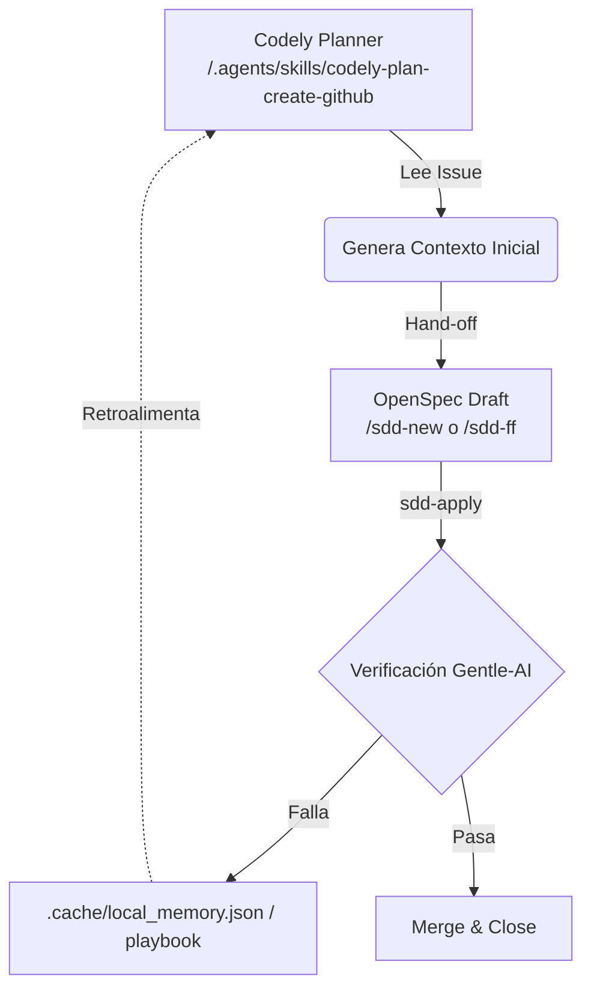

# Spec: SDD/FSM Architecture Closure

> **Versión corregida** — Alineada al estado real del repositorio `momentum-v2` al 2026-08-07.
> Baselines verificados: `AGENTS.md` (96.12% / -35.09%) y `test_quant_gate.py` (2.55% / -41.95%).

---

## Requirements

### REQ-1: Reconciliación de Artefactos (Phase 1)
El sistema DEBE mantener alineados los criterios de aceptación documentados con los tests ejecutables.

#### Scenario: Alineación de umbrales y exclusiones
- **Given** los tests `tests/test_quant_gate.py` y `tests/test_integrity.py` en el repositorio
- **When** se ejecute la suite de validación `pytest tests/`
- **Then** todos los tests deben pasar exitosamente, validando:
  - Umbrales duros de `test_quant_gate.py`: Return `>= 2.55%` y MDD `>= -41.95%` (baseline Variant E, 2023-2024, 158 trades).
  - Umbrales de referencia documentados en `AGENTS.md`: Return `>= 96%`, MDD `<= -36%` (baseline Gold Standard ex-XLV, 6 años).
  - `test_integrity` verifica la ausencia de duplicados activos y carpetas recursivas corruptas.

> **Nota de alcance:** No existe `sdd/momentum-v2/testing-capabilities` ni carpeta `archive/2026-07-23-refactor-ticker-cache/` en el repo. La reconciliación se limita a garantizar que `pytest` pase limpio con los thresholds actuales.

---

### REQ-2: Memoria de Gobernanza Activa (Phase 2)
El agente DEBE ser capaz de recordar reglas operativas sin consultar repositorios estáticos.

#### Scenario: Recuperación de Reglas desde memoria local
- **Given** el agente interactuando con el proyecto `momentum-v2`
- **When** se le pregunte "¿qué regla debo seguir antes de tocar outputs/best_combos_run/?"
- **Then** el sistema debe recuperar de `.cache/local_memory.json` la política "Promotion Gates" y advertir explícitamente la prohibición de mutar `outputs/best_combos_run/` sin significancia estadística, demostrando recuperación semántica exacta con la regla guardada.

> **Nota técnica:** El proyecto utiliza `.cache/local_memory.json` (documentado en `docs/playbook_sdd_scrumban.md`) como memoria local auxiliar. El contrato de guardado es escritura/lectura JSON sobre ese archivo, no `engram save`.

---

### REQ-3: Playbook Pragmático (Phase 3)
El playbook DEBE contener directrices accionables, no historias narrativas.

#### Scenario: Detección de "Code Smells"
- **Given** el archivo `docs/playbook_sdd_scrumban.md`
- **When** un ingeniero lea la sección "Smells Operativos"
- **Then** debe identificar claramente 5 "olores a revisar" derivados directamente de incidentes reales documentados en `rejection_audit.csv`, `DECISIONS.md` o commits recientes del repo.

---

### REQ-4: Puente Arquitectónico (Phase 4)
El inicio de las tareas DEBE estar estandarizado integrando la skill de planeamiento disponible.

#### Scenario: Dry-Run de codely-plan-create-github
- **Given** un nuevo issue en GitHub y la skill `.agents/skills/codely-plan-create-github/SKILL.md` disponible en el workspace
- **When** se invoque `/codely-plan-create-github <issue-url>`
- **Then** el agente debe preparar el contexto (Goal, Context, fases y contratos públicos), solicitar aprobación del usuario, y — tras aprobación — entregar el control al loop SDD local (`/sdd-ff` o `/sdd-new`) para implementación phase-by-phase.

> **Nota:** La skill `codely-plan-create-github` crea un árbol de issues nativos en GitHub (parent + sub-issues por fase). La implementación se realiza luego mediante `/codely-plan_phase-implement-github <child-issue-url>`.

---

## Design: SDD/FSM Architecture Closure

### Architecture & Data Flow
El diseño introduce un bucle cerrado de conocimiento donde el planificador y el ejecutor se conectan pero mantienen sus motores nativos.



### Component Changes

- `tests/test_quant_gate.py`: Consolidar documentación de baseline dual (AGENTS.md vs Variant E).
- `tests/test_integrity.py`: Verificar estado limpio de duplicados y carpetas recursivas.
- `docs/playbook_sdd_scrumban.md`: Inyección de 5 estudios de caso (smells operativos) con formato accionable.
- `AGENTS.md`: Actualizar Fase 1 — Contexto para referenciar formalmente `.agents/skills/codely-plan-create-github/SKILL.md` como entry point de planeamiento.
- `.cache/local_memory.json`: Seed inicial con 3 Golden Rules de gobernanza.

### Interfaces & Contracts

Las reglas inyectadas en memoria local DEBEN usar este contrato exacto de guardado:

```python
import json
from pathlib import Path

memory_path = Path(".cache/local_memory.json")
memory_path.parent.mkdir(parents=True, exist_ok=True)

payload = {
    "project": "momentum-v2",
    "type": "policy",
    "scope": "project",
    "rule": "...",
    "created_at": "2026-08-07T00:00:00Z"
}

with open(memory_path, "w", encoding="utf-8") as f:
    json.dump(payload, f, indent=2, ensure_ascii=False)
```

---

## Tasks: SDD/FSM Architecture Closure

- [ ] **Task 1: Phase 1 — Consolidar baselines y validar suite**
  - Documentar en `tests/test_quant_gate.py` los **dos baselines activos** con sus scopes:
    - Baseline A (AGENTS.md): Russell 1000 + E25 Sizing + ex-XLV → 96.12% Return, -35.09% MDD (6 años).
    - Baseline B (Variant E control): 2.55% Return, -41.95% MDD, 158 trades (2023-2024).
  - Verificar que `pyproject.toml` no excluye `test_integrity` (confirmado: no hay exclusiones).
  - *Verificación*: Ejecutar `PYTHONPATH=. pytest tests/` — full suite exitoso.

- [ ] **Task 2: Phase 2 — Seed .cache/local_memory.json con 3 Golden Rules**
  - Crear/actualizar `.cache/local_memory.json` con 3 políticas de gobernanza:
    1. Promotion Gates: prohibición de mutar `outputs/best_combos_run/` sin significancia estadística (n >= 30 trades, p < 0.05).
    2. Módulos Sensibles: `src/backtest/` y `src/data/` requieren autorización explícita del Orquestador.
    3. Baseline Protection: ningún merge a `main` puede degradar métricas por debajo de los umbrales documentados.
  - *Verificación*: Leer `.cache/local_memory.json` y confirmar que la pregunta "¿qué regla debo seguir antes de tocar outputs/best_combos_run/" devuelve la Promotion Gate correspondiente.

- [ ] **Task 3: Phase 3 — Write Playbook Smells**
  - Rellenar `docs/playbook_sdd_scrumban.md` con una sección "Smells Operativos" conteniendo 5 casos:
    1. **Phantom Baseline**: Cuando un test afirma un baseline que no coincide con `AGENTS.md` ni con métricas históricas verificables.
    2. **Recursive Directory Leak**: Carpetas anidadas corruptas (ej. `vps_snapshot/vps_snapshot/`) que escapan al `.gitignore`.
    3. **Config Drift**: Parámetros hardcodeados en scripts que difieren de `production_config.json`.
    4. **Shadow Mode Premature Promotion**: Promover a producción una variante con < 30 señales acumuladas.
    5. **Missing Trade Count Gate**: Aceptar un backtest como válido sin verificar n >= 30 trades para significancia estadística.
  - *Verificación*: Peer review del documento asegurando que cada smell tiene: (a) trigger detectable, (b) acción correctiva, (c) referencia a incidente real en el repo.

- [ ] **Task 4: Phase 4 — Adoptar codely-plan-create-github**
  - Documentar en `AGENTS.md` (Fase 1 — Contexto) la alternativa de planeamiento:
    - Opción A (manual): `gh issue view <ID>` + `make start ticket=<ID> name=<nombre>`.
    - Opción B (plan skill): `/codely-plan-create-github <issue-url>` → aprobación → `/codely-plan_phase-implement-github <child-issue-url>`.
  - Documentar en `docs/playbook_sdd_scrumban.md` el flujo de hand-off entre Codely y SDD local.
  - *Verificación*: Dry-run trivial — ejecutar `cat .agents/skills/codely-plan-create-github/SKILL.md` y confirmar que la skill está operativa; validar que el hand-off a `/sdd-ff` está documentado.

---

## Criterios de Aceptación Globales

El issue está **CERRADO** cuando:

1. `pytest tests/` pasa al 100% sin nuevos warnings.
2. `tests/test_quant_gate.py` documenta ambos baselines con scopes claros.
3. `.cache/local_memory.json` contiene las 3 Golden Rules y responde correctamente a queries semánticas.
4. `docs/playbook_sdd_scrumban.md` incluye la sección "Smells Operativos" con 5 casos accionables.
5. `AGENTS.md` y el playbook documentan el puente a `codely-plan-create-github`.
6. El commit referencia el issue: `Fixes #<N>`.
