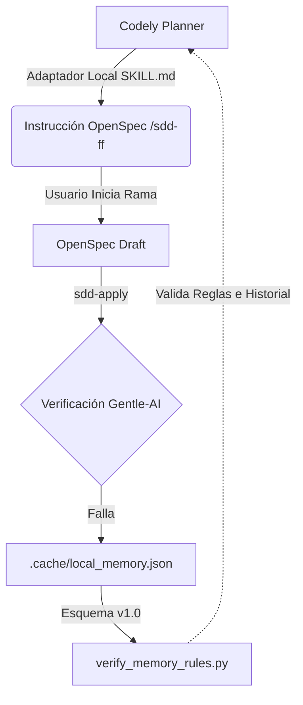

# Design: SDD/FSM Architecture Closure

## Architecture & Data Flow

## Component Changes
- `SYSTEM_CONTEXT.md`: Se añade una cláusula para separar explícitamente la Variante E del baseline general (96.12% return / -35.09% MDD) (REQ-1).
- `openspec/config.yaml`: Se eliminan las exclusiones del parámetro `-k "not test_integrity"` de las 3 ubicaciones exactas: `testing.test_command`, `rules.apply.test_command` y `rules.verify.test_command` (REQ-1).
- `.cache/local_memory.json`: Migración transaccional de estructura raíz de Array a Diccionario (`{"schema_version": "1.0", "entries": [...]}`) (REQ-2).
- `scripts/verify_memory_rules.py` *(Nuevo)*: Script Python portable que verifica que `schema_version` existe, que `len(entries) == 25` (22 históricas + 3 nuevas), y que las 3 reglas se decodifican bien (REQ-2).
- `docs/playbook_sdd_scrumban.md`: Eliminación del comando `--no-verify`. Inyección de matriz con 5 incidentes exactos (REQ-3):
  1. *Falsificación temporal*: Métricas con datos del futuro (Look-Ahead Bias).
  2. *Evidencia vacía*: Output SHA-256 en blanco.
  3. *Umbral mágico*: Selección arbitraria de thresholds.
  4. *Paridad fantasma*: Pruebas A/B sobre un dirty working tree.
  5. *Bypass de calidad*: Uso de `--no-verify` bajo excusas operativas.
- `scratch/check_playbook_smells.py` *(Nuevo)*: Validador portátil que asegura que el Playbook no contenga menciones a "--no-verify".
- `.agents/skills/codely-plan-create-github/SKILL.md`: Sobreescritura de las 4 referencias apuntando ahora a la ejecución de `/sdd-ff` o `/sdd-new` (REQ-4).
- `scratch/check_skill_handoff.py` *(Nuevo)*: Validador portátil para certificar que el SKILL modificado no contiene ninguna mención a `codely-plan_phase-implement-github`.
