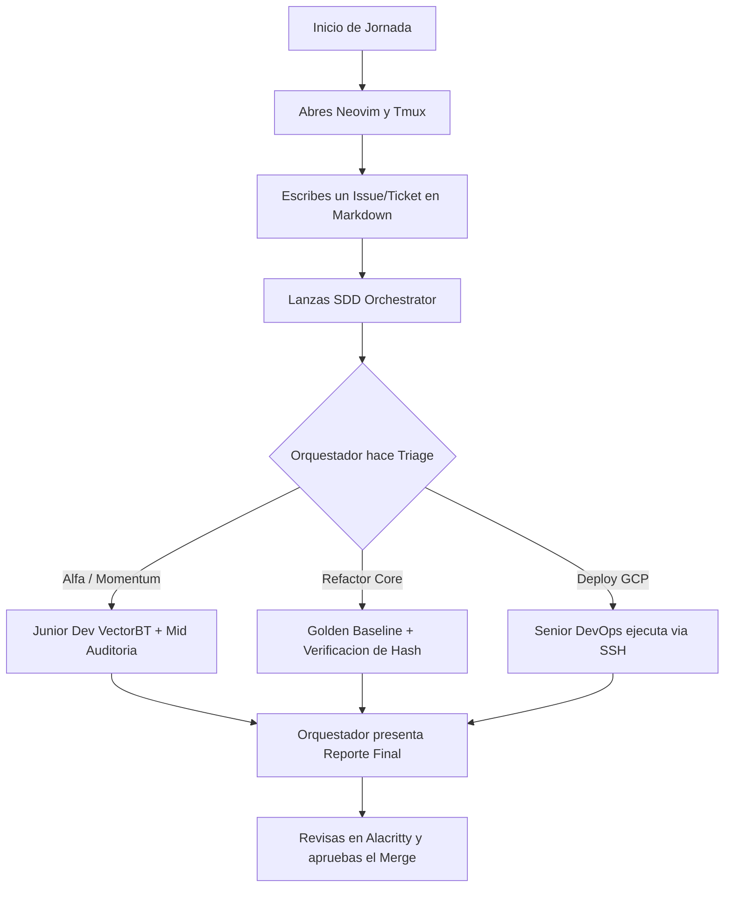

# EPIC: Implementación de Agent Teams Lite (SDD Framework)

**Estado:** ⏳ Pendiente (En Backlog)
**Prioridad:** Alta (Post-Migración ext4)
**Bloqueado por:** Ticket `erf/tier0-golden-benchmark-ext4`

## Descripción
Este ticket documenta la necesidad de estructurar físicamente las reglas de enrutamiento y los perfiles de los subagentes en el repositorio, pasando del diseño teórico a la ejecución real automatizada.

---

### FASE 2: Configuración de la Matriz de Agentes LLM
Aquí definimos las "personalidades" técnicas y las restricciones (System Prompts) para cada subagente. (Archivos a crear en `.agents/subagents/`).

| Rol Asignado | Modelo LLM | Herramientas & Librerías Clave | Responsabilidad Técnica |
| :--- | :--- | :--- | :--- |
| **Tech Lead / Orquestador** | `pro` | OpenSpec, Git, GCP CLI | Genera `proposal.md`, rutea tickets (Triage), valida Hashes (SHA-256) y aprueba despliegues. |
| **Senior Quant Risk / Mid** | `pro` / `flash` | Pytest, Pandas (Métricas) | Ejecuta `sdd_verify_wrapper.py`. Audita código del Junior buscando *look-ahead bias* y límites de Drawdown. |
| **Junior Quant Dev** | `flash` | vectorbt, Optuna, LightGBM | Fuerza bruta matemática. Escribe vectorizaciones, optimiza hiperparámetros y limpia tick data. |
| **Junior DevOps** | `flash_lite` | Bash, Linux utils (ext4) | Tareas repetitivas: formateo de logs, limpieza de contenedores, scripts básicos de I/O. |

---

### FASE 3: Implementación del Triage de Tickets (OpenSpec)
Se debe programar al Orquestador (AGENTS.md / scripts) para que clasifique los issues y active el flujo correcto según el playbook:

#### 1. Flujo de Alfa (Nueva Estrategia Momentum/Swing)
* **Trigger:** Ticket "Probar LightGBM para Momentum".
* **Ejecución:** El Orquestador despierta al Junior Quant Dev para estructurar los datos y correr el backtest con vectorbt.
* **Cierre:** El Senior Risk revisa los resultados y aprueba pasar la estrategia a la instancia de GCP.

#### 2. Flujo de Infraestructura (Core / Refactor)
* **Trigger:** Ticket "Refactorizar conector de mercado / Migrar base de datos".
* **Ejecución:** El Orquestador manda al Junior Quant Dev a generar el Golden Baseline de la estrategia actual.
* **Cierre:** El Orquestador compara el hash de los resultados nuevos vs. los viejos antes de hacer el merge.

#### 3. Flujo de Incidencia Crítica (Hotfix)
* **Trigger:** Ticket "Latencia alta en GCP / Error de API".
* **Ejecución:** El Orquestador asume control directo (`pro`). Genera un parche de emergencia, lo aplica y registra un Post-Mortem.

#### 4. Flujo de Datos (Data Pipeline)
* **Trigger:** Ticket "Gaps detectados en histórico de precios".
* **Ejecución:** El Junior Quant Dev corre scripts de recolección de datos para rellenar los huecos y el Mid verifica la integridad temporal de las nuevas velas.

---

### FASE 4: Flujo de Ejecución (Tu Día a Día)
Para visualizar cómo trabajarás realmente con este plan ensamblado, una vez implementado:

## Tareas a Realizar (To-Do)
- [ ] Crear directorio `.agents/subagents/`.
- [ ] Escribir prompt para `junior_quant_dev.md` (Flujo Alfa y Flujo Data).
- [ ] Escribir prompt para `senior_quant_risk.md` (Auditorías Alfa).
- [ ] Escribir prompt para `junior_devops.md` (I/O, limpieza, scripts bash).
- [ ] Refinar `AGENTS.md` o crear lógica de enrutamiento basada en las etiquetas (labels) del GitHub Issue.
